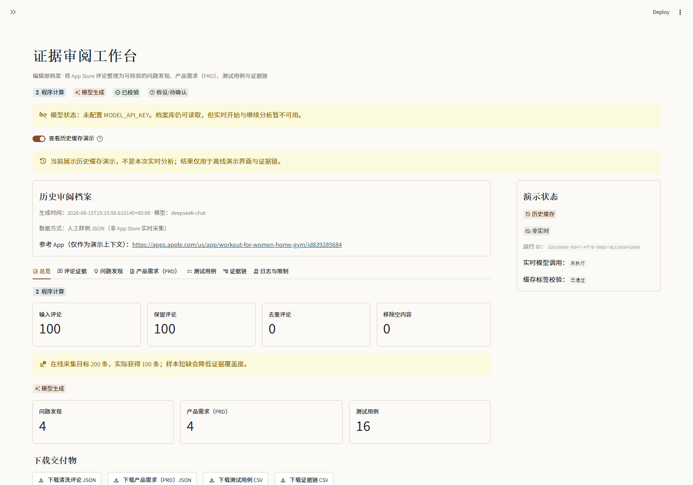
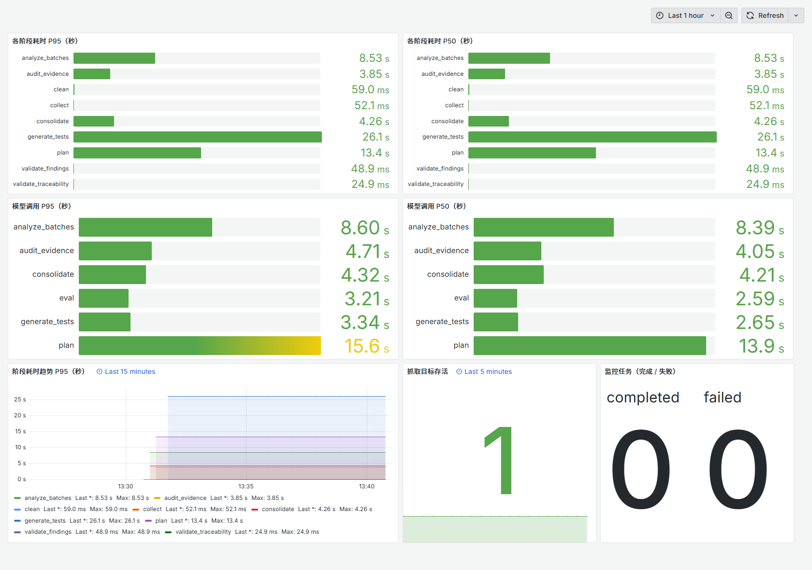
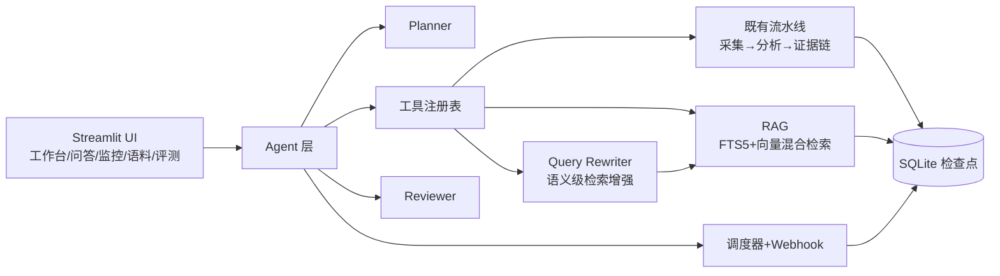

# App Review Insights · 多 Agent 产品情报系统

[](https://github.com/xshdxz/app-review-insights-agents/actions/workflows/ci.yml)
[](LICENSE)
[](pyproject.toml)

**在线演示（免安装、免密钥）：** <https://xsh-review-insights.streamlit.app/>

打开上面的地址即可使用：不配置密钥时它回放一次真实运行的模型输出，「开始分析」可点，
在自带样例上跑完整条流水线，全程不调用外部 API。

**把 App Store / Google Play / 社交评论，变成有证据支撑的产品发现、分版本 PRD 需求与可追溯测试用例。**

把评论丢给大模型写一份报告，得到的是无法验证的文字：引用可能是编的、计数可能是错的、
结论摊开来看无从追溯。这个项目的答案是把**判断权**交给模型，把**验证权**留在代码里 ——
每条结论必须引用真实存在的 `review_id`，支持数/冲突数/置信度/优先级全部由程序重算，
**Review → Finding → Requirement → TestCase 是唯一合法输出路径**，证据链断开的结果不会进入正式视图。



## 几个能被验证的事实

> 下面每一条都有可复现的证据，不是形容词。

| 事实 | 证据 |
|---|---|
| **模型输出永远不直接成为交付物** | 计数、置信度、优先级、`review_id` 存在性全部由 Python 重算；引用了不存在的评论会被确定性校验删掉，证据链断开的结果不进正式视图 |
| **评测指标一度在测错东西，是我们自己发现并改的口径** | 同一次运行：`topic_recall = 0.033`（词面一致率）vs `topic_found_by_evidence = 1.000`（按证据），粒度比 2.15 解释了两者为什么差这么多 —— 见 [D-11](docs/defect-list.md) |
| **进程被硬杀之后能接着跑完** | 真子进程硬杀 × 15 个场景 + 随机时刻，断言结果与「一次跑完」**逐字节相同**；22 项全部走回放 ⇒ 零模型成本（`tests/reliability/`） |
| **运行不依赖浏览器标签页** | 提交即入队，worker 认领执行；关掉页面照跑完（`EXECUTION_MODE=queued` + `RUN_QUEUE_ENABLED`），队列没人消费时界面**如实报警**而不是让人干等 |
| **有对外契约** | HTTP 接口 9 个端点 + OpenAPI（`/docs`）；写端点需令牌、积压超限 429、取消是协作式的（响应里写明在阶段边界生效） |
| **能出事，也能查** | `/metrics` 暴露阶段与模型耗时 P50/P95、队列深度与最久等待；每条 SLI 都写明怎么算；Runbook 11 个场景；备份恢复**真演练过** —— 见 [看板截图](docs/images/06-grafana-overview.png) |
| **质量基线** | 669 项测试 / 覆盖率 92% / ruff 双绿 / CI 六个 job（Linux 3.11–3.13，含独立契约 job） |

---

## 30 秒跑起来

```powershell
git clone https://github.com/xshdxz/app-review-insights-agents.git
cd app-review-insights-agents
py -3.13 -m venv .venv
.\.venv\Scripts\python -m pip install -e ".[dev]"
Copy-Item .env.example .env      # 填 DEEPSEEK_API_KEY；留空则进入离线演示模式
.\.venv\Scripts\streamlit run app.py
```

打开 <http://localhost:8501>。**没有 API Key 也能启动**：应用进入演示模式，输入锁定为自带样例，
点「开始分析」就能回放一次真实运行的模型输出、跑完整条流水线（全程不调用外部 API）；
「查看历史缓存演示」开关则用于浏览附带的离线档案 —— 两者都明确标注，绝不伪装成实时结果。

---

## 和"让模型读评论写报告"有什么不同

| 常见做法 | 这个项目 |
|---|---|
| 模型直接输出结论 | 模型只产出**候选**，程序逐条校验后才成为结论 |
| 引用看着合理就行 | 引用的 `review_id` 必须真实存在；计数、置信度、优先级由程序**重算**，不采信模型给的数字 |
| 失败就从头再来 | 每个阶段先落盘检查点；模型失败可用**同一 `run_id`** 续跑，已完成批次不重跑 |
| 效果凭感觉 | 30 例 / 120 条评论的黄金评测集 + CI 门禁，指标跨版本可比 |
| 上线才知道花多少钱 | 每次模型调用都计量 token 与费用，可按阶段拆解；单次运行与当日累计两个预算都在每次调用前检查，超限即停在检查点；两个计数存在同一个库里、随容器重建一同归零 |

### 证据链长什么样

每一步都可回指上一步，最终回指到评论原文：

```text
F-001 免费内容大幅减少，付费墙限制基本功能   ← 15 条支持评论 + 3 条冲突评论（冲突也如实展示）
  └─ REQ-001 优化免费内容与付费墙体验（V1.0）
       └─ TC-001 验证未订阅用户可完成至少 3 个免费基础训练
```

证据不足时**宁可少给结论也不凑数**：不足 5 个需求是允许的，系统会显式披露原因。

---

## 功能一览

### 输入

- **在线采集**：App Store（任意区，RSS 最多 500 条/区）+ Google Play（尽力而为）+ Reddit/X 社交舆情
- **JSON/CSV 导入**：自有评论文件（格式见 `docs/data-format.md`）
- **离线演示模式**：无密钥且录制文件存在时自动回放 `data/recordings/demo-replay.json`
  （一次真实付费运行的录制），「开始分析」可点、跑完整条流水线且不调用外部 API；
  另有附带的历史缓存档案可浏览

### 分析流水线

- **确定性处理**：文本规范化、语言检测、精确 + 近似去重、ID 冲突处理
- **结构化模型分析**：逐批主题发现 → 跨批归并 → 证据审计 → 需求草拟 → 测试用例草拟
- **检查点续跑**：每个阶段先持久化再进入下一阶段，失败后用同一 `run_id` 续跑

### Agent 编排

- **Planner**：根据目标自动规划工具调用（`run_analysis` / `query_corpus` / `get_latest_report`）
- **Reviewer**：确定性证据校验（ID 存在性、计数一致性、置信度范围）+ LLM 抽查目标覆盖
- **实时推理可见性**：CLI 和监控页面实时展示推理过程（📋规划 → 🔧执行 → 👁️复核 → 🏁完成）
- **结构化日志**：全链路 JSONL 事件记录（`data/agent/agent_events.jsonl`）
- **人工审批门控**：可配置推送前需人工批准

### RAG 问答

- **Query Rewriting Agent**：把自然语言问题扩展为 3-5 条等价短查询，多路检索合并去重，提升召回率
- **混合检索**：FTS5 BM25（0.6）+ 本地向量（0.4）min-max 归一化融合
- **引用校验**：每条引用的 review_id 必须存在于检索结果，quote 必须是原文子串（NFKC 归一化）
- **检索质量有可回归的评测**（`docs/retrieval-eval.md`）：21 条查询（中 9 / 英 12）、答案锚定既有黄金集；纯 FTS 基线 recall@3 = 0.595。
  **首跑就撞出并修掉一个中文检索缺陷**——没有空白或标点的中文长问句会被当成一条必须逐字出现的短语，换个说法就一条都命不中（D-17）；
  修复后中文 recall@3 从 0.167 到 0.722，英文无回归。**向量/混合那一路本机没有 provider，标注为未测**，不假装比过。
- **跨 App 对比**：单 App 深聊 / 多 App 横向对比

### 语料库管理

- **自动索引**：分析完成后自动将清洗后的评论写入语料库（含向量生成）
- **语料管理页面**（`pages/4_语料库管理.py`）：查看分布、按关键词搜索、按 App 删除
- **统计仪表盘**：App / 语言 / 来源分布图表

### 评测中心

- **标注数据集**（`evals/gold-reviews.json`）：**30 个案例 / 120 条评论**，覆盖中英单语与混排、冲突证据、证据不足、重复评论、Prompt 注入、全正面等场景；数据集完整性在 CI 里有独立门禁
- **自动评测**（`scripts/run_eval.py --live`）：引用召回 / 引用精确率 / 主题召回 / 主题键覆盖率 /
  幻觉率 / 结构化输出成功率；`--stability N` 另给"同输入 N 次的主题集合一致度"。
  报告带 prompt 版本与文本指纹、实际花费，并受 `--max-cost-usd` 上限保护
- **跨版本比较**（`scripts/compare_eval.py`）：两份报告逐指标算差值，按指标方向判定回退
  （幻觉率越小越好），`--fail-on-regression` 可作手动门禁；`--save-history` 把报告存进
  `evals/history/`（文件名带 prompt 指纹与时分）
- **评测中心页面**（`pages/3_评测中心.py`）：可视化结果 + 历史对比

### 定时监控与推送

- **cron 调度**：APScheduler 定时触发分析，生成变化摘要报告
- **群机器人推送**：飞书 / 钉钉 / 企业微信 / Slack
- **独立 worker 进程**：`python -m app_review_insights.monitor.worker`，带健康探针与 Prometheus 指标端点

### 部署

- **Docker + docker-compose**：web（Streamlit + 健康检查含 SQLite 连通性）+ worker（常驻调度 + 自身 healthcheck），两者**共用同一份镜像**（同一个 Dockerfile，两条启动命令）
- **一键脚本**：`scripts/setup.ps1`（本机）、`scripts/deploy.ps1`（Docker）

### 可观测性与运维

`docker compose --profile observability up -d` 一条命令拉起 Prometheus + Grafana（默认不启动，不影响只想跑 web+worker 的人）。下图是**真实运行**出来的看板：



- **耗时可见**：`/metrics` 暴露各阶段与模型调用的 P50/P95（以秒为基本单位，`ari_stage_duration_seconds` / `ari_model_latency_seconds`）。耗时取自共享 SQLite，因此**web 进程里跑出来的流水线耗时，在 worker 的端点上同样看得到**——这也是为什么抓取目标只指向常驻的 worker：Streamlit 的脚本按会话执行，空闲时它连端点都不存在（D-14）。
- **面板阈值与告警同源**：条形图变黄/红的那一刻，就是 `ops/alerts.yml` 要响的那一刻（阶段 30s/120s、模型 15s/60s）。
- **告警即代码**：四条规则（进程存活 / 未就绪 / 阶段慢 / 模型慢 / 任务失败），引用的每个指标都由测试拿**真实渲染结果**逐条核对——引用不存在的指标等于一条永不触发的假告警，刻意**不留豁免名单**。
- **出事了照着做**：`docs/slo.md`（6 条 SLI，每条写明用哪句 PromQL / SQL 算）+ `docs/runbook.md`（10 个场景：症状 → 先看什么 → 处置 → 怎么确认好了）。
- **恢复能力是演练过的**：`scripts/backup_restore_drill.py` 用 SQLite 在线备份 API 备份、**从备份**恢复后逐表核对行数与内容摘要，真实记录见 `docs/backup-drill.md`。

### 作为服务运行（HTTP 接口）

流水线也能不经过页面直接用。装上可选 extra 之后：

```powershell
pip install -e ".[api]"
$env:API_TOKEN = "dev-token"        # 不配令牌时写入端点一律 503（提交一次分析要花钱）
python -m app_review_insights.api  # 默认只监听 127.0.0.1:8000

# 提交一次分析：202 表示「已受理」，执行交给 worker
curl -X POST http://127.0.0.1:8000/v1/runs `
  -H "Authorization: Bearer dev-token" -H "Content-Type: application/json" `
  -d '{"analysis_goal":"找出订阅转化的问题","reviews":[{"review_id":"r1","content":"订阅页看不到续费价格"}]}'

# 看进度（加 ?stream=1 走 SSE），或看整条队列
curl http://127.0.0.1:8000/v1/runs/<run_id>
curl http://127.0.0.1:8000/v1/queue
```

- **为什么是 202 而不是 200**：这次调用只保证「已受理」。执行者是 worker——**运行不依赖你的终端，也不依赖浏览器标签页**。
- **取消是协作式的**：`POST /v1/runs/{id}/cancel` 只记下意图，执行者在下一个阶段边界才停，响应里写明了这一点，**不假装「点了就停」**。
- **写端点要令牌，读端点不要**：提交一次分析要花钱，一个能匿名花钱的接口不该默认打开；没配 `API_TOKEN` 时写入端点返回 503 并说明怎么开。
- **背压**：队列积压超过 `API_MAX_QUEUE_DEPTH` 时新提交返回 429——宁可现在如实拒绝，也不让请求排到天荒地老。
- **契约有测试守着**：`tests/test_api.py` 冻结路由表与受理码。刻意不比对整份 OpenAPI schema 快照——那东西会随 FastAPI/pydantic 小版本漂移，天天红之后就没人看了。
- `docker compose up -d` 会一并起 `api` 服务（同一份镜像的第三条启动命令），端口只绑本机；交互式文档在 `/docs`。
---

## 核心架构



### 职责划分

Agent 层**包裹在确定性核心之外**：

| 层 | 职责 | 特征 |
|---|---|---|
| **Agent 层** | Planner 规划、Reviewer 复核、RAG 问答、Query Rewriting | LLM 驱动，任何失败都回退默认计划或确定性校验 |
| **确定性核心** | 采集、清洗、计数、ID 校验、置信度、优先级、Schema 校验、追溯、检查点 | 纯程序，可复现、可测试 |
| **基础设施** | SQLite 存储、FTS5 索引、向量检索、调度器、Webhook 推送、健康探针 | 无状态，故障隔离 |

---

## 运行方式

### 一键脚本（Windows）

```powershell
.\scripts\setup.ps1     # venv + 依赖 + .env 模板
.\scripts\deploy.ps1    # Docker 构建并启动 web + worker
```

### 部署到云端（Streamlit Community Cloud）

免费公开 demo，访客**无需安装**即可使用 —— 详见 [`docs/deploy-streamlit-cloud.md`](docs/deploy-streamlit-cloud.md)。

要点：Cloud 走 `requirements.txt`（`-e .`）安装依赖；Python 版本在部署对话框的 Advanced settings 里选 **3.11**；
**公开 demo 不挂密钥**，应用停在演示模式即可点着跑，没有成本面。确要给受控范围内的部署配密钥时，
至少设 `MODEL_BUDGET_USD_PER_RUN` —— 它约束的是**单次运行**的花费，与 `MODEL_BUDGET_USD_PER_DAY`
读的是**同一张用量表**（`model_usage`，位于容器内的 SQLite）；守卫挂在**每次模型调用之前**，
所以边界是「超限后不再发起新的调用」，跨过阈值时已在途的那一笔仍会完成并计入。两个计数都随
容器重建归零，区别不在「存在哪儿」，而在**约束的是什么**（完整边界见部署文档的「预算上限的真实边界」）。

### Agent CLI

```powershell
# 完整 Agent 运行（需要 .env 中的模型密钥）
.\.venv\Scripts\python scripts/run_agent.py `
  --app-url "https://apps.apple.com/us/app/workout-for-women-home-gym/id839285684" `
  --goal "重点分析订阅转化" --out output/agent-run.json

# 离线冒烟验证（不需要 API Key）
.\.venv\Scripts\python scripts/manual_agent_test.py
```

---

## 配置（`.env`）

| 变量 | 默认值 | 含义 |
|---|---|---|
| `DEEPSEEK_API_KEY` | *(空)* | DeepSeek API 密钥。绝不提交真实密钥；`.env` 已被 git 忽略。 |
| `MODEL_API_KEY` | *(空)* | 可切换的模型密钥（留空回退 `DEEPSEEK_API_KEY`）。 |
| `MODEL_ENABLED` | `true` | 设为 `false` 视为没有可用模型：`auto` 档走演示回放，`live` 档装配失败。 |
| `MODEL_NAME` / `MODEL_BASE_URL` | `deepseek-chat` / `https://api.deepseek.com` | OpenAI 兼容端点。 |
| `MODEL_TIMEOUT_SECONDS` / `MODEL_MAX_RETRIES` / `MODEL_MAX_TOKENS` | `60` / `2` / `8192` | 模型调用行为。 |
| `MODEL_BUDGET_USD_PER_RUN` / `MODEL_BUDGET_USD_PER_DAY` | `0` / `0` | 费用预算（美元，0 = 不限制）。超限时流水线停在检查点，调高后可用同一 `run_id` 续跑。 |
| `MODEL_CACHE_ENABLED` | `true` | 响应缓存：同一请求（模型/温度/输出上限/Schema/请求文本全同）直接返回上次响应，不再付费。任何一项变了都不会命中，因此不会串味。 |
| `MODEL_CACHE_PATH` | `data/cache/llm-cache.sqlite3` | 缓存库位置。可随时删除重建。 |
| `MODEL_CACHE_TTL_DAYS` | `7` | 超过该天数的条目视为未命中，并在数据维护时清除。 |
| `DATABASE_PATH` | `data/runs/runs.sqlite3` | 流水线检查点库。 |
| `AGENT_DB_PATH` | `data/agent/agent.sqlite3` | Agent 运行 / 监控任务 / 报告 / 语料（FTS5）。 |
| `WEBHOOK_TYPE` / `WEBHOOK_URLS` | *(空)* | `feishu` / `dingtalk` / `wecom` / `slack`；多个地址用英文逗号分隔。 |
| `SCHEDULER_ENABLED` | `false` | 本进程是否启动定时调度（worker 容器设为 `true`）。 |
| `RUN_QUEUE_ENABLED` | `false` | worker 是否**消费运行队列**（把提交的分析真正跑起来）。与 `SCHEDULER_ENABLED` 是两个独立职责，可只做其一；**web 进程不消费队列**——这正是"运行不依赖浏览器标签页"的前提。 |
| `RUN_QUEUE_POLL_SECONDS` | `2` | 队列轮询间隔。空队列时执行者按这个间隔看一眼；调大会让"提交之后被接手"变慢。 |
| `EXECUTION_MODE` | `inline` | 界面怎么执行一次分析：`inline`＝在本进程里直接跑；`queued`＝只入队、交给 worker——**运行因此不依赖浏览器标签页**。队列模式下界面会如实显示有没有执行者在消费队列。 |
| `API_TOKEN` | 空 | HTTP 接口的写入令牌（`Authorization: Bearer …`）。**没配置时写入端点返回 503**——提交一次分析要花钱，一个能匿名花钱的接口不该默认打开；读取端点不受影响。 |
| `API_MAX_QUEUE_DEPTH` | `20` | 队列积压上限，超过就对新的提交返回 429（背压：宁可现在拒绝，也不让请求排到天荒地老）。 |
| `ARI_API_HOST` / `ARI_API_PORT` | `127.0.0.1` / `8000` | API 服务监听地址。容器里必须显式设成 `0.0.0.0`，否则端口映射形同虚设。 |
| `WEB_HEALTH_HOST` / `WEB_HEALTH_PORT` | `0.0.0.0` / `9101` | web 进程的健康与指标端点（同上三个路径）。**默认不被 Prometheus 抓取**：Streamlit 的脚本按会话执行，没人打开页面时该端点并不存在；阶段耗时写在共享 SQLite 里，worker 的 `/metrics` 读的是同一份数据。 |
| `OTEL_EXPORTER_OTLP_ENDPOINT` | *(空)* | 三层追踪（run → stage → model call）的上报地址。**留空 = 不上报**；需要先装 `.[observability]` extra。|
| `WORKER_HEALTH_HOST` / `WORKER_HEALTH_PORT` | `0.0.0.0` / `9100` | worker 的健康与指标端点：`/healthz` 存活、`/readyz` 就绪、`/metrics` Prometheus 文本。 |
| `RUN_MAX_DURATION_SECONDS` | `0` | 整轮运行的墙钟上限（0 = 不限制）。超时停在检查点，状态为「超时停止」，可续跑。 |
| `LOG_LEVEL` / `LOG_FORMAT` | `INFO` / `text` | `json` 时输出 JSON Lines，每条带 `run_id` / `stage` 关联 ID，便于采集器按运行检索。 |
| `RETENTION_DAYS` / `EVENTS_KEEP_PER_RUN` / `REPORTS_KEEP_PER_APP` | `90` / `50` / `20` | 数据保留策略。只清理终态运行；可续跑的运行永不删除。 |
| `MAINTENANCE_ENABLED` / `MAINTENANCE_INTERVAL_SECONDS` | `true` / `86400` | worker 自动执行数据维护；也可手动 `python -m app_review_insights.maintenance`。 |
| `AGENT_MAX_REVIEW_ROUNDS` | `2` | Reviewer 复核不通过时的最大重做轮数。 |
| `APPROVAL_REQUIRED` | `false` | 推送前是否需要人工审批。 |
| `EMBEDDING_ENABLED` | `false` | 向量检索开关。 |
| `EMBEDDING_LOCAL_MODEL_PATH` | *(空)* | 本地 sentence-transformers 模型路径（优先于 API）。 |
| `EMBEDDING_MODEL` / `EMBEDDING_BASE_URL` / `EMBEDDING_API_KEY` | `text-embedding-3-small` / … | API 向量检索配置（本地路径为空时使用）。 |
| `SOCIAL_X_ENDPOINT` | *(空)* | 可选的 X 舆情搜索端点（返回 JSON 数组）。 |
| `DEFAULT_REVIEW_LIMIT` / `BATCH_REVIEW_LIMIT` / `BATCH_MAX_CHARACTERS` | `500` / `100` / `60000` | 数量与分批限制。 |
| `DEMO_MODE` | `auto` | 运行模式：`auto` 配了密钥且未被 `MODEL_ENABLED=false` 禁用时走真实模型，无密钥且录制文件存在时回放录制；`live` 强制真实模型；`replay` 强制回放、不看密钥。 |
| `MODEL_RECORD_PATH` | *(空)* | 录制输出路径（留空 = 不录制）。`scripts/record_demo.py` 会自动指向 `data/recordings/demo-replay.json`。**只在临时导出时设置，不要常驻写进 `.env`**：装配录制必须提供输入指纹，而 worker 与 `pages/` 调用的 `build_agent_stack` 不传指纹，写进 `.env` 会让它们在装配期直接抛 `InputDataError`。 |
| `DEMO_REPLAY_PATH` | `data/recordings/demo-replay.json` | 回放读取的录制文件（随仓库提交）。不存在时两档表现不同：`DEMO_MODE=auto` 退回「按钮禁用」的降级形态（界面只给模型状态提醒），`DEMO_MODE=replay` 装配失败并抛 `InputDataError`、横幅明说录制文件缺失。 |

密钥处理：密钥只在运行时读入 provider；绝不记录日志、导出或包含进下载；错误信息会脱敏密钥、评论原文与 `.env` 引用。

---

## 测试与评测

```powershell
# 全量测试（当前 620 项，覆盖率 92%）
# 620 是本次实际执行的用例数；另有 22 项标了 reliability 的用例默认不跑（-m reliability）。
# 数字一律取 pytest 的输出，不要用 grep `def test_` 去数：parametrize 会展开成多例，
# 嵌套在测试内部的局部辅助函数又会被 grep 误计入。
.\.venv\Scripts\python -m pytest

# 覆盖率报告
.\.venv\Scripts\python -m pytest --cov=app_review_insights --cov-report=term-missing

# Lint 与格式
.\.venv\Scripts\python -m ruff check .
.\.venv\Scripts\python -m ruff format --check .

# 评测集完整性校验（不调用模型，CI 每次 push 都跑）
.\.venv\Scripts\python scripts/run_eval.py

# 真实 DeepSeek 评测（可传 --fail-under-topic-recall 等阈值做回归门禁）
.\run_eval.ps1 -Live -Output output\prompt-eval.json

# 真实评测 + 稳定性 + 存进评测历史（约 0.07 美元/次，受 --max-cost-usd 约束）
.\.venv\Scripts\python scripts/run_eval.py --live --stability 3 --save-history

# 与历史基线比较（--fail-on-regression 供手动门禁）
.\.venv\Scripts\python scripts/compare_eval.py evals/history/<基线>.json evals/history/<本次>.json

# 数据保留清理 + VACUUM
.\.venv\Scripts\python -m app_review_insights.maintenance

# 崩溃一致性 / 故障注入（真实子进程硬杀，全部回放 ⇒ 零模型成本；默认不随主套件运行）
.\.venv\Scripts\python -m pytest -m reliability
```

CI 在 push / PR 时跑 ruff 与 pytest（Python 3.11 / 3.12 / 3.13）；实时评测门禁
（`.github/workflows/eval.yml`）需手动触发并配置 `DEEPSEEK_API_KEY` secret。

---

## 项目结构

```
src/app_review_insights/
├── agent/          # Planner/Reviewer/Orchestrator/Tools/HumanInLoop
├── collectors/     # AppStore/GooglePlay/Social(Reddit/X) + 瞬时故障重试
├── llm/            # DeepSeek Provider + Prompt + Schema + 用量与预算计量
├── monitor/        # Scheduler/Webhook/Report/Worker + 健康探针与告警
├── pipeline/       # 核心流水线：orchestrator/analyze/validate/planning/traceability
├── rag/            # embeddings/indexer/retrieval/answer/rewriter/schemas
├── storage/        # RunRepository(检查点) + AgentRepository(FTS5语料库) + 迁移
├── ui/             # Streamlit 主页面 + 组件
├── config.py       # Settings 配置
├── factory.py      # 依赖装配（单一装配点）
├── models.py       # 领域模型
├── logging_setup.py# 结构化日志（JSON Lines + run_id 关联）
├── maintenance.py  # 数据保留清理与 VACUUM
└── errors.py       # 异常类

pages/
├── 1_产品情报问答.py   # RAG 问答页
├── 2_监控任务.py       # 监控任务管理 + 手动运行 + 实时推理展示
├── 3_评测中心.py       # 评测结果可视化
└── 4_语料库管理.py     # 语料搜索/删除/统计图表

scripts/
├── run_agent.py        # Agent CLI
├── run_eval.py         # Prompt 评测 + 数据集完整性校验
├── run_real_validation.py  # 端到端验证
├── manual_agent_test.py    # 离线冒烟测试
├── record_demo.py          # 录制一次真实运行，供演示模式回放
├── setup.ps1           # 一键本机安装
└── deploy.ps1          # 一键 Docker 部署

evals/
└── gold-reviews.json   # 标注评测数据集（30 个案例 / 120 条评论）
```

---

## 数据源与限制

- **Apple RSS**：`https://itunes.apple.com/{region}/rss/customerreviews/page={n}/id={appId}/sortby=mostrecent/json` —— 每页 50 条、最多 10 页、**每区最多 500 条**。接受任意区链接（`/us/`、`/gb/` 等）。接口历史上多次变更，采集器带旧式 URL 回退。
- **Google Play**：无公开 RSS，采集器使用网页版 `getreviews` 端点，属**尽力而为** —— 上游结构变化时请改用 JSON/CSV 导入。
- **Reddit**：`search.json` 公开可用。
- **X**：需要自配 `SOCIAL_X_ENDPOINT`。
- 采集对**瞬时故障**（传输层异常与 429/5xx）做指数退避重试；4xx 等确定性错误立即失败，不浪费对方配额。
- 若机器配置了未启动的 HTTP 代理（`HTTP_PROXY`/`HTTPS_PROXY`），采集与模型调用会连接失败 —— 启动代理或临时移除这些环境变量。

---

## 架构文档

- `docs/architecture.md` — 流水线阶段、Agent/RAG/Monitor 模块、持久化
- `docs/agent-architecture.md` — Planner/Reviewer/工具注册表设计与降级矩阵
- `docs/data-format.md` — JSON/CSV 导入格式
- `docs/model-and-prompts.md` — 模型/Prompt 设计与评测记录
- `docs/reliability.md` — 崩溃一致性矩阵、实测结果、反向验收与**已知边界**
- `docs/slo.md` — SLI/SLO 定义与错误预算（每条 SLI 都写清怎么算）
- `docs/runbook.md` — 出问题照着做：症状 → 判断 → 处置 → 验证
- `docs/backup-drill.md` — 备份恢复演练记录与人工恢复流程
- `docs/defect-list.md` — 缺陷清单与修复记录
- `docs/highlights.md` — 技术亮点
- `docs/experiments/langgraph-vs-native.md` — LangGraph vs 原生编排对比实验

---

## 技术栈

- **Python 3.11+** / **Streamlit** / **Pydantic v2** / **SQLite (FTS5 + WAL)** / **httpx** / **APScheduler 3.11**
- **OpenAI 兼容 Provider**（DeepSeek 默认，可切换）
- **sentence-transformers** + **bce-embedding-base_v1**（本地向量检索，768 维，无需 API Key）
- **Docker + docker-compose** 部署；GitHub Actions CI（ubuntu × 3 个 Python 版本）

---

## 仓库卫生

- `.env`、`data/runs/`、`data/agent/`、`output/`、`tmp/`、`.planning/` 均被 git 忽略。
- 提交前运行密钥扫描：

```powershell
git grep -n -I -E "(sk-[A-Za-z0-9_-]{12,}|DEEPSEEK_API_KEY=.+)" -- . ':!.env.example'
```
