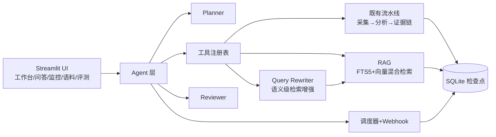

# App Review Insights · 多 Agent 产品情报系统

[](https://github.com/xshdxz/app-review-insights-agents/actions/workflows/ci.yml)
[](LICENSE)
[](pyproject.toml)

把 App Store / Google Play / 社交媒体评论整理为有证据支撑的产品发现、分版本 PRD 需求与可追溯测试用例的中文本地分析工作台。

基于确定性证据链 + Agent 编排架构：**Review → Finding → Requirement → TestCase** 是唯一合法输出路径；每个阶段都持久化为检查点，模型调用失败不会丢失已完成的工作。

---

## 核心架构



### 职责划分

Agent 层**包裹在确定性核心之外**：

| 层 | 职责 | 特征 |
|---|---|---|
| **Agent 层** | Planner 规划、Reviewer 复核、RAG 问答、Query Rewriting | LLM 驱动，任何失败都回退默认计划或确定性校验 |
| **确定性核心** | 采集、清洗、计数、ID 校验、置信度、优先级、Schema 校验、追溯、检查点 | 纯程序，可复现、可测试 |
| **基础设施** | SQLite 存储、FTS5 索引、向量检索、调度器、Webhook 推送 | 无状态，故障隔离 |

---

## 功能一览

### 输入

- **在线采集**：App Store（任意区，RSS 最多 500 条/区）+ Google Play（尽力而为）+ Reddit/X 社交舆情
- **JSON/CSV 导入**：自有评论文件（格式见 `docs/data-format.md`）
- **离线演示**：附带的历史缓存，无 API Key 也能演示界面

### 分析流水线

- **确定性处理**：文本规范化、语言检测、精确 + 近似去重、ID 冲突处理
- **结构化模型分析**：逐批主题发现 → 跨批归并 → 证据审计 → 需求草拟 → 测试用例草拟
- **检查点续跑**：每个阶段先持久化再进入下一阶段，失败后用同一 `run_id` 续跑

### Agent 编排

- **Planner**：根据目标自动规划工具调用（`run_analysis` / `query_corpus` / `get_latest_report`）
- **Reviewer**：确定性证据校验（ID 存在性、计数一致性、置信度范围）+ LLM 抽查目标覆盖
- **实时推理可见性**：CLI 和监控页面实时展示推理过程（📋规划 → 🔧执行 → 👁️复核 → 🏁完成）
- **结构化日志**：全链路 JSONL 事件记录（`data/agent/agent_events.jsonl`）
- **人工审批门控**：可配置推送前需人工批准

### RAG 问答

- **Query Rewriting Agent**：把自然语言问题扩展为 3-5 条等价短查询，多路检索合并去重，提升召回率
- **混合检索**：FTS5 BM25（0.6）+ 本地向量（0.4）min-max 归一化融合
- **引用校验**：每条引用的 review_id 必须存在于检索结果，quote 必须是原文子串（NFKC 归一化）
- **跨 App 对比**：单 App 深聊 / 多 App 横向对比

### 语料库管理

- **自动索引**：分析完成后自动将清洗后的评论写入语料库（含向量生成）
- **语料管理页面**（`pages/4_语料库管理.py`）：查看分布、按关键词搜索、按 App 删除
- **统计仪表盘**：App / 语言 / 来源分布图表
- **当前语料**：300 条评论（Workout for Women + MyFitnessPal + Nike Run Club）

### 评测中心

- **标注数据集**（`evals/gold-reviews.json`）：3 个案例，覆盖"有发现"和"证据不足"场景
- **自动评测**（`scripts/run_eval.py --live`）：主题召回率、引用精确率、结构化输出成功率
- **评测中心页面**（`pages/3_评测中心.py`）：可视化结果 + 历史对比

### 定时监控与推送

- **cron 调度**：APScheduler 定时触发分析，生成变化摘要报告
- **群机器人推送**：飞书 / 钉钉 / 企业微信 / Slack
- **独立 worker 进程**：`python -m app_review_insights.monitor.worker`

### 部署

- **Docker + docker-compose**：web（Streamlit + 健康检查含 SQLite 连通性）+ worker（常驻调度）
- **一键脚本**：`scripts/setup.ps1`（本机）、`scripts/deploy.ps1`（Docker）

---

## 快速开始

### 本机运行

```powershell
# 一键安装：venv + 依赖 + .env 模板
.\scripts\setup.ps1

# 启动 Streamlit 工作台
.\.venv\Scripts\streamlit run app.py
```

打开 http://localhost:8501。没有 DeepSeek 密钥时仍可浏览离线演示档案；"开始分析"按钮保持禁用并说明原因。

### Agent CLI

```powershell
# 完整 Agent 运行（需要 .env 中的模型密钥）
.\.venv\Scripts\python scripts/run_agent.py `
  --app-url "https://apps.apple.com/us/app/workout-for-women-home-gym/id839285684" `
  --goal "重点分析订阅转化" --out output/agent-run.json

# 离线验证（不需要 API Key）
python scripts/manual_agent_test.py
```

### Docker 部署

```powershell
.\scripts\deploy.ps1    # 构建并启动 web + worker
```

---

## 配置（`.env`）

| 变量 | 默认值 | 含义 |
|---|---|---|
| `DEEPSEEK_API_KEY` | *(空)* | DeepSeek API 密钥。绝不提交真实密钥；`.env` 已被 git 忽略。 |
| `MODEL_API_KEY` | *(空)* | 可切换的模型密钥（留空回退 `DEEPSEEK_API_KEY`）。 |
| `MODEL_ENABLED` | `true` | 设为 `false` 强制演示模式。 |
| `MODEL_NAME` / `MODEL_BASE_URL` | `deepseek-chat` / `https://api.deepseek.com` | OpenAI 兼容端点。 |
| `MODEL_TIMEOUT_SECONDS` / `MODEL_MAX_RETRIES` / `MODEL_MAX_TOKENS` | `60` / `2` / `8192` | 模型调用行为。 |
| `DATABASE_PATH` | `data/runs/runs.sqlite3` | 流水线检查点库。 |
| `AGENT_DB_PATH` | `data/agent/agent.sqlite3` | Agent 运行 / 监控任务 / 报告 / 语料（FTS5）。 |
| `WEBHOOK_TYPE` / `WEBHOOK_URLS` | *(空)* | `feishu` / `dingtalk` / `wecom` / `slack`；多个地址用英文逗号分隔。 |
| `SCHEDULER_ENABLED` | `false` | 本进程是否启动定时调度（worker 容器设为 `true`）。 |
| `AGENT_MAX_REVIEW_ROUNDS` | `2` | Reviewer 复核不通过时的最大重做轮数。 |
| `APPROVAL_REQUIRED` | `false` | 推送前是否需要人工审批。 |
| `EMBEDDING_ENABLED` | `false` | 向量检索开关。 |
| `EMBEDDING_LOCAL_MODEL_PATH` | *(空)* | 本地 sentence-transformers 模型路径（优先于 API）。 |
| `EMBEDDING_MODEL` / `EMBEDDING_BASE_URL` / `EMBEDDING_API_KEY` | `text-embedding-3-small` / … | API 向量检索配置（本地路径为空时使用）。 |
| `SOCIAL_X_ENDPOINT` | *(空)* | 可选的 X 舆情搜索端点（返回 JSON 数组）。 |
| `DEFAULT_REVIEW_LIMIT` / `BATCH_REVIEW_LIMIT` / `BATCH_MAX_CHARACTERS` | `500` / `100` / `60000` | 数量与分批限制。 |

密钥处理：密钥只在运行时读入 provider；绝不记录日志、导出或包含进下载；错误信息会脱敏密钥、评论原文与 `.env` 引用。

---

## 测试与评测

```powershell
# 全量测试（当前 293 项，覆盖率 92%）
.\.venv\Scripts\python -m pytest

# 覆盖率报告
.\.venv\Scripts\python -m pytest --cov=app_review_insights --cov-report=term-missing

# Lint 与格式
.\.venv\Scripts\python -m ruff check .
.\.venv\Scripts\python -m ruff format --check .

# Prompt 评测（dry run：只校验数据集）
.\run_eval.ps1
# 真实 DeepSeek 评测
.\run_eval.ps1 -Live -Output output\prompt-eval.json

# Agent CLI 端到端
.\.venv\Scripts\python scripts/run_agent.py --app-url <URL> --goal "..." --out output/agent-run.json

# 离线冒烟验证（不需要 API Key）
.\.venv\Scripts\python scripts/manual_agent_test.py
```

---

## 项目结构

```
src/app_review_insights/
├── agent/          # Planner/Reviewer/Orchestrator/Tools/HumanInLoop
├── collectors/     # AppStore/GooglePlay/Social(Reddit/X)
├── llm/            # DeepSeek Provider + Prompt + Schema
├── monitor/        # Scheduler/Webhook/Report/Worker
├── pipeline/       # 核心流水线：orchestrator/analyze/validate/planning/traceability
├── rag/            # embeddings/indexer/retrieval/answer/rewriter/schemas
├── storage/        # RunRepository(检查点) + AgentRepository(FTS5语料库)
├── ui/             # Streamlit 主页面 + 组件
├── config.py       # Settings 配置
├── factory.py      # 依赖装配（单一装配点）
├── models.py       # 领域模型
└── errors.py       # 异常类

pages/
├── 1_产品情报问答.py   # RAG 问答页
├── 2_监控任务.py       # 监控任务管理 + 手动运行 + 实时推理展示
├── 3_评测中心.py       # 评测结果可视化
└── 4_语料库管理.py     # 语料搜索/删除/统计图表

scripts/
├── run_agent.py        # Agent CLI
├── run_eval.py         # Prompt 评测
├── run_real_validation.py  # 端到端验证
├── manual_agent_test.py    # 离线冒烟测试
├── setup.ps1           # 一键本机安装
└── deploy.ps1          # 一键 Docker 部署

evals/
└── gold-reviews.json   # 标注评测数据集（3 个案例）
```

---

## 数据源与限制

- **Apple RSS**：`https://itunes.apple.com/{region}/rss/customerreviews/page={n}/id={appId}/sortby=mostrecent/json`——每页 50 条、最多 10 页、**每区最多 500 条**。接受任意区链接（`/us/`、`/gb/` 等）。
- **Google Play**：无公开 RSS，采集器使用网页版 `getreviews` 端点，属**尽力而为**——上游结构变化时请改用 JSON/CSV 导入。
- **Reddit**：`search.json` 公开可用。
- **X**：需要自配 `SOCIAL_X_ENDPOINT`。
- 若机器配置了未启动的 HTTP 代理（`HTTP_PROXY`/`HTTPS_PROXY`），采集与模型调用会连接失败——启动代理或临时移除这些环境变量。

---

## 架构文档

- `docs/architecture.md` — 流水线阶段、Agent/RAG/Monitor 模块、持久化
- `docs/agent-architecture.md` — Planner/Reviewer/工具注册表设计与降级矩阵
- `docs/data-format.md` — JSON/CSV 导入格式
- `docs/model-and-prompts.md` — 模型/Prompt 设计与评测记录
- `docs/highlights.md` — 技术亮点
- `docs/experiments/langgraph-vs-native.md` — LangGraph vs 原生编排对比实验

---

## 技术栈

- **Python 3.11+** / **Streamlit 1.61+** / **Pydantic v2** / **SQLite (FTS5)** / **httpx** / **APScheduler 3.11**
- **OpenAI 兼容 Provider**（DeepSeek 默认，可切换）
- **sentence-transformers** + **bce-embedding-base_v1**（本地向量检索，768 维，无需 API Key）
- **Docker + docker-compose** 部署

---

## 仓库卫生

- `.env`、`data/runs/`、`data/agent/`、`output/`、`tmp/`、`.planning/` 均被 git 忽略。
- 提交前运行密钥扫描：

```powershell
git grep -n -I -E "(sk-[A-Za-z0-9_-]{12,}|DEEPSEEK_API_KEY=.+)" -- . ':!.env.example'
```
