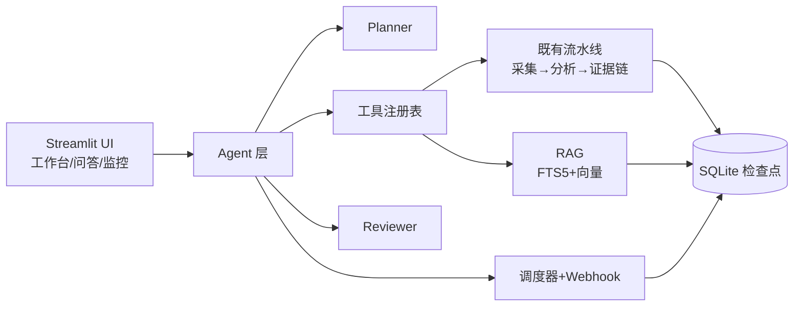

# App Review Insights · 多 Agent 产品情报系统

Turn US App Store reviews into evidence-grounded product findings, versioned PRD requirements, and traceable test cases — a local, single-page Chinese analysis workbench, now upgraded with a multi-agent intelligence layer: agent orchestration, RAG Q&A, scheduled monitoring with group-bot push, and multi-source collection.

> 中文说明见 [README.zh-CN.md](README.zh-CN.md)（中英文描述同一功能范围）。

---

## What it does

1. **Input**
   - **Online collection** from the US App Store via Apple's public RSS feed (up to 500 reviews in practice, most recent first). Any storefront region accepted (`/us/`, `/gb/`, …).
   - **JSON/CSV import** of your own review files (see `docs/data-format.md`).
   - **Offline demo archive**: a bundled, clearly labeled *historical cache* (never presented as a live result) so the UI can be demonstrated without an API key.

2. **Deterministic processing** (Python, no model involved)
   - Normalization, language detection, exact + near-duplicate removal, review-ID collision handling.
   - Batching by review count and character count.
   - Evidence validation: model-cited review IDs must exist; support/conflict counts, confidence, and limitations are recomputed deterministically; findings without support are rejected, and findings with thin support are marked as **Assumption**.
   - Priority scoring and traceability validation of the full chain.

3. **Structured LLM analysis** (DeepSeek `deepseek-chat`; any OpenAI-compatible provider switchable via `MODEL_API_KEY`/`MODEL_BASE_URL`)
   - Per-batch dynamic topic discovery with a Chinese summary for every review.
   - Cross-batch consolidation, per-citation evidence audit, requirement drafting (5–10 when evidence allows, honestly fewer otherwise), and test-case drafting (2–4 per requirement).
   - JSON output is validated against Pydantic schemas; retries are bounded; on final failure the run is paused at a checkpoint.

4. **Checkpoint resume**
   - Every stage and batch output is persisted to SQLite (`data/runs/runs.sqlite3` by default).
   - A paused run can be resumed with the **same `run_id`**; completed batches are never re-run, even if batch sizes change.

## New in v0.2+: Multi-Agent Product Intelligence

- **Agent orchestration**: Planner (goal → tool plan) → tool execution → Reviewer (evidence re-check + goal coverage) → optional human approval. Any model failure degrades to the default plan or deterministic checks — the offline demo never breaks. See `docs/agent-architecture.md`.
- **RAG Q&A** (`pages/1_产品情报问答.py`): single-app deep-dive or cross-app comparison over the review corpus (FTS5 BM25 + optional embeddings); every answer cites review IDs whose existence and quotes are validated deterministically.
- **Scheduled monitoring** (`pages/2_监控任务.py`): cron jobs → auto analysis → change summary → push to Feishu / DingTalk / WeCom / Slack group bots. A dedicated worker process runs the scheduler (`python -m app_review_insights.monitor.worker`).
- **Multi-source collection**: App Store (any region) + Google Play (best-effort) + Reddit/X social mentions (tagged `platform="social"`, kept out of the evidence chain by default).
- **Deployment-ready**: Docker + docker-compose (web + worker + healthcheck) and one-click PowerShell scripts.



## Quick start (Windows PowerShell)

```powershell
# Local
.\scripts\setup.ps1            # venv + deps + .env template (one-time)
.\.venv\Scripts\streamlit run app.py

# Agent CLI (needs a model key in .env)
.\.venv\Scripts\python scripts/run_agent.py `
  --app-url "https://apps.apple.com/us/app/workout-for-women-home-gym/id839285684" `
  --goal "重点分析订阅转化" --out output/agent-run.json

# Docker
.\scripts\deploy.ps1           # build + up web & worker
```

Open http://localhost:8501. Without a DeepSeek key you can still explore the offline demo archive and the sample data; the "开始分析" button stays disabled and the UI says why.

## Configuration (`.env`)

| Variable | Default | Meaning |
|---|---|---|
| `DEEPSEEK_API_KEY` | *(empty)* | DeepSeek API key. Never commit a real key; `.env` is git-ignored. |
| `MODEL_API_KEY` | *(empty)* | Alternative model key (falls back to `DEEPSEEK_API_KEY`). |
| `MODEL_ENABLED` | `true` | Set to `false` to force demo mode even with a key. |
| `MODEL_NAME` / `MODEL_BASE_URL` | `deepseek-chat` / `https://api.deepseek.com` | OpenAI-compatible endpoint. |
| `MODEL_TIMEOUT_SECONDS` / `MODEL_MAX_RETRIES` / `MODEL_MAX_TOKENS` | `60` / `2` / `8192` | Provider behavior. |
| `DATABASE_PATH` | `data/runs/runs.sqlite3` | Pipeline checkpoint database. |
| `AGENT_DB_PATH` | `data/agent/agent.sqlite3` | Agent runs / monitor jobs / reports / corpus (FTS5). |
| `WEBHOOK_TYPE` / `WEBHOOK_URLS` | *(empty)* | `feishu` / `dingtalk` / `wecom` / `slack`; comma-separated URLs. |
| `SCHEDULER_ENABLED` | `false` | Run the monitor scheduler in this process (worker container sets `true`). |
| `AGENT_MAX_REVIEW_ROUNDS` | `2` | Reviewer redo cap. |
| `APPROVAL_REQUIRED` | `false` | Require human approval before push. |
| `EMBEDDING_ENABLED` / `EMBEDDING_MODEL` / `EMBEDDING_BASE_URL` / `EMBEDDING_API_KEY` | `false` / … | Optional vector retrieval; off = pure FTS5. |
| `SOCIAL_X_ENDPOINT` | *(empty)* | Optional X search endpoint returning a JSON array. |
| `DEFAULT_REVIEW_LIMIT` / `BATCH_REVIEW_LIMIT` / `BATCH_MAX_CHARACTERS` | `500` / `100` / `60000` | Limits. |

Key handling: the key is only read into the provider at runtime; it is never logged, exported, or included in downloads; error messages redact key-like strings, review texts, and `.env` references.

## Responsibility split (why the core is not an agent framework)

The evidence pipeline remains a **synchronous state machine orchestrator** with single-purpose Python modules. Reasons:

- The task is a fixed, sequential pipeline with deterministic acceptance checks between stages. Agents add orchestration overhead and nondeterminism without adding capability.
- Evidence integrity depends on *programmatic* validation (ID existence, counts, confidence, traceability) that must be reproducible and testable — this is deterministic code, not model judgment.
- Every stage persists before the next begins, so a failed model call pauses exactly where it happened and resumes without repeating completed work.

The agent layer sits **around** this core: Planner decides which tools to call, Reviewer re-checks goal coverage, Monitor schedules and pushes. Model responsibilities: topic discovery, Chinese summarization, consolidation, evidence audit rationales, requirement/test drafting, planning, review, RAG answers. Program responsibilities: collection/import, cleaning, counting, ID validation, confidence, priority scoring, schema validation, traceability, checkpointing, exports, retrieval ranking, citation validation, scheduling, delivery.

## Data source and limits

- Apple RSS: `https://itunes.apple.com/{region}/rss/customerreviews/page={n}/id={appId}/sortby=mostrecent/json` — up to 50 reviews per page, 10 pages, **500 reviews max** per region.
- Online collection accepts any region storefront link; the region is taken from the URL (`/us/`, `/gb/`, …).
- Google Play has no public RSS: the collector uses its web `getreviews` endpoint and is **best-effort** — if upstream changes break parsing, switch to JSON/CSV import.
- Reddit search (`search.json`) is public; X requires your own `SOCIAL_X_ENDPOINT`.
- If your machine has an HTTP proxy configured (`HTTP_PROXY`/`HTTPS_PROXY`) that is not running, collection and model calls fail with a connection error — start the proxy or temporarily remove those environment variables.

## Testing and evaluation

```powershell
# Full test suite
.\.venv\Scripts\python -m pytest

# Coverage report
.\.venv\Scripts\python -m pytest --cov=app_review_insights --cov-report=term-missing

# Lint and format
.\.venv\Scripts\python -m ruff check .
.\.venv\Scripts\python -m ruff format --check .

# Prompt evaluation (dry run: validates the dataset only)
.\run_eval.ps1
# Live DeepSeek evaluation
.\run_eval.ps1 -Live -Output output\prompt-eval.json

# Real end-to-end validation with live model
.\.venv\Scripts\python scripts/run_real_validation.py `
    --app-url "https://apps.apple.com/us/app/workout-for-women-home-gym/id839285684" `
    --goal "重点分析订阅转化" --limit 200 --out output/real-run.json

# Agent CLI end-to-end
.\.venv\Scripts\python scripts/run_agent.py --app-url <URL> --goal "..." --out output/agent-run.json
```

The real-run script verifies the evidence chain (referenced IDs exist, counts match, confidence in range, inheritance rules, traceability valid) and exits non-zero on any violation.

## Repository hygiene

- `.env`, `data/runs/`, `data/agent/`, `output/`, `tmp/`, `.planning/`, `.superpowers/`, and the private local materials are git-ignored.
- Before submitting, run `git status --short --ignored` and the key scan:

```powershell
git grep -n -I -E "(sk-[A-Za-z0-9_-]{12,}|DEEPSEEK_API_KEY=.+)" -- . ':!.env.example'
```

## Architecture and docs

- `docs/architecture.md` — pipeline stages, agent/rag/monitor modules, persistence.
- `docs/agent-architecture.md` — planner/reviewer/tool registry design, degradation matrix.
- `docs/data-format.md` — JSON/CSV import format.
- `docs/model-and-prompts.md` — model/prompt design and evaluation records.
- `docs/defect-list.md` — known issues by severity (updated during development).
- `docs/manual-testing.md` — manual tests for model-failure and offline scenarios.
