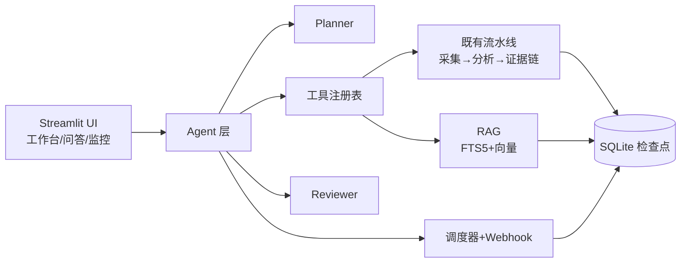

# App Review Insights · 多 Agent 产品情报系统

把美国区 App Store 评论整理为有证据支撑的产品发现、分版本 PRD 需求与可追溯测试用例的中文本地单页分析工作台；现已升级为多 Agent 产品情报系统：Agent 编排、RAG 问答、定时监控与群机器人推送、多源采集。

本仓库最初是确定性证据链流水线，刻意让每一条结论都可核验：**Review → Finding → Requirement → TestCase** 是进入正式结果视图的唯一路径；每个阶段都会持久化为检查点，模型调用失败不会丢失已完成的工作。

> English version: [README.md](README.md)（中英文描述同一功能范围）。

---

## 功能

1. **输入**
   - **在线采集**：通过 Apple 公开 RSS 接口采集 App Store 评论（实际最多约 500 条/区，按最新排序），支持任意区号（`/us/`、`/gb/` 等）。
   - **JSON/CSV 导入**：导入自有评论文件（格式见 `docs/data-format.md`）。
   - **离线演示档案**：随仓库附带的、明确标记为"历史缓存"的结果（绝不被伪装成实时结果），没有 API Key 也能演示界面。

2. **确定性处理**（纯 Python，不经过模型）
   - 文本规范化、语言检测、精确去重 + 近似去重、评论 ID 冲突处理。
   - 按评论数量与字符数分批。
   - 证据校验：模型引用的评论 ID 必须真实存在；支持数/冲突数、置信度、局限说明全部由程序确定性重算；无支持证据的发现被拒绝，证据不足的发现标记为 **Assumption（假设）**。
   - 优先级评分与全链路追溯校验。

3. **结构化模型分析**（DeepSeek `deepseek-chat`；`MODEL_API_KEY`/`MODEL_BASE_URL` 可切换任意 OpenAI 兼容服务）
   - 逐批动态主题发现，并为每条评论生成中文摘要。
   - 跨批次归并、逐条引用证据审计、需求草拟（证据充分时 5–10 个，不足时如实减少）、测试用例草拟（每个需求 2–4 条）。
   - JSON 输出经 Pydantic Schema 校验；有限重试；最终失败时运行停在检查点。

4. **检查点续跑**
   - 每个阶段与批次输出都持久化到 SQLite（默认 `data/runs/runs.sqlite3`）。
   - 暂停的运行可用**同一 `run_id`** 续跑；已完成的批次绝不重复执行，即使批次大小配置发生变化。

5. **交付物下载**：清洗评论（JSON）、PRD（JSON）、测试用例（CSV）、完整证据链矩阵（CSV），全部 UTF-8 且带稳定 ID。

## v0.2+ 新增：多 Agent 产品情报能力

- **Agent 编排**：Planner（目标 → 工具计划）→ 工具执行 → Reviewer（证据复核 + 目标覆盖检查）→ 可选人工审批。任何模型失败都回退默认计划或纯确定性校验——离线演示永不失效。详见 `docs/agent-architecture.md`。
- **RAG 问答**（`pages/1_产品情报问答.py`）：单 App 深聊 / 跨 App 对比，基于评论语料（FTS5 BM25 + 可选向量）；每条回答必带证据引用，引用存在性与原文片段均经确定性校验。
- **定时监控**（`pages/2_监控任务.py`）：cron 任务 → 自动分析 → 变化摘要 → 推送到飞书/钉钉/企业微信/Slack 群机器人；调度由独立 worker 进程执行（`python -m app_review_insights.monitor.worker`）。
- **多源采集**：App Store（任意区）+ Google Play（尽力而为）+ Reddit/X 舆情（标记 `platform="social"`，默认不进入证据链）。
- **部署就绪**：Docker + docker-compose（web + worker + 健康检查）+ PowerShell 一键脚本。



## 快速开始（Windows PowerShell）

```powershell
# 本机
.\scripts\setup.ps1            # 一键：venv + 依赖 + .env 模板
.\.venv\Scripts\streamlit run app.py

# Agent CLI（需要 .env 中的模型密钥）
.\.venv\Scripts\python scripts/run_agent.py `
  --app-url "https://apps.apple.com/us/app/workout-for-women-home-gym/id839285684" `
  --goal "重点分析订阅转化" --out output/agent-run.json

# Docker 部署
.\scripts\deploy.ps1           # 构建并启动 web + worker
```

打开 http://localhost:8501。没有 DeepSeek 密钥时仍可浏览离线演示档案与样例数据；"开始分析"按钮保持禁用并说明原因。

## 配置（`.env`）

| 变量 | 默认值 | 含义 |
|---|---|---|
| `DEEPSEEK_API_KEY` | *(空)* | DeepSeek API 密钥。绝不提交真实密钥；`.env` 已被 git 忽略。 |
| `MODEL_API_KEY` | *(空)* | 可切换的模型密钥（留空回退 `DEEPSEEK_API_KEY`）。 |
| `MODEL_ENABLED` | `true` | 设为 `false` 强制演示模式（即使有密钥）。 |
| `MODEL_NAME` / `MODEL_BASE_URL` | `deepseek-chat` / `https://api.deepseek.com` | OpenAI 兼容端点。 |
| `MODEL_TIMEOUT_SECONDS` / `MODEL_MAX_RETRIES` / `MODEL_MAX_TOKENS` | `60` / `2` / `8192` | 模型调用行为。 |
| `DATABASE_PATH` | `data/runs/runs.sqlite3` | 流水线检查点库。 |
| `AGENT_DB_PATH` | `data/agent/agent.sqlite3` | Agent 运行 / 监控任务 / 报告 / 语料（FTS5）。 |
| `WEBHOOK_TYPE` / `WEBHOOK_URLS` | *(空)* | `feishu` / `dingtalk` / `wecom` / `slack`；多个地址用英文逗号分隔。 |
| `SCHEDULER_ENABLED` | `false` | 本进程是否启动定时调度（worker 容器设为 `true`）。 |
| `AGENT_MAX_REVIEW_ROUNDS` | `2` | Reviewer 复核不通过时的最大重做轮数。 |
| `APPROVAL_REQUIRED` | `false` | 推送前是否需要人工审批。 |
| `EMBEDDING_ENABLED` / `EMBEDDING_MODEL` / `EMBEDDING_BASE_URL` / `EMBEDDING_API_KEY` | `false` / … | 可选向量检索；关闭时 RAG 仅用 FTS5。 |
| `SOCIAL_X_ENDPOINT` | *(空)* | 可选的 X 舆情搜索端点（返回 JSON 数组）。 |
| `DEFAULT_REVIEW_LIMIT` / `BATCH_REVIEW_LIMIT` / `BATCH_MAX_CHARACTERS` | `500` / `100` / `60000` | 数量与分批限制。 |

密钥处理：密钥只在运行时读入 provider；绝不记录日志、导出或包含进下载；错误信息会脱敏密钥、评论原文与 `.env` 引用。

## 职责划分（为什么核心不用 Agent 框架）

证据流水线仍然是**同步状态机编排器** + 单一职责模块。原因：

- 任务是固定顺序流水线，阶段之间有确定性验收检查。Agent 只增加编排开销与不确定性，不增加能力。
- 证据完整性依赖*程序化*校验（ID 存在性、计数、置信度、追溯），必须可复现、可测试——这是确定性代码，不是模型判断。
- 每个阶段先持久化再进入下一阶段，模型调用失败正好停在原地，续跑不重复已完成的工作。

Agent 层**包裹在核心之外**：Planner 决定调用哪些工具，Reviewer 复核目标覆盖，Monitor 调度与推送。模型职责：主题发现、中文摘要、归并、证据审计理由、需求/用例草拟、规划、复核、RAG 回答。程序职责：采集/导入、清洗、计数、ID 校验、置信度、优先级评分、Schema 校验、追溯、检查点、导出、检索排序、引用校验、调度、投递。

## 数据源与限制

- Apple RSS：`https://itunes.apple.com/{region}/rss/customerreviews/page={n}/id={appId}/sortby=mostrecent/json`——每页 50 条、最多 10 页、**每区最多 500 条**。
- 在线采集接受任意区链接，区号取自 URL（`/us/`、`/gb/` 等）。
- Google Play 无公开 RSS：采集器使用其网页版 `getreviews` 端点，属**尽力而为**——上游结构变化导致解析失败时请改用 JSON/CSV 导入。
- Reddit 搜索（`search.json`）公开可用；X 需要自配 `SOCIAL_X_ENDPOINT`。
- 若机器配置了未启动的 HTTP 代理（`HTTP_PROXY`/`HTTPS_PROXY`），采集与模型调用会连接失败——启动代理或临时移除这些环境变量。

## 测试与评测

```powershell
# 全量测试
.\.venv\Scripts\python -m pytest

# 覆盖率报告
.\.venv\Scripts\python -m pytest --cov=app_review_insights --cov-report=term-missing

# Lint 与格式
.\.venv\Scripts\python -m ruff check .
.\.venv\Scripts\python -m ruff format --check .

# Prompt 评测（dry run：只校验数据集）
.\run_eval.ps1
# 真实 DeepSeek 评测
.\run_eval.ps1 -Live -Output output\prompt-eval.json

# 真实端到端验证（在线采集）
.\.venv\Scripts\python scripts/run_real_validation.py `
    --app-url "https://apps.apple.com/us/app/workout-for-women-home-gym/id839285684" `
    --goal "重点分析订阅转化" --limit 200 --out output/real-run.json

# Agent CLI 端到端
.\.venv\Scripts\python scripts/run_agent.py --app-url <URL> --goal "..." --out output/agent-run.json
```

真实运行脚本逐项校验证据链（引用 ID 存在、计数一致、置信度在范围、继承规则、追溯有效），任何违例即非零退出。

## 仓库卫生

- `.env`、`data/runs/`、`data/agent/`、`output/`、`tmp/`、`.planning/`、`.superpowers/` 均被 git 忽略。
- 提交前运行 `git status --short --ignored` 与密钥扫描：

```powershell
git grep -n -I -E "(sk-[A-Za-z0-9_-]{12,}|DEEPSEEK_API_KEY=.+)" -- . ':!.env.example'
```

## 架构与文档

- `docs/architecture.md` — 流水线阶段、Agent/RAG/Monitor 模块、持久化。
- `docs/agent-architecture.md` — Planner/Reviewer/工具注册表设计与降级矩阵。
- `docs/data-format.md` — JSON/CSV 导入格式。
- `docs/model-and-prompts.md` — 模型/Prompt 设计与评测记录。
- `docs/defect-list.md` — 按严重程度排序的已知缺陷。
- `docs/manual-testing.md` — 模型失败与离线场景的手动测试。
