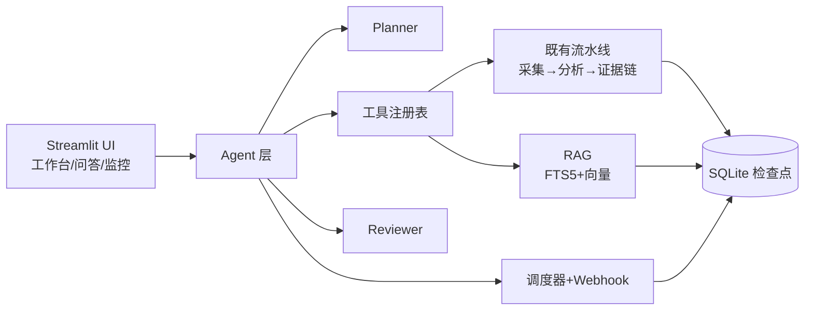

# 多 Agent 产品情报系统实施计划

> **For agentic workers:** REQUIRED SUB-SKILL: Use superpowers:subagent-driven-development (recommended) or superpowers:executing-plans to implement this plan task-by-task. Steps use checkbox (`- [ ]`) syntax for tracking.

**Goal:** 把现有 App Review Insights（证据链工作台）升级为多 Agent 产品情报系统：Agent 编排层（Planner/Reviewer/工具注册表）、RAG 问答（单 App + 跨 App 对比）、定时监控与群机器人推送、多源采集（App Store 多区 / Google Play / Reddit）、Docker 部署就绪。

**Architecture:** 现有确定性流水线（采集→清洗→分析→证据校验→PRD/用例→追溯）保持不变并作为"工具"被 Agent 层调用。新增 `agent/`（Planner 规划、工具执行、Reviewer 复核、人工审批）、`rag/`（FTS5 + 可选向量检索、引用校验）、`monitor/`（APScheduler 定时、Webhook 推送、报告生成）、新采集器（Google Play / Reddit）。全部状态持久化到 SQLite。降级策略：Planner/Reviewer/模型失败一律回退默认计划或确定性校验，离线演示永不失效。

**Tech Stack:** Python 3.11+、Streamlit、Pydantic v2、SQLite（FTS5）、httpx、APScheduler（新增）、openai（embeddings 可选）、pytest、Ruff。

**规格文档:** `docs/superpowers/specs/2026-08-20-multi-agent-product-intelligence-design.md`

---

## 阶段总览

| 阶段 | 任务 | 内容 |
|---|---|---|
| D1–D2 Agent 层 | 1–9 | 配置扩展、factory 提取、AgentRepository、工具注册表、Planner、Reviewer、编排器、CLI |
| D3 RAG | 10–14 | embeddings、索引器、检索器、回答器、问答页面 |
| D4 调度推送 | 15–18 | Webhook、报告、调度器/worker、监控页面 |
| D5 数据源 | 19–21 | 多区 App Store、Google Play、Reddit/X |
| D6 部署 | 22–24 | Docker、一键脚本、.env.example |
| D7 文档交付 | 25–28 | README、架构文档、LangGraph 实验（弹性）、最终回归与推送 |

---

## Phase D1–D2：Agent 编排层

### Task 1: 依赖与配置扩展

**Files:**
- Modify: `pyproject.toml`
- Modify: `src/app_review_insights/config.py`
- Modify: `.env.example`
- Test: `tests/test_config.py`

- [ ] **Step 1: 写失败测试** — 在 `tests/test_config.py` 末尾追加：

```python
def test_agent_and_webhook_settings_defaults(tmp_path, monkeypatch):
    monkeypatch.delenv("MODEL_API_KEY", raising=False)
    monkeypatch.delenv("WEBHOOK_TYPE", raising=False)
    monkeypatch.delenv("WEBHOOK_URLS", raising=False)
    monkeypatch.delenv("SCHEDULER_ENABLED", raising=False)
    monkeypatch.delenv("AGENT_DB_PATH", raising=False)
    settings = load_settings()
    assert settings.model_api_key == ""
    assert settings.webhook_type == ""
    assert settings.webhook_urls == []
    assert settings.scheduler_enabled is False
    assert settings.agent_max_review_rounds == 2
    assert settings.approval_required is False
    assert settings.agent_db_path.name == "agent.sqlite3"


def test_webhook_urls_parsed_from_csv(monkeypatch):
    monkeypatch.setenv("WEBHOOK_URLS", "https://a.example/hook,https://b.example/hook")
    settings = load_settings()
    assert settings.webhook_urls == [
        "https://a.example/hook",
        "https://b.example/hook",
    ]


def test_model_api_key_overrides_deepseek_key(monkeypatch):
    monkeypatch.setenv("MODEL_API_KEY", "sk-custom")
    settings = load_settings()
    assert settings.effective_model_api_key == "sk-custom"
```

- [ ] **Step 2: 运行确认失败**

Run: `.\.venv\Scripts\python -m pytest tests/test_config.py -k "agent_and_webhook or webhook_urls or model_api_key" -v`
Expected: FAIL（`Settings` 无这些字段）

- [ ] **Step 3: 实现** — 修改 `src/app_review_insights/config.py`：

```python
from pydantic import Field, field_validator
from pydantic_settings import BaseSettings, SettingsConfigDict


class Settings(BaseSettings):
    model_config = SettingsConfigDict(
        env_file=".env",
        env_file_encoding="utf-8",
        extra="ignore",
        populate_by_name=True,
    )

    deepseek_api_key: str = Field(default="", alias="DEEPSEEK_API_KEY")
    model_enabled: bool = Field(default=True, alias="MODEL_ENABLED")
    model_provider: str = Field(default="deepseek", alias="MODEL_PROVIDER")
    model_name: str = Field(default="deepseek-chat", alias="MODEL_NAME")
    model_base_url: str = Field(default="https://api.deepseek.com", alias="MODEL_BASE_URL")
    model_timeout_seconds: float = Field(default=60, alias="MODEL_TIMEOUT_SECONDS")
    model_max_retries: int = Field(default=2, alias="MODEL_MAX_RETRIES")
    model_max_tokens: int = Field(default=8192, alias="MODEL_MAX_TOKENS")
    model_api_key: str = Field(default="", alias="MODEL_API_KEY")
    database_path: Path = Field(default=Path("data/runs/runs.sqlite3"), alias="DATABASE_PATH")
    default_review_limit: int = Field(default=500, alias="DEFAULT_REVIEW_LIMIT")
    batch_review_limit: int = Field(default=100, alias="BATCH_REVIEW_LIMIT")
    batch_max_characters: int = Field(default=60000, alias="BATCH_MAX_CHARACTERS")
    agent_db_path: Path = Field(default=Path("data/agent/agent.sqlite3"), alias="AGENT_DB_PATH")
    webhook_type: str = Field(default="", alias="WEBHOOK_TYPE")
    webhook_urls: list[str] = Field(default_factory=list, alias="WEBHOOK_URLS")
    scheduler_enabled: bool = Field(default=False, alias="SCHEDULER_ENABLED")
    agent_max_review_rounds: int = Field(default=2, alias="AGENT_MAX_REVIEW_ROUNDS")
    approval_required: bool = Field(default=False, alias="APPROVAL_REQUIRED")
    embedding_enabled: bool = Field(default=False, alias="EMBEDDING_ENABLED")
    embedding_model: str = Field(default="text-embedding-3-small", alias="EMBEDDING_MODEL")
    embedding_base_url: str = Field(
        default="https://api.openai.com/v1", alias="EMBEDDING_BASE_URL"
    )
    embedding_api_key: str = Field(default="", alias="EMBEDDING_API_KEY")

    @field_validator("webhook_urls", mode="before")
    @classmethod
    def _split_webhook_urls(cls, value):
        if isinstance(value, str):
            return [item.strip() for item in value.split(",") if item.strip()]
        return value

    @property
    def effective_model_api_key(self) -> str:
        return self.model_api_key or self.deepseek_api_key

    @property
    def model_available(self) -> bool:
        return self.model_enabled and bool(self.effective_model_api_key)
```

（保留文件底部 `_strip_env_bom` 与 `load_settings` 不动。）

- [ ] **Step 4: 运行确认通过**

Run: `.\.venv\Scripts\python -m pytest tests/test_config.py -v`
Expected: 全部 PASS（含原有用例）

- [ ] **Step 5: 更新 `.env.example`** — 追加到末尾：

```
# --- 多 Agent 产品情报系统（新增） ---
# 可切换的模型密钥（留空则回退用 DEEPSEEK_API_KEY）
MODEL_API_KEY=
# 群机器人类型：feishu / dingtalk / wecom / slack（留空=不推送）
WEBHOOK_TYPE=
# 多个 Webhook 地址用英文逗号分隔
WEBHOOK_URLS=
# 是否在本进程启动定时调度（web 默认关，worker 容器开）
SCHEDULER_ENABLED=false
# Reviewer 复核不通过时最多重做轮数
AGENT_MAX_REVIEW_ROUNDS=2
# 报告推送前是否需要人工审批
APPROVAL_REQUIRED=false
# 向量检索（可选；关闭时 RAG 仅用 FTS5）
EMBEDDING_ENABLED=false
EMBEDDING_MODEL=text-embedding-3-small
EMBEDDING_BASE_URL=https://api.openai.com/v1
EMBEDDING_API_KEY=
# Agent/监控/RAG 状态库
AGENT_DB_PATH=data/agent/agent.sqlite3
```

- [ ] **Step 6: 提交**

```bash
git add pyproject.toml src/app_review_insights/config.py .env.example tests/test_config.py
git commit -m "feat: add agent/webhook/embedding config with model key fallback"
```

> 注：apscheduler 依赖在 Task 17 需要时再加入 `pyproject.toml` 主依赖，避免提前引入未用依赖。

---

### Task 2: 提取 factory（pipeline 服务构造复用）

**Files:**
- Create: `src/app_review_insights/factory.py`
- Modify: `src/app_review_insights/ui/main.py`（`build_services` 改为委托）
- Modify: `src/app_review_insights/llm/provider.py`（`from_settings` 使用 `effective_model_api_key`）
- Test: `tests/test_factory.py`（新建）

- [ ] **Step 1: 写失败测试** — 新建 `tests/test_factory.py`：

```python
from app_review_insights.config import load_settings
from app_review_insights.factory import build_pipeline_services
from app_review_insights.pipeline.orchestrator import PipelineServices


def test_build_pipeline_services_fake_provider(tmp_path, monkeypatch):
    monkeypatch.setenv("DATABASE_PATH", str(tmp_path / "runs.sqlite3"))
    services = build_pipeline_services(load_settings(), use_fake_provider=True)
    assert isinstance(services, PipelineServices)
    assert services.batch_analyzer is None
    assert services.collector is not None
    assert services.finding_validator is not None
    assert services.traceability_validator is not None


def test_build_pipeline_services_live_provider(tmp_path, monkeypatch):
    monkeypatch.setenv("DATABASE_PATH", str(tmp_path / "runs.sqlite3"))
    monkeypatch.setenv("MODEL_API_KEY", "sk-test")
    services = build_pipeline_services(load_settings(), use_fake_provider=False)
    assert services.batch_analyzer is not None
    assert services.consolidator is not None
```

- [ ] **Step 2: 运行确认失败**

Run: `.\.venv\Scripts\python -m pytest tests/test_factory.py -v`
Expected: FAIL（`app_review_insights.factory` 不存在）

- [ ] **Step 3: 实现 factory** — 新建 `src/app_review_insights/factory.py`：

```python
"""依赖装配：从 Settings 构建流水线服务与 Agent 栈（单一装配点）。"""

from __future__ import annotations

from app_review_insights.collectors import AppStoreCollector
from app_review_insights.config import Settings, load_settings
from app_review_insights.llm import DeepSeekProvider
from app_review_insights.pipeline.analyze import (
    analyze_batch,
    audit_finding_evidence,
    consolidate_findings,
)
from app_review_insights.pipeline.orchestrator import PipelineServices
from app_review_insights.pipeline.planning import build_requirements
from app_review_insights.pipeline.test_generation import generate_test_cases
from app_review_insights.pipeline.traceability import validate_traceability
from app_review_insights.pipeline.validate import validate_finding_drafts
from app_review_insights.storage import RunRepository


def build_pipeline_services(
    settings: Settings,
    use_fake_provider: bool = False,
) -> PipelineServices:
    repository = RunRepository(settings.database_path)
    common = {
        "repository": repository,
        "collector": AppStoreCollector(),
        "finding_validator": validate_finding_drafts,
        "traceability_validator": validate_traceability,
        "batch_size": settings.batch_review_limit,
        "batch_max_characters": settings.batch_max_characters,
    }
    if use_fake_provider or not settings.model_available:
        return PipelineServices(batch_analyzer=None, **common)

    provider = DeepSeekProvider.from_settings(settings)
    return PipelineServices(
        batch_analyzer=lambda reviews, goal: analyze_batch(provider, reviews, goal),
        consolidator=lambda results, goal, reviews: consolidate_findings(
            provider, results, goal, reviews
        ),
        evidence_auditor=lambda findings, reviews, goal: audit_finding_evidence(
            provider, findings, reviews, goal
        ),
        requirement_builder=lambda findings, goal, total: build_requirements(
            provider, findings, goal, total
        ),
        test_case_builder=lambda requirements: generate_test_cases(provider, requirements),
        **common,
    )
```

- [ ] **Step 4: provider 密钥回退** — 修改 `src/app_review_insights/llm/provider.py` 的 `from_settings`：

```python
    @classmethod
    def from_settings(cls, settings):
        return cls(
            client=OpenAI(
                api_key=settings.effective_model_api_key,
                base_url=settings.model_base_url,
                timeout=settings.model_timeout_seconds,
                max_retries=0,
            ),
            model=settings.model_name,
            max_retries=settings.model_max_retries,
            max_tokens=settings.model_max_tokens,
        )
```

- [ ] **Step 5: UI 委托** — 修改 `src/app_review_insights/ui/main.py`：

删除 `build_services` 函数体，替换为：

```python
from app_review_insights.factory import build_pipeline_services as _build_pipeline_services


def build_services(use_fake_provider: bool = False) -> PipelineServices:
    return _build_pipeline_services(load_settings(), use_fake_provider=use_fake_provider)
```

同时删除 `main.py` 中不再使用的导入：`AppStoreCollector`、`DeepSeekProvider`、`analyze_batch`、`consolidate_findings`、`audit_finding_evidence`、`build_requirements`、`generate_test_cases`、`validate_traceability`、`validate_finding_drafts`（保留 `RunRepository`、`PipelineServices`、`AnalysisOrchestrator` 等仍在用的导入）。

- [ ] **Step 6: 运行确认通过**

Run: `.\.venv\Scripts\python -m pytest tests/test_factory.py tests/test_config.py tests/test_app_smoke.py -v`
Expected: 全部 PASS

- [ ] **Step 7: 提交**

```bash
git add src/app_review_insights/factory.py src/app_review_insights/ui/main.py src/app_review_insights/llm/provider.py tests/test_factory.py
git commit -m "refactor: extract pipeline service factory with model key fallback"
```

---

### Task 3: 领域模型扩展 + AgentRepository

**Files:**
- Modify: `src/app_review_insights/models.py`
- Create: `src/app_review_insights/storage/agent_repository.py`
- Test: `tests/test_agent_repository.py`（新建）

- [ ] **Step 1: 写失败测试** — 新建 `tests/test_agent_repository.py`：

```python
from datetime import UTC, datetime

import pytest

from app_review_insights.models import (
    AgentRun,
    AgentRunStatus,
    MonitorJob,
    MonitorReport,
    Review,
)
from app_review_insights.storage.agent_repository import AgentRepository


@pytest.fixture
def repo(tmp_path):
    return AgentRepository(tmp_path / "agent.sqlite3")


def _review(review_id: str, app_id: str, content: str, platform: str = "app-store") -> Review:
    return Review(
        review_id=review_id,
        app_id=app_id,
        content_original=content,
        rating=3,
        published_at=datetime(2026, 1, 1, tzinfo=UTC),
        source="test",
        platform=platform,
    )


def test_agent_run_roundtrip(repo):
    run = AgentRun(
        run_id="a1",
        goal="分析订阅转化",
        app_url="https://apps.apple.com/us/app/x/id1",
        status=AgentRunStatus.PENDING,
        created_at=datetime(2026, 1, 1, tzinfo=UTC),
        updated_at=datetime(2026, 1, 1, tzinfo=UTC),
    )
    repo.save_agent_run(run)
    loaded = repo.get_agent_run("a1")
    assert loaded.goal == "分析订阅转化"
    assert loaded.status == AgentRunStatus.PENDING


def test_agent_run_list_by_status(repo):
    for i in range(3):
        repo.save_agent_run(
            AgentRun(
                run_id=f"r{i}",
                goal="g",
                app_url="https://apps.apple.com/us/app/x/id1",
                status=AgentRunStatus.WAITING_APPROVAL if i == 0 else AgentRunStatus.COMPLETED,
                created_at=datetime(2026, 1, 1, tzinfo=UTC),
                updated_at=datetime(2026, 1, 1, tzinfo=UTC),
            )
        )
    waiting = repo.list_agent_runs(status=AgentRunStatus.WAITING_APPROVAL)
    assert [r.run_id for r in waiting] == ["r0"]


def test_monitor_job_crud(repo):
    job = MonitorJob(
        job_id="j1",
        name="每日监控",
        app_url="https://apps.apple.com/us/app/x/id1",
        goal="监控订阅转化口碑",
        cron="0 9 * * *",
        created_at=datetime(2026, 1, 1, tzinfo=UTC),
        updated_at=datetime(2026, 1, 1, tzinfo=UTC),
    )
    repo.save_job(job)
    assert repo.get_job("j1").name == "每日监控"
    assert len(repo.list_jobs()) == 1
    repo.delete_job("j1")
    assert repo.list_jobs() == []


def test_report_roundtrip_and_latest(repo):
    report = MonitorReport(
        report_id="rep1",
        agent_run_id="a1",
        app_url="https://apps.apple.com/us/app/x/id1",
        goal="g",
        markdown="# 报告",
        summary="摘要",
        findings_count=3,
        created_at=datetime(2026, 1, 1, tzinfo=UTC),
    )
    repo.save_report(report)
    assert repo.get_report("rep1").summary == "摘要"
    assert repo.latest_report("https://apps.apple.com/us/app/x/id1").report_id == "rep1"
    assert repo.latest_report("https://other.example") is None


def test_corpus_upsert_and_search(repo):
    repo.upsert_corpus(_review("v1", "app-a", "订阅太贵了，续费不划算"))
    repo.upsert_corpus(_review("v2", "app-a", "界面很漂亮"))
    repo.upsert_corpus(_review("v3", "app-b", "订阅流程顺畅"))
    hits = repo.search_corpus("订阅", app_ids=["app-a"], limit=10)
    assert {h["review_id"] for h in hits} == {"v1"}
    assert repo.app_ids() == ["app-a", "app-b"]


def test_corpus_social_platform_tagged(repo):
    repo.upsert_corpus(_review("s1", "app-a", "有人在讨论这个 App", platform="social"))
    hits = repo.search_corpus("讨论", app_ids=["app-a"], limit=10)
    assert hits[0]["platform"] == "social"


def test_delete_app(repo):
    repo.upsert_corpus(_review("v1", "app-a", "内容一"))
    repo.upsert_corpus(_review("v2", "app-b", "内容二"))
    assert repo.delete_app("app-a") == 1
    assert repo.app_ids() == ["app-b"]
```

- [ ] **Step 2: 运行确认失败**

Run: `.\.venv\Scripts\python -m pytest tests/test_agent_repository.py -v`
Expected: FAIL（模型与模块不存在）

- [ ] **Step 3: 扩展 models.py** — 在 `Review` 增加 `platform` 字段，并追加以下模型：

```python
class Review(BaseModel):
    review_id: str
    app_id: str
    storefront: str = "us"
    title: str = ""
    content_original: str = Field(min_length=1)
    content_summary_zh: str | None = None
    rating: int = Field(ge=1, le=5)
    app_version: str | None = None
    author: str | None = None
    published_at: datetime
    language: str | None = None
    source: str
    source_page: int | None = None
    content_hash: str = ""
    platform: str = "app-store"
```

追加（文件末尾）：

```python
class AgentRunStatus(StrEnum):
    PENDING = "pending"
    RUNNING = "running"
    WAITING_APPROVAL = "waiting_approval"
    COMPLETED = "completed"
    FAILED = "failed"


class AgentRun(BaseModel):
    run_id: str
    goal: str
    app_url: str
    status: AgentRunStatus
    plan_summary: str = ""
    analysis_run_id: str | None = None
    report_id: str | None = None
    review_rounds: int = 0
    feedback: list[str] = Field(default_factory=list)
    require_approval: bool = False
    error: str | None = None
    created_at: datetime
    updated_at: datetime


class MonitorJob(BaseModel):
    job_id: str
    name: str
    app_url: str
    goal: str
    cron: str
    review_limit: int = Field(default=200, ge=100, le=1000)
    enabled: bool = True
    require_approval: bool = False
    last_run_at: datetime | None = None
    last_status: str | None = None
    created_at: datetime
    updated_at: datetime


class MonitorReport(BaseModel):
    report_id: str
    agent_run_id: str
    app_url: str
    goal: str
    markdown: str
    summary: str
    findings_count: int
    changes: list[str] = Field(default_factory=list)
    created_at: datetime
    delivered_to: list[str] = Field(default_factory=list)
```

- [ ] **Step 4: 实现 AgentRepository** — 新建 `src/app_review_insights/storage/agent_repository.py`：

```python
import json
import sqlite3
from contextlib import contextmanager
from pathlib import Path
from typing import Any

from app_review_insights.models import (
    AgentRun,
    AgentRunStatus,
    MonitorJob,
    MonitorReport,
    Review,
)

_CORPUS_FTS_QUERY = (
    "SELECT c.review_id, c.app_id, c.content, c.platform, c.source, c.storefront, "
    "       -bm25(corpus_fts) AS score "
    "FROM corpus_fts JOIN corpus c ON c.review_id = corpus_fts.review_id "
    "WHERE corpus_fts MATCH ? {app_filter} "
    "ORDER BY score DESC LIMIT ?"
)


def fts5_available(path: Path) -> bool:
    try:
        connection = sqlite3.connect(path)
        try:
            row = connection.execute(
                "SELECT sqlite_compileoption_used('ENABLE_FTS5')"
            ).fetchone()
            return bool(row and row[0])
        finally:
            connection.close()
    except sqlite3.Error:
        return False


def build_fts_query(text: str) -> str:
    """把用户查询转成 FTS5 MATCH 表达式：逐词加引号、AND 连接；空则匹配不到任何行。

    CJK 字符之间插入空格（与索引侧 _cjk_segment 对称），保证 FTS5 按字符分词，
    中文检索在 unicode61 分词器下行为确定。
    """
    import re

    segmented = _cjk_segment(text)
    tokens = re.findall(r"[\w\u4e00-\u9fff]+", segmented.lower())
    tokens = [f'"{token}"' for token in tokens if token.strip()]
    if not tokens:
        return '"__no_match__"'
    return " AND ".join(tokens)


def _cjk_segment(text: str) -> str:
    """在相邻 CJK 字符之间插入空格（不拆分英文单词）。

    FTS5 unicode61 对连续 CJK 的切分行为依赖 SQLite 版本；显式切分后
    索引与查询两侧行为一致，中文检索结果可复现。
    """
    import re

    return re.sub(r"(?<=[\u4e00-\u9fff])(?=[\u4e00-\u9fff])", " ", text)


class AgentRepository:
    def __init__(self, path: Path):
        self.path = Path(path)
        self.path.parent.mkdir(parents=True, exist_ok=True)
        self._initialize()

    def _connect(self) -> sqlite3.Connection:
        connection = sqlite3.connect(self.path)
        connection.row_factory = sqlite3.Row
        return connection

    @contextmanager
    def _session(self):
        connection = self._connect()
        try:
            with connection:
                yield connection
        finally:
            connection.close()

    def _initialize(self) -> None:
        with self._session() as connection:
            connection.executescript(
                """
                CREATE TABLE IF NOT EXISTS agent_runs (
                    run_id TEXT PRIMARY KEY,
                    payload_json TEXT NOT NULL,
                    updated_at TEXT NOT NULL
                );
                CREATE TABLE IF NOT EXISTS monitor_jobs (
                    job_id TEXT PRIMARY KEY,
                    payload_json TEXT NOT NULL,
                    updated_at TEXT NOT NULL
                );
                CREATE TABLE IF NOT EXISTS reports (
                    report_id TEXT PRIMARY KEY,
                    payload_json TEXT NOT NULL,
                    created_at TEXT NOT NULL
                );
                CREATE TABLE IF NOT EXISTS corpus (
                    review_id TEXT PRIMARY KEY,
                    app_id TEXT NOT NULL,
                    content TEXT NOT NULL,
                    language TEXT,
                    platform TEXT,
                    region TEXT,
                    source TEXT,
                    published_at TEXT
                );
                CREATE VIRTUAL TABLE IF NOT EXISTS corpus_fts USING fts5(
                    review_id UNINDEXED,
                    app_id UNINDEXED,
                    content,
                    tokenize='unicode61'
                );
                """
            )

    # ---- agent runs ----
    def save_agent_run(self, run: AgentRun) -> None:
        with self._session() as connection:
            connection.execute(
                """
                INSERT INTO agent_runs(run_id, payload_json, updated_at)
                VALUES (?, ?, ?)
                ON CONFLICT(run_id) DO UPDATE SET
                    payload_json = excluded.payload_json,
                    updated_at = excluded.updated_at
                """,
                (run.run_id, run.model_dump_json(), run.updated_at.isoformat()),
            )

    def get_agent_run(self, run_id: str) -> AgentRun:
        with self._session() as connection:
            row = connection.execute(
                "SELECT payload_json FROM agent_runs WHERE run_id = ?", (run_id,)
            ).fetchone()
        if row is None:
            raise KeyError(run_id)
        return AgentRun.model_validate_json(row["payload_json"])

    def list_agent_runs(
        self, status: AgentRunStatus | None = None, limit: int = 100
    ) -> list[AgentRun]:
        with self._session() as connection:
            if status is None:
                rows = connection.execute(
                    "SELECT payload_json FROM agent_runs ORDER BY updated_at DESC LIMIT ?",
                    (limit,),
                ).fetchall()
            else:
                rows = connection.execute(
                    "SELECT payload_json FROM agent_runs WHERE ? = json_extract(payload_json, '$.status') "
                    "ORDER BY updated_at DESC LIMIT ?",
                    (status.value, limit),
                ).fetchall()
        return [AgentRun.model_validate_json(row["payload_json"]) for row in rows]

    # ---- monitor jobs ----
    def save_job(self, job: MonitorJob) -> None:
        with self._session() as connection:
            connection.execute(
                """
                INSERT INTO monitor_jobs(job_id, payload_json, updated_at)
                VALUES (?, ?, ?)
                ON CONFLICT(job_id) DO UPDATE SET
                    payload_json = excluded.payload_json,
                    updated_at = excluded.updated_at
                """,
                (job.job_id, job.model_dump_json(), job.updated_at.isoformat()),
            )

    def get_job(self, job_id: str) -> MonitorJob:
        with self._session() as connection:
            row = connection.execute(
                "SELECT payload_json FROM monitor_jobs WHERE job_id = ?", (job_id,)
            ).fetchone()
        if row is None:
            raise KeyError(job_id)
        return MonitorJob.model_validate_json(row["payload_json"])

    def list_jobs(self) -> list[MonitorJob]:
        with self._session() as connection:
            rows = connection.execute(
                "SELECT payload_json FROM monitor_jobs ORDER BY updated_at DESC"
            ).fetchall()
        return [MonitorJob.model_validate_json(row["payload_json"]) for row in rows]

    def delete_job(self, job_id: str) -> None:
        with self._session() as connection:
            connection.execute("DELETE FROM monitor_jobs WHERE job_id = ?", (job_id,))

    # ---- reports ----
    def save_report(self, report: MonitorReport) -> None:
        with self._session() as connection:
            connection.execute(
                """
                INSERT INTO reports(report_id, payload_json, created_at)
                VALUES (?, ?, ?)
                ON CONFLICT(report_id) DO UPDATE SET
                    payload_json = excluded.payload_json,
                    created_at = excluded.created_at
                """,
                (report.report_id, report.model_dump_json(), report.created_at.isoformat()),
            )

    def get_report(self, report_id: str) -> MonitorReport:
        with self._session() as connection:
            row = connection.execute(
                "SELECT payload_json FROM reports WHERE report_id = ?", (report_id,)
            ).fetchone()
        if row is None:
            raise KeyError(report_id)
        return MonitorReport.model_validate_json(row["payload_json"])

    def list_reports(self, limit: int = 50) -> list[MonitorReport]:
        with self._session() as connection:
            rows = connection.execute(
                "SELECT payload_json FROM reports ORDER BY created_at DESC LIMIT ?",
                (limit,),
            ).fetchall()
        return [MonitorReport.model_validate_json(row["payload_json"]) for row in rows]

    def latest_report(self, app_url: str) -> MonitorReport | None:
        with self._session() as connection:
            row = connection.execute(
                "SELECT payload_json FROM reports WHERE json_extract(payload_json, '$.app_url') = ? "
                "ORDER BY created_at DESC LIMIT 1",
                (app_url,),
            ).fetchone()
        return MonitorReport.model_validate_json(row["payload_json"]) if row else None

    # ---- corpus ----
    def upsert_corpus(self, review: Review) -> None:
        with self._session() as connection:
            connection.execute(
                """
                INSERT OR REPLACE INTO corpus(
                    review_id, app_id, content, language, platform, region, source, published_at
                ) VALUES (?, ?, ?, ?, ?, ?, ?, ?)
                """,
                (
                    review.review_id,
                    review.app_id,
                    review.content_original,
                    review.language,
                    review.platform,
                    review.storefront,
                    review.source,
                    review.published_at.isoformat(),
                ),
            )
            connection.execute(
                "DELETE FROM corpus_fts WHERE review_id = ?", (review.review_id,)
            )
            connection.execute(
                "INSERT INTO corpus_fts(review_id, app_id, content) VALUES (?, ?, ?)",
                (review.review_id, review.app_id, _cjk_segment(review.content_original)),
            )

    def search_corpus(
        self,
        query: str,
        app_ids: list[str] | None = None,
        limit: int = 20,
    ) -> list[dict[str, Any]]:
        fts_query = build_fts_query(query)
        app_filter = ""
        params: list[Any] = [fts_query]
        if app_ids:
            placeholders = ",".join("?" for _ in app_ids)
            app_filter = f"AND c.app_id IN ({placeholders})"
            params.extend(app_ids)
        params.append(limit)
        with self._session() as connection:
            rows = connection.execute(
                _CORPUS_FTS_QUERY.format(app_filter=app_filter),
                params,
            ).fetchall()
        return [dict(row) for row in rows]

    def app_ids(self) -> list[str]:
        with self._session() as connection:
            rows = connection.execute(
                "SELECT DISTINCT app_id FROM corpus ORDER BY app_id"
            ).fetchall()
        return [row["app_id"] for row in rows]

    def delete_app(self, app_id: str) -> int:
        with self._session() as connection:
            cursor = connection.execute("DELETE FROM corpus WHERE app_id = ?", (app_id,))
            connection.execute("DELETE FROM corpus_fts WHERE app_id = ?", (app_id,))
        return cursor.rowcount
```

- [ ] **Step 5: 运行确认通过**

Run: `.\.venv\Scripts\python -m pytest tests/test_agent_repository.py -v`
Expected: 全部 PASS

- [ ] **Step 6: 回归既有测试**（Review 新增字段不应破坏旧用例）

Run: `.\.venv\Scripts\python -m pytest -q`
Expected: 全部 PASS

- [ ] **Step 7: 提交**

```bash
git add src/app_review_insights/models.py src/app_review_insights/storage/agent_repository.py tests/test_agent_repository.py
git commit -m "feat: add agent domain models and agent repository with corpus fts5"
```

---

### Task 4: 工具注册表（现有流水线变工具）

**Files:**
- Create: `src/app_review_insights/agent/__init__.py`
- Create: `src/app_review_insights/agent/schemas.py`
- Create: `src/app_review_insights/agent/tools.py`
- Test: `tests/test_tools.py`（新建）

- [ ] **Step 1: 写失败测试** — 新建 `tests/test_tools.py`：

```python
from datetime import UTC, datetime

import pytest

from app_review_insights.agent.schemas import ToolCall
from app_review_insights.agent.tools import Tool, ToolRegistry
from app_review_insights.models import MonitorReport
from app_review_insights.pipeline.orchestrator import PipelineServices
from app_review_insights.storage.agent_repository import AgentRepository
from app_review_insights.storage.repository import RunRepository


class _FakePipeline:
    def __init__(self):
        self.calls = []

    def start(self, request, imported_reviews=None):
        self.calls.append(request)
        return _FakeRun()


class _FakeRun:
    run_id = "run-1"
    status = "completed"


class _FakeRag:
    def __init__(self):
        self.calls = []

    def answer(self, question, app_ids):
        self.calls.append((question, app_ids))
        return {"answer": "ok", "citations": [], "evidence_sufficient": True, "limitation": ""}


class _FakeWebhook:
    def __init__(self):
        self.calls = []

    def send_report(self, report, settings):
        self.calls.append(report.report_id)
        return ["feishu"]


@pytest.fixture
def registry(tmp_path):
    repo = RunRepository(tmp_path / "runs.sqlite3")
    agent_repo = AgentRepository(tmp_path / "agent.sqlite3")
    fake_pipeline = _FakePipeline()
    pipeline = PipelineServices(repository=repo, batch_analyzer=None)
    registry = ToolRegistry(
        tools=[
            Tool(
                name="run_analysis",
                description="运行标准分析流水线",
                parameters=_RunAnalysisParams,
                func=_make_run_analysis(fake_pipeline, pipeline),
            ),
            Tool(
                name="query_corpus",
                description="RAG 问答",
                parameters=_QueryCorpusParams,
                func=_make_query_corpus(_FakeRag()),
            ),
        ]
    )
    return registry


from pydantic import BaseModel, Field


class _RunAnalysisParams(BaseModel):
    app_url: str = Field(min_length=1)
    goal: str = Field(min_length=3)
    review_limit: int = Field(default=200, ge=100, le=1000)


class _QueryCorpusParams(BaseModel):
    app_id: str = Field(min_length=1)
    question: str = Field(min_length=1)
    compare_app_ids: list[str] = Field(default_factory=list)


def _make_run_analysis(fake_pipeline, pipeline):
    def run_analysis(app_url: str, goal: str, review_limit: int = 200) -> dict:
        request = pipeline_request(app_url, goal, review_limit)
        run = fake_pipeline.start(request)
        return {"run_id": run.run_id, "status": run.status}

    return run_analysis


def pipeline_request(app_url, goal, review_limit):
    from app_review_insights.models import AnalysisRequest, SourceType

    return AnalysisRequest(
        source_type=SourceType.ONLINE,
        analysis_goal=goal,
        app_url=app_url,
        review_limit=review_limit,
    )


def test_registry_names_and_get(registry):
    assert set(registry.names()) == {"run_analysis", "query_corpus"}
    assert registry.get("run_analysis").name == "run_analysis"


def test_registry_invoke_validates_params(registry):
    result = registry.invoke(
        "run_analysis",
        app_url="https://apps.apple.com/us/app/x/id1",
        goal="分析订阅转化",
        review_limit=100,
    )
    assert result["run_id"] == "run-1"


def test_registry_invoke_rejects_bad_params(registry):
    with pytest.raises(Exception):
        registry.invoke("run_analysis", app_url="", goal="ok")


def test_registry_invoke_unknown_tool(registry):
    with pytest.raises(KeyError):
        registry.invoke("nope")


def test_tool_call_schema_roundtrip():
    call = ToolCall(tool="run_analysis", arguments={"app_url": "https://x", "goal": "g"})
    assert call.tool == "run_analysis"
```

- [ ] **Step 2: 运行确认失败**

Run: `.\.venv\Scripts\python -m pytest tests/test_tools.py -v`
Expected: FAIL（模块不存在）

- [ ] **Step 3: 实现 schemas** — 新建 `src/app_review_insights/agent/schemas.py`：

```python
from typing import Any

from pydantic import BaseModel, Field


class ToolCall(BaseModel):
    tool: str
    arguments: dict[str, Any] = Field(default_factory=dict)


class AgentPlan(BaseModel):
    rationale: str = ""
    tool_calls: list[ToolCall]


class ReviewVerdict(BaseModel):
    approved: bool
    feedback: str = ""
```

- [ ] **Step 4: 实现 tools** — 新建 `src/app_review_insights/agent/tools.py`：

```python
"""工具注册表：把确定性流水线、RAG、报告、推送暴露为可被 Agent 调用的工具。

每个工具带 Pydantic 参数模型：调用时先校验再执行，结果必须是 JSON 可序列化的 dict。
"""

from __future__ import annotations

from collections.abc import Callable
from dataclasses import dataclass, field
from typing import Any

from pydantic import BaseModel, Field

from app_review_insights.models import AnalysisRequest, SourceType
from app_review_insights.pipeline.orchestrator import AnalysisOrchestrator, PipelineServices


@dataclass
class Tool:
    name: str
    description: str
    parameters: type[BaseModel]
    func: Callable[..., Any]

    def invoke(self, **kwargs: Any) -> Any:
        params = self.parameters(**kwargs)
        return self.func(**params.model_dump())


@dataclass
class ToolRegistry:
    tools: list[Tool] = field(default_factory=list)

    def names(self) -> list[str]:
        return [tool.name for tool in self.tools]

    def get(self, name: str) -> Tool:
        for tool in self.tools:
            if tool.name == name:
                return tool
        raise KeyError(f"未知工具：{name}")

    def invoke(self, name: str, **kwargs: Any) -> Any:
        return self.get(name).invoke(**kwargs)

    def schemas(self) -> dict[str, Any]:
        return {
            tool.name: {
                "description": tool.description,
                "parameters": tool.parameters.model_json_schema(),
            }
            for tool in self.tools
        }


# ---- 工具参数模型 ----
class RunAnalysisParams(BaseModel):
    app_url: str = Field(min_length=1, description="App Store 链接")
    goal: str = Field(min_length=3, description="分析目标")
    review_limit: int = Field(default=200, ge=100, le=1000)


class QueryCorpusParams(BaseModel):
    app_id: str = Field(min_length=1)
    question: str = Field(min_length=1)
    compare_app_ids: list[str] = Field(default_factory=list)


class SendReportParams(BaseModel):
    report_id: str = Field(min_length=1)


class CollectReviewsParams(BaseModel):
    app_url: str = Field(min_length=1)
    review_limit: int = Field(default=200, ge=100, le=1000)


class GetLatestReportParams(BaseModel):
    app_url: str = Field(min_length=1)


# ---- 工具工厂 ----
def make_run_analysis_tool(pipeline_services: PipelineServices) -> Tool:
    def run_analysis(app_url: str, goal: str, review_limit: int = 200) -> dict:
        request = AnalysisRequest(
            source_type=SourceType.ONLINE,
            analysis_goal=goal,
            app_url=app_url,
            review_limit=review_limit,
        )
        run = AnalysisOrchestrator(pipeline_services).start(request)
        return {
            "run_id": run.run_id,
            "status": run.status.value,
            "current_stage": run.current_stage.value,
        }

    return Tool(
        name="run_analysis",
        description="对指定 App 运行完整分析流水线（采集→清洗→分析→证据校验→PRD/用例），返回 run_id。",
        parameters=RunAnalysisParams,
        func=run_analysis,
    )


def make_query_corpus_tool(rag_service: Any) -> Tool:
    def query_corpus(
        app_id: str,
        question: str,
        compare_app_ids: list[str] | None = None,
    ) -> dict:
        app_ids = [app_id, *(compare_app_ids or [])]
        answer = rag_service.answer(question, app_ids)
        if hasattr(answer, "model_dump"):
            return answer.model_dump(mode="json")
        return dict(answer)

    return Tool(
        name="query_corpus",
        description="对已建语料的 App 做 RAG 问答（可跨 App 对比），返回带证据引用的回答。",
        parameters=QueryCorpusParams,
        func=query_corpus,
    )


def make_send_report_tool(
    webhook_sender: Any,
    settings: Any | None = None,
    agent_repository: Any | None = None,
) -> Tool:
    def send_report(report_id: str) -> dict:
        if settings is not None and agent_repository is not None:
            delivered = webhook_sender.send_report_by_id(
                report_id, settings, agent_repository
            )
        else:
            delivered = webhook_sender.send_report_by_id(report_id)
        return {"report_id": report_id, "delivered_to": delivered}

    return Tool(
        name="send_report",
        description="把已生成的报告推送到配置的群机器人 Webhook。",
        parameters=SendReportParams,
        func=send_report,
    )


def make_collect_reviews_tool(collector: Any, pipeline_services: PipelineServices) -> Tool:
    def collect_reviews(app_url: str, review_limit: int = 200) -> dict:
        reviews = collector.collect(app_url, review_limit)
        return {"count": len(reviews), "sample_ids": [r.review_id for r in reviews[:5]]}

    return Tool(
        name="collect_reviews",
        description="仅采集并返回评论（不分析），用于了解数据规模。",
        parameters=CollectReviewsParams,
        func=collect_reviews,
    )


def make_get_latest_report_tool(agent_repository: Any) -> Tool:
    def get_latest_report(app_url: str) -> dict | None:
        report = agent_repository.latest_report(app_url)
        if report is None:
            return None
        return {
            "report_id": report.report_id,
            "summary": report.summary,
            "findings_count": report.findings_count,
            "created_at": report.created_at.isoformat(),
        }

    return Tool(
        name="get_latest_report",
        description="获取某 App 最近一次情报报告摘要。",
        parameters=GetLatestReportParams,
        func=get_latest_report,
    )
```

- [ ] **Step 5: 新建 `src/app_review_insights/agent/__init__.py`**：

```python
from app_review_insights.agent.schemas import AgentPlan, ReviewVerdict, ToolCall
from app_review_insights.agent.tools import Tool, ToolRegistry

__all__ = ["AgentPlan", "ReviewVerdict", "ToolCall", "Tool", "ToolRegistry"]
```

- [ ] **Step 6: 运行确认通过**

Run: `.\.venv\Scripts\python -m pytest tests/test_tools.py -v`
Expected: 全部 PASS

- [ ] **Step 7: 提交**

```bash
git add src/app_review_insights/agent/ tests/test_tools.py
git commit -m "feat: add tool registry exposing pipeline/rag/report tools"
```

---

### Task 5: Planner Agent（规划 + 默认计划回退）

**Files:**
- Create: `src/app_review_insights/agent/prompts.py`
- Create: `src/app_review_insights/agent/planner.py`
- Test: `tests/test_planner.py`（新建）

- [ ] **Step 1: 写失败测试** — 新建 `tests/test_planner.py`：

```python
import pytest

from app_review_insights.agent.planner import Planner, default_plan
from app_review_insights.agent.schemas import AgentPlan
from app_review_insights.agent.tools import Tool, ToolRegistry
from app_review_insights.errors import RecoverableModelError
from pydantic import BaseModel


class _Params(BaseModel):
    app_url: str
    goal: str


def _registry():
    return ToolRegistry(
        tools=[
            Tool(
                name="run_analysis",
                description="run",
                parameters=_Params,
                func=lambda app_url, goal: {"ok": True},
            )
        ]
    )


class _FakeProvider:
    def __init__(self, plan=None, error=False):
        self.plan = plan
        self.error = error
        self.calls = 0

    def generate(self, system_prompt, user_prompt, schema):
        self.calls += 1
        if self.error:
            raise RecoverableModelError("boom")
        if self.plan is not None:
            return schema.model_validate(self.plan)
        return schema(
            rationale="默认",
            tool_calls=[{"tool": "run_analysis", "arguments": {"app_url": "x", "goal": "g"}}],
        )


def test_default_plan_uses_run_analysis():
    plan = default_plan("https://apps.apple.com/us/app/x/id1", "分析订阅")
    assert plan.tool_calls[0].tool == "run_analysis"
    assert plan.tool_calls[0].arguments["goal"] == "分析订阅"


def test_planner_returns_model_plan():
    planner = Planner(_FakeProvider(), _registry())
    plan = planner.plan("分析订阅", "https://apps.apple.com/us/app/x/id1")
    assert isinstance(plan, AgentPlan)
    assert plan.tool_calls[0].tool == "run_analysis"


def test_planner_falls_back_on_model_error():
    planner = Planner(_FakeProvider(error=True), _registry())
    plan = planner.plan("分析订阅", "https://apps.apple.com/us/app/x/id1")
    assert plan.tool_calls[0].tool == "run_analysis"
    assert plan.rationale  # 非空即回退说明


def test_planner_falls_back_on_unknown_tool():
    provider = _FakeProvider(
        plan={
            "rationale": "hack",
            "tool_calls": [{"tool": "not_a_tool", "arguments": {}}],
        }
    )
    planner = Planner(provider, _registry())
    plan = planner.plan("分析订阅", "https://apps.apple.com/us/app/x/id1")
    assert plan.tool_calls[0].tool == "run_analysis"


def test_planner_falls_back_on_empty_calls():
    provider = _FakeProvider(plan={"rationale": "empty", "tool_calls": []})
    planner = Planner(provider, _registry())
    plan = planner.plan("分析订阅", "https://apps.apple.com/us/app/x/id1")
    assert plan.tool_calls[0].tool == "run_analysis"
```

- [ ] **Step 2: 运行确认失败**

Run: `.\.venv\Scripts\python -m pytest tests/test_planner.py -v`
Expected: FAIL（模块不存在）

- [ ] **Step 3: 实现 prompts** — 新建 `src/app_review_insights/agent/prompts.py`：

```python
PLANNER_SYSTEM_PROMPT = (
    "你是产品情报系统的规划 Agent。任务：根据用户的分析目标，从可用工具中选择并"
    "编排工具调用计划。规则：\n"
    "1. 必须且只能调用一个 run_analysis（证据必须来自确定性流水线）。\n"
    "2. 可在 run_analysis 之后补充 query_corpus（对已建语料追问）或 get_latest_report。\n"
    "3. 输出 JSON：{rationale: 简短理由, tool_calls: [{tool, arguments}]}。\n"
    "4. 不确定时只输出 run_analysis 一个调用。"
)


def render_planner_user_prompt(goal: str, app_url: str, tool_schemas: dict) -> str:
    import json

    return (
        f"分析目标：{goal}\n"
        f"App 链接：{app_url}\n"
        f"可用工具：{json.dumps(tool_schemas, ensure_ascii=False)}\n"
    )
```

- [ ] **Step 4: 实现 planner** — 新建 `src/app_review_insights/agent/planner.py`：

```python
from __future__ import annotations

from typing import Any

from app_review_insights.agent.prompts import PLANNER_SYSTEM_PROMPT, render_planner_user_prompt
from app_review_insights.agent.schemas import AgentPlan, ToolCall
from app_review_insights.agent.tools import ToolRegistry
from app_review_insights.errors import RecoverableModelError

_DEFAULT_TOOL = "run_analysis"


def default_plan(app_url: str, goal: str) -> AgentPlan:
    return AgentPlan(
        rationale="模型不可用或计划无效，回退到默认标准分析流程。",
        tool_calls=[
            ToolCall(
                tool=_DEFAULT_TOOL,
                arguments={"app_url": app_url, "goal": goal},
            )
        ],
    )


class Planner:
    """规划 Agent：LLM 生成工具调用计划，任何失败都回退默认计划。"""

    def __init__(self, provider: Any, registry: ToolRegistry):
        self.provider = provider
        self.registry = registry

    def plan(self, goal: str, app_url: str) -> AgentPlan:
        if self.provider is None:
            return default_plan(app_url, goal)
        try:
            plan = self.provider.generate(
                PLANNER_SYSTEM_PROMPT,
                render_planner_user_prompt(goal, app_url, self.registry.schemas()),
                AgentPlan,
            )
        except RecoverableModelError:
            return default_plan(app_url, goal)
        if not self._is_valid(plan):
            return default_plan(app_url, goal)
        return plan

    def _is_valid(self, plan: AgentPlan) -> bool:
        if not plan.tool_calls:
            return False
        known = set(self.registry.names())
        if not all(call.tool in known for call in plan.tool_calls):
            return False
        if not any(call.tool == _DEFAULT_TOOL for call in plan.tool_calls):
            return False
        for call in plan.tool_calls:
            if call.tool == _DEFAULT_TOOL:
                args = call.arguments
                if not args.get("app_url") or not args.get("goal"):
                    return False
        return True
```

- [ ] **Step 5: 运行确认通过**

Run: `.\.venv\Scripts\python -m pytest tests/test_planner.py -v`
Expected: 全部 PASS

- [ ] **Step 6: 提交**

```bash
git add src/app_review_insights/agent/prompts.py src/app_review_insights/agent/planner.py tests/test_planner.py
git commit -m "feat: add planner agent with default plan fallback"
```

---

### Task 6: Reviewer Agent（确定性复核 + LLM 抽查 + 重做上限）

**Files:**
- Create: `src/app_review_insights/agent/reviewer.py`
- Test: `tests/test_reviewer.py`（新建）

- [ ] **Step 1: 写失败测试** — 新建 `tests/test_reviewer.py`：

```python
from datetime import UTC, datetime

import pytest

from app_review_insights.agent.reviewer import Reviewer
from app_review_insights.agent.schemas import ReviewVerdict
from app_review_insights.errors import RecoverableModelError
from app_review_insights.models import (
    AnalysisRequest,
    RunRecord,
    RunStatus,
    SourceType,
    Stage,
    ValidationReport,
)
from app_review_insights.storage.repository import RunRepository


@pytest.fixture
def repo(tmp_path):
    return RunRepository(tmp_path / "runs.sqlite3")


def _run(run_id, status=RunStatus.COMPLETED):
    return RunRecord(
        run_id=run_id,
        request=AnalysisRequest(
            source_type=SourceType.ONLINE,
            analysis_goal="分析订阅转化",
            app_url="https://apps.apple.com/us/app/x/id1",
        ),
        current_stage=Stage.COMPLETE if status == RunStatus.COMPLETED else Stage.CONSOLIDATE,
        status=status,
        created_at=datetime(2026, 1, 1, tzinfo=UTC),
        updated_at=datetime(2026, 1, 1, tzinfo=UTC),
    )


class _FakeProvider:
    def __init__(self, verdict=None, error=False):
        self.verdict = verdict
        self.error = error

    def generate(self, system_prompt, user_prompt, schema):
        if self.error:
            raise RecoverableModelError("boom")
        if self.verdict is not None:
            return schema.model_validate(self.verdict)
        return schema(approved=True, feedback="")


def _save_valid_traceability(repo, run_id):
    repo.save_output(
        run_id,
        Stage.VALIDATE_TRACEABILITY,
        ValidationReport(valid=True, issues=[]).model_dump(mode="json"),
    )


def test_reviewer_rejects_incomplete_run(repo):
    repo.save_run(_run("r1", status=RunStatus.WAITING))
    reviewer = Reviewer(provider=None, repository=repo)
    verdict = reviewer.review("goal", "r1")
    assert not verdict.approved
    assert "未完成" in verdict.feedback


def test_reviewer_rejects_invalid_traceability(repo):
    repo.save_run(_run("r2"))
    repo.save_output(
        "r2",
        Stage.VALIDATE_TRACEABILITY,
        ValidationReport(valid=False, issues=[]).model_dump(mode="json"),
    )
    reviewer = Reviewer(provider=None, repository=repo)
    assert not reviewer.review("goal", "r2").approved


def test_reviewer_approves_completed_valid_run(repo):
    repo.save_run(_run("r3"))
    _save_valid_traceability(repo, "r3")
    reviewer = Reviewer(provider=None, repository=repo)
    verdict = reviewer.review("goal", "r3")
    assert verdict.approved


def test_reviewer_llm_spot_check_feedback(repo):
    repo.save_run(_run("r4"))
    _save_valid_traceability(repo, "r4")
    provider = _FakeProvider(verdict={"approved": False, "feedback": "目标覆盖不足"})
    reviewer = Reviewer(provider=provider, repository=repo)
    verdict = reviewer.review("分析订阅转化", "r4")
    assert not verdict.approved
    assert verdict.feedback == "目标覆盖不足"


def test_reviewer_llm_failure_degrades_to_deterministic(repo):
    repo.save_run(_run("r5"))
    _save_valid_traceability(repo, "r5")
    reviewer = Reviewer(provider=_FakeProvider(error=True), repository=repo)
    assert reviewer.review("goal", "r5").approved
```

- [ ] **Step 2: 运行确认失败**

Run: `.\.venv\Scripts\python -m pytest tests/test_reviewer.py -v`
Expected: FAIL（模块不存在）

- [ ] **Step 3: 实现 reviewer** — 新建 `src/app_review_insights/agent/reviewer.py`：

```python
"""Reviewer Agent：确定性证据复核优先，LLM 抽查目标覆盖；模型失败时降级为纯确定性。"""

from __future__ import annotations

from typing import Any

from app_review_insights.agent.schemas import ReviewVerdict
from app_review_insights.errors import RecoverableModelError
from app_review_insights.models import RunStatus, Stage, ValidationReport
from app_review_insights.storage.repository import RunRepository

_REVIEWER_SYSTEM_PROMPT = (
    "你是产品情报系统的复核 Agent。检查分析结果是否覆盖用户目标。"
    "输出 JSON：{approved: bool, feedback: string}。"
    "approve=true 仅当结果与目标相关且证据充分；否则给出一句可执行的改进反馈。"
)


def _render_review_prompt(goal: str) -> str:
    return f"分析目标：{goal}\n请复核结果是否覆盖该目标。"


class Reviewer:
    def __init__(
        self,
        provider: Any | None,
        repository: RunRepository,
        max_rounds: int = 2,
    ):
        self.provider = provider
        self.repository = repository
        self.max_rounds = max_rounds

    def review(self, goal: str, analysis_run_id: str) -> ReviewVerdict:
        try:
            run = self.repository.get_run(analysis_run_id)
        except KeyError:
            return ReviewVerdict(approved=False, feedback="分析运行不存在")
        if run.status != RunStatus.COMPLETED:
            return ReviewVerdict(
                approved=False,
                feedback=f"分析未完成（状态：{run.status.value}）",
            )
        trace_output = self.repository.get_output(
            analysis_run_id, Stage.VALIDATE_TRACEABILITY
        )
        if trace_output is None:
            return ReviewVerdict(approved=False, feedback="缺少追溯校验结果")
        report = ValidationReport.model_validate(trace_output)
        if not report.valid:
            issues = "; ".join(issue.message for issue in report.issues[:3])
            return ReviewVerdict(approved=False, feedback=f"证据链校验未通过：{issues}")

        if self.provider is None:
            return ReviewVerdict(approved=True, feedback="")
        try:
            return self.provider.generate(
                _REVIEWER_SYSTEM_PROMPT,
                _render_review_prompt(goal),
                ReviewVerdict,
            )
        except RecoverableModelError:
            return ReviewVerdict(approved=True, feedback="")
```

- [ ] **Step 4: 运行确认通过**

Run: `.\.venv\Scripts\python -m pytest tests/test_reviewer.py -v`
Expected: 全部 PASS

- [ ] **Step 5: 提交**

```bash
git add src/app_review_insights/agent/reviewer.py tests/test_reviewer.py
git commit -m "feat: add reviewer agent with deterministic-first validation"
```

---

### Task 7: Agent 编排器（规划→执行→复核循环）+ 人工审批

**Files:**
- Create: `src/app_review_insights/agent/orchestrator.py`
- Create: `src/app_review_insights/agent/human_in_loop.py`
- Test: `tests/test_agent_orchestrator.py`（新建）

- [ ] **Step 1: 写失败测试** — 新建 `tests/test_agent_orchestrator.py`：

```python
from datetime import UTC, datetime

import pytest

from app_review_insights.agent.orchestrator import AgentOrchestrator
from app_review_insights.agent.schemas import AgentPlan, ToolCall
from app_review_insights.models import (
    AgentRun,
    AgentRunStatus,
    AnalysisRequest,
    RunRecord,
    RunStatus,
    SourceType,
    Stage,
    ValidationReport,
)
from app_review_insights.storage.agent_repository import AgentRepository
from app_review_insights.storage.repository import RunRepository


class _FakePlanner:
    def __init__(self, plan=None):
        self.plan = plan or AgentPlan(
            rationale="r",
            tool_calls=[ToolCall(tool="run_analysis", arguments={"goal": "g", "app_url": "u"})],
        )

    def plan(self, goal, app_url):
        return self.plan


class _FakeRegistry:
    def __init__(self, run_ids):
        self.run_ids = list(run_ids)
        self.calls = []

    def invoke(self, name, **kwargs):
        self.calls.append((name, kwargs))
        return {"run_id": self.run_ids.pop(0) if self.run_ids else "run-x", "status": "completed"}


class _FakeReviewer:
    def __init__(self, verdicts):
        self.verdicts = list(verdicts)
        self.calls = []

    def review(self, goal, analysis_run_id):
        self.calls.append((goal, analysis_run_id))
        return self.verdicts.pop(0)


def _completed_run(run_id):
    return RunRecord(
        run_id=run_id,
        request=AnalysisRequest(
            source_type=SourceType.ONLINE,
            analysis_goal="g",
            app_url="https://apps.apple.com/us/app/x/id1",
        ),
        current_stage=Stage.COMPLETE,
        status=RunStatus.COMPLETED,
        created_at=datetime(2026, 1, 1, tzinfo=UTC),
        updated_at=datetime(2026, 1, 1, tzinfo=UTC),
    )


def test_agent_run_completes_on_first_approval(tmp_path):
    agent_repo = AgentRepository(tmp_path / "agent.sqlite3")
    run_repo = RunRepository(tmp_path / "runs.sqlite3")
    run_repo.save_run(_completed_run("run-1"))
    run_repo.save_output(
        "run-1",
        Stage.VALIDATE_TRACEABILITY,
        ValidationReport(valid=True).model_dump(mode="json"),
    )
    orchestrator = AgentOrchestrator(
        planner=_FakePlanner(),
        registry=_FakeRegistry(["run-1"]),
        reviewer=_FakeReviewer([_Verdict(True)]),
        agent_repository=agent_repo,
    )
    result = orchestrator.run("g", "https://apps.apple.com/us/app/x/id1")
    assert isinstance(result, AgentRun)
    assert result.status == AgentRunStatus.COMPLETED
    assert result.analysis_run_id == "run-1"
    assert result.review_rounds == 1


def test_agent_run_retries_with_feedback_then_completes(tmp_path):
    agent_repo = AgentRepository(tmp_path / "agent.sqlite3")
    run_repo = RunRepository(tmp_path / "runs.sqlite3")
    for run_id in ("run-1", "run-2"):
        run_repo.save_run(_completed_run(run_id))
        run_repo.save_output(
            run_id,
            Stage.VALIDATE_TRACEABILITY,
            ValidationReport(valid=True).model_dump(mode="json"),
        )
    orchestrator = AgentOrchestrator(
        planner=_FakePlanner(),
        registry=_FakeRegistry(["run-1", "run-2"]),
        reviewer=_FakeReviewer([_Verdict(False, "覆盖不足"), _Verdict(True)]),
        agent_repository=agent_repo,
    )
    result = orchestrator.run("g", "https://apps.apple.com/us/app/x/id1")
    assert result.status == AgentRunStatus.COMPLETED
    assert result.review_rounds == 2
    assert "覆盖不足" in result.feedback
    # 第二次分析的 goal 应带上反馈
    assert "覆盖不足" in orchestrator.registry.calls[1][1]["goal"]


def test_agent_run_fails_after_max_rounds(tmp_path):
    agent_repo = AgentRepository(tmp_path / "agent.sqlite3")
    run_repo = RunRepository(tmp_path / "runs.sqlite3")
    run_repo.save_run(_completed_run("run-1"))
    run_repo.save_output(
        "run-1",
        Stage.VALIDATE_TRACEABILITY,
        ValidationReport(valid=True).model_dump(mode="json"),
    )
    orchestrator = AgentOrchestrator(
        planner=_FakePlanner(),
        registry=_FakeRegistry(["run-1"]),
        reviewer=_FakeReviewer([_Verdict(False, "不行")]),
        agent_repository=agent_repo,
        max_review_rounds=1,
    )
    result = orchestrator.run("g", "https://apps.apple.com/us/app/x/id1")
    assert result.status == AgentRunStatus.FAILED
    assert result.error


def test_agent_run_waits_for_approval(tmp_path):
    agent_repo = AgentRepository(tmp_path / "agent.sqlite3")
    run_repo = RunRepository(tmp_path / "runs.sqlite3")
    run_repo.save_run(_completed_run("run-1"))
    run_repo.save_output(
        "run-1",
        Stage.VALIDATE_TRACEABILITY,
        ValidationReport(valid=True).model_dump(mode="json"),
    )
    orchestrator = AgentOrchestrator(
        planner=_FakePlanner(),
        registry=_FakeRegistry(["run-1"]),
        reviewer=_FakeReviewer([_Verdict(True)]),
        agent_repository=agent_repo,
    )
    result = orchestrator.run(
        "g", "https://apps.apple.com/us/app/x/id1", require_approval=True
    )
    assert result.status == AgentRunStatus.WAITING_APPROVAL


class _Verdict:
    def __init__(self, approved, feedback=""):
        self.approved = approved
        self.feedback = feedback
```

- [ ] **Step 2: 运行确认失败**

Run: `.\.venv\Scripts\python -m pytest tests/test_agent_orchestrator.py -v`
Expected: FAIL（模块不存在）

- [ ] **Step 3: 实现 orchestrator** — 新建 `src/app_review_insights/agent/orchestrator.py`：

```python
"""Agent 编排器：规划 → 执行工具 → Reviewer 复核 →（重做循环）→ 定稿。"""

from __future__ import annotations

from datetime import UTC, datetime
from typing import Any
from uuid import uuid4

from app_review_insights.agent.reviewer import Reviewer
from app_review_insights.agent.tools import ToolRegistry
from app_review_insights.models import AgentRun, AgentRunStatus
from app_review_insights.storage.agent_repository import AgentRepository


class AgentOrchestrator:
    def __init__(
        self,
        planner: Any,
        registry: ToolRegistry,
        reviewer: Reviewer,
        agent_repository: AgentRepository,
        max_review_rounds: int = 2,
    ):
        self.planner = planner
        self.registry = registry
        self.reviewer = reviewer
        self.agent_repository = agent_repository
        self.max_review_rounds = max(1, max_review_rounds)

    def run(
        self,
        goal: str,
        app_url: str,
        require_approval: bool = False,
    ) -> AgentRun:
        now = datetime.now(UTC)
        agent_run = AgentRun(
            run_id=str(uuid4()),
            goal=goal,
            app_url=app_url,
            status=AgentRunStatus.RUNNING,
            require_approval=require_approval,
            created_at=now,
            updated_at=now,
        )
        self.agent_repository.save_agent_run(agent_run)

        try:
            plan = self.planner.plan(goal, app_url)
            agent_run = self._update(
                agent_run,
                plan_summary=plan.rationale,
            )

            analysis_run_id: str | None = None
            for call in plan.tool_calls:
                result = self.registry.invoke(call.tool, **call.arguments)
                if call.tool == "run_analysis" and isinstance(result, dict):
                    analysis_run_id = result.get("run_id") or analysis_run_id
            if analysis_run_id is None:
                raise RuntimeError("计划执行后未获得分析运行 ID")

            agent_run = self._update(
                agent_run,
                analysis_run_id=analysis_run_id,
            )

            current_goal = goal
            for round_index in range(self.max_review_rounds):
                verdict = self.reviewer.review(current_goal, analysis_run_id)
                agent_run = self._update(
                    agent_run,
                    review_rounds=round_index + 1,
                    feedback=[*agent_run.feedback, verdict.feedback] if verdict.feedback else agent_run.feedback,
                )
                if verdict.approved:
                    agent_run = self._update(
                        agent_run,
                        status=(
                            AgentRunStatus.WAITING_APPROVAL
                            if require_approval
                            else AgentRunStatus.COMPLETED
                        ),
                    )
                    return agent_run
                if round_index + 1 >= self.max_review_rounds:
                    agent_run = self._update(
                        agent_run,
                        status=AgentRunStatus.FAILED,
                        error=f"复核未通过（已达最大轮数）：{verdict.feedback}",
                    )
                    return agent_run
                # 重做：把反馈并入目标，重新分析（新 run_id）
                current_goal = f"{current_goal}\n评审反馈：{verdict.feedback}"
                redo = self.registry.invoke(
                    "run_analysis",
                    app_url=app_url,
                    goal=current_goal,
                )
                analysis_run_id = redo.get("run_id") or analysis_run_id
                agent_run = self._update(agent_run, analysis_run_id=analysis_run_id)

            agent_run = self._update(
                agent_run,
                status=AgentRunStatus.FAILED,
                error="复核循环意外结束",
            )
            return agent_run
        except Exception as exc:  # noqa: BLE001 - 编排器兜底
            agent_run = self._update(
                agent_run,
                status=AgentRunStatus.FAILED,
                error=str(exc)[:500],
            )
            return agent_run

    def _update(self, agent_run: AgentRun, **updates: Any) -> AgentRun:
        updates["updated_at"] = datetime.now(UTC)
        updated = agent_run.model_copy(update=updates)
        self.agent_repository.save_agent_run(updated)
        return updated
```

- [ ] **Step 4: 实现 human_in_loop** — 新建 `src/app_review_insights/agent/human_in_loop.py`：

```python
"""人工审批闸门：报告推送前由用户在 UI 批准/驳回。"""

from __future__ import annotations

from datetime import UTC, datetime

from app_review_insights.models import AgentRun, AgentRunStatus
from app_review_insights.storage.agent_repository import AgentRepository


def approve_run(agent_repository: AgentRepository, run_id: str) -> AgentRun:
    run = agent_repository.get_agent_run(run_id)
    if run.status != AgentRunStatus.WAITING_APPROVAL:
        raise ValueError(f"运行 {run_id} 不在待审批状态")
    updated = run.model_copy(
        update={
            "status": AgentRunStatus.COMPLETED,
            "updated_at": datetime.now(UTC),
        }
    )
    agent_repository.save_agent_run(updated)
    return updated


def reject_run(
    agent_repository: AgentRepository,
    run_id: str,
    reason: str,
) -> AgentRun:
    run = agent_repository.get_agent_run(run_id)
    updated = run.model_copy(
        update={
            "status": AgentRunStatus.FAILED,
            "error": f"审批驳回：{reason}" if reason else "审批驳回",
            "updated_at": datetime.now(UTC),
        }
    )
    agent_repository.save_agent_run(updated)
    return updated
```

- [ ] **Step 5: 补充人工审批测试** — 追加到 `tests/test_agent_orchestrator.py`：

```python
from app_review_insights.agent.human_in_loop import approve_run, reject_run


def test_approve_run_changes_status(tmp_path):
    agent_repo = AgentRepository(tmp_path / "agent.sqlite3")
    agent_repo.save_agent_run(
        AgentRun(
            run_id="a1",
            goal="g",
            app_url="https://apps.apple.com/us/app/x/id1",
            status=AgentRunStatus.WAITING_APPROVAL,
            created_at=datetime(2026, 1, 1, tzinfo=UTC),
            updated_at=datetime(2026, 1, 1, tzinfo=UTC),
        )
    )
    approved = approve_run(agent_repo, "a1")
    assert approved.status == AgentRunStatus.COMPLETED


def test_reject_run_records_reason(tmp_path):
    agent_repo = AgentRepository(tmp_path / "agent.sqlite3")
    agent_repo.save_agent_run(
        AgentRun(
            run_id="a2",
            goal="g",
            app_url="https://apps.apple.com/us/app/x/id1",
            status=AgentRunStatus.WAITING_APPROVAL,
            created_at=datetime(2026, 1, 1, tzinfo=UTC),
            updated_at=datetime(2026, 1, 1, tzinfo=UTC),
        )
    )
    rejected = reject_run(agent_repo, "a2", "报告不完整")
    assert rejected.status == AgentRunStatus.FAILED
    assert "报告不完整" in rejected.error
```

- [ ] **Step 6: 运行确认通过**

Run: `.\.venv\Scripts\python -m pytest tests/test_agent_orchestrator.py -v`
Expected: 全部 PASS

- [ ] **Step 7: 提交**

```bash
git add src/app_review_insights/agent/orchestrator.py src/app_review_insights/agent/human_in_loop.py tests/test_agent_orchestrator.py
git commit -m "feat: add agent orchestrator loop and human approval gate"
```

---

### Task 8: Agent 栈装配（factory 扩展）+ CLI 脚本

**Files:**
- Modify: `src/app_review_insights/factory.py`
- Create: `scripts/run_agent.py`
- Test: `tests/test_factory.py`（扩展）

- [ ] **Step 1: 写失败测试** — 追加到 `tests/test_factory.py`：

```python
from app_review_insights.factory import build_agent_stack


def test_build_agent_stack_fake(tmp_path, monkeypatch):
    monkeypatch.setenv("DATABASE_PATH", str(tmp_path / "runs.sqlite3"))
    monkeypatch.setenv("AGENT_DB_PATH", str(tmp_path / "agent.sqlite3"))
    stack = build_agent_stack(use_fake_provider=True)
    assert stack.registry.names()
    assert stack.planner is not None
    assert stack.reviewer is not None
    assert stack.orchestrator is not None
    assert stack.webhook is not None


def test_build_agent_stack_default_plan_without_model(tmp_path, monkeypatch):
    monkeypatch.setenv("DATABASE_PATH", str(tmp_path / "runs.sqlite3"))
    monkeypatch.setenv("AGENT_DB_PATH", str(tmp_path / "agent.sqlite3"))
    monkeypatch.delenv("DEEPSEEK_API_KEY", raising=False)
    monkeypatch.delenv("MODEL_API_KEY", raising=False)
    stack = build_agent_stack()
    plan = stack.planner.plan("分析订阅", "https://apps.apple.com/us/app/x/id1")
    assert plan.tool_calls[0].tool == "run_analysis"
```

- [ ] **Step 2: 运行确认失败**

Run: `.\.venv\Scripts\python -m pytest tests/test_factory.py -k "agent_stack" -v`
Expected: FAIL（`build_agent_stack` 不存在）

- [ ] **Step 3: 实现 factory 扩展** — 在 `src/app_review_insights/factory.py` 追加：

```python
from dataclasses import dataclass

from app_review_insights.agent.orchestrator import AgentOrchestrator
from app_review_insights.agent.planner import Planner
from app_review_insights.agent.reviewer import Reviewer
from app_review_insights.agent.tools import (
    ToolRegistry,
    make_collect_reviews_tool,
    make_get_latest_report_tool,
    make_query_corpus_tool,
    make_run_analysis_tool,
    make_send_report_tool,
)
from app_review_insights.storage.agent_repository import AgentRepository


@dataclass
class AgentStack:
    registry: ToolRegistry
    planner: Planner
    reviewer: Reviewer
    orchestrator: AgentOrchestrator
    agent_repository: AgentRepository
    webhook: Any = None
    rag: Any = None


def build_agent_stack(
    settings: Settings | None = None,
    use_fake_provider: bool = False,
) -> AgentStack:
    settings = settings or load_settings()
    pipeline_services = build_pipeline_services(settings, use_fake_provider=use_fake_provider)
    agent_repository = AgentRepository(settings.agent_db_path)

    provider = None
    if not use_fake_provider and settings.model_available:
        provider = DeepSeekProvider.from_settings(settings)

    # RAG 与 Webhook 在本任务先占位（Task 10–17 填充真实实现）
    rag = _placeholder_rag()
    webhook = _placeholder_webhook(agent_repository)

    tools = [
        make_run_analysis_tool(pipeline_services),
        make_collect_reviews_tool(pipeline_services.collector, pipeline_services),
        make_query_corpus_tool(rag),
        make_get_latest_report_tool(agent_repository),
        make_send_report_tool(webhook),
    ]
    registry = ToolRegistry(tools)
    planner = Planner(provider, registry)
    reviewer = Reviewer(provider, pipeline_services.repository, max_rounds=settings.agent_max_review_rounds)
    orchestrator = AgentOrchestrator(
        planner=planner,
        registry=registry,
        reviewer=reviewer,
        agent_repository=agent_repository,
        max_review_rounds=settings.agent_max_review_rounds,
    )
    return AgentStack(
        registry=registry,
        planner=planner,
        reviewer=reviewer,
        orchestrator=orchestrator,
        agent_repository=agent_repository,
        webhook=webhook,
        rag=rag,
    )


class _PlaceholderRag:
    def answer(self, question, app_ids):
        return {
            "answer": "语料检索尚未启用（RAG 模块将在后续任务接入）。",
            "citations": [],
            "evidence_sufficient": False,
            "limitation": "RAG 未启用",
        }


class _PlaceholderWebhook:
    def __init__(self, agent_repository):
        self.agent_repository = agent_repository

    def send_report_by_id(self, report_id):
        report = self.agent_repository.get_report(report_id)
        return report.delivered_to if report else []


def _placeholder_rag():
    return _PlaceholderRag()


def _placeholder_webhook(agent_repository):
    return _PlaceholderWebhook(agent_repository)
```

- [ ] **Step 4: 实现 CLI** — 新建 `scripts/run_agent.py`：

```python
"""命令行运行 Agent 编排：目标 → 计划 → 分析 → 复核 → 报告。

用法：
    python scripts/run_agent.py --app-url <URL> --goal "分析订阅转化" --out output/agent-run.json
    python scripts/run_agent.py --app-url <URL> --goal "..." --require-approval
    python scripts/run_agent.py --app-url <URL> --goal "..." --webhook-test
"""

from __future__ import annotations

import argparse
import json
import sys
from pathlib import Path

from app_review_insights.config import load_settings
from app_review_insights.factory import build_agent_stack
from app_review_insights.models import AgentRunStatus


def parse_args() -> argparse.Namespace:
    parser = argparse.ArgumentParser(description="运行产品情报 Agent")
    parser.add_argument("--app-url", required=True, help="App Store 链接")
    parser.add_argument("--goal", required=True, help="分析目标")
    parser.add_argument("--limit", type=int, default=200, help="评论数量（100–1000）")
    parser.add_argument("--out", type=Path, default=None, help="结果 JSON 输出路径")
    parser.add_argument("--require-approval", action="store_true", help="完成后停在待审批")
    parser.add_argument("--webhook-test", action="store_true", help="只校验 Webhook payload 格式，不发送")
    return parser.parse_args()


def main() -> int:
    args = parse_args()
    settings = load_settings()
    stack = build_agent_stack(settings)

    agent_run = stack.orchestrator.run(
        args.goal,
        args.app_url,
        require_approval=args.require_approval,
    )

    result = {
        "agent_run_id": agent_run.run_id,
        "status": agent_run.status.value,
        "plan_summary": agent_run.plan_summary,
        "analysis_run_id": agent_run.analysis_run_id,
        "review_rounds": agent_run.review_rounds,
        "feedback": agent_run.feedback,
        "error": agent_run.error,
    }

    if args.webhook_test and settings.webhook_urls:
        from app_review_insights.monitor.webhook import WebhookSender

        sender = WebhookSender()
        result["webhook_payloads"] = sender.build_payloads_for_test(settings)

    if args.out:
        args.out.parent.mkdir(parents=True, exist_ok=True)
        args.out.write_text(json.dumps(result, ensure_ascii=False, indent=2), encoding="utf-8")
        print(f"结果已写入 {args.out}")

    if agent_run.status in (AgentRunStatus.COMPLETED, AgentRunStatus.WAITING_APPROVAL):
        print(f"[ok] agent_run={agent_run.run_id} status={agent_run.status.value}")
        return 0
    print(f"[error] agent_run={agent_run.run_id} status={agent_run.status.value} error={agent_run.error}", file=sys.stderr)
    return 1


if __name__ == "__main__":
    raise SystemExit(main())
```

> 注：`WebhookSender.build_payloads_for_test` 在 Task 15 实现；本任务先创建脚本，webhook 分支在 Task 15 后验证。

- [ ] **Step 5: 运行确认通过**

Run: `.\.venv\Scripts\python -m pytest tests/test_factory.py -v`
Expected: 全部 PASS

- [ ] **Step 6: 冒烟验证 CLI（离线模式，无模型）**

Run: `.\.venv\Scripts\python scripts/run_agent.py --app-url "https://apps.apple.com/us/app/workout-for-women-home-gym/id839285684" --goal "分析订阅转化" --limit 100 --out tmp/agent-run.json`
Expected: 失败退出码 1（无模型密钥时 reviewer 确定性拒绝或采集失败属预期），但脚本不崩溃；若有密钥则运行真实分析。

- [ ] **Step 7: 提交**

```bash
git add src/app_review_insights/factory.py scripts/run_agent.py tests/test_factory.py
git commit -m "feat: add agent stack factory and CLI runner"
```

---

### Task 9: Phase D1–D2 回归

- [ ] **Step 1: 全量回归**

Run: `.\.venv\Scripts\python -m pytest -q`
Expected: 全部 PASS

- [ ] **Step 2: lint**

Run: `.\.venv\Scripts\python -m ruff check . && .\.venv\Scripts\python -m ruff format --check .`
Expected: 无错误（如有格式问题运行 `ruff format .` 后重跑）

- [ ] **Step 3: 提交**

```bash
git add -A
git commit -m "chore: phase d1-d2 agent layer regression"
```

---

## Phase D3：RAG 问答

### Task 10: 嵌入存储（可选向量检索底座）

**Files:**
- Create: `src/app_review_insights/rag/__init__.py`
- Create: `src/app_review_insights/rag/embeddings.py`
- Test: `tests/test_embeddings.py`（新建）

- [ ] **Step 1: 写失败测试** — 新建 `tests/test_embeddings.py`：

```python
import json

import pytest

from app_review_insights.rag.embeddings import cosine_similarity
from app_review_insights.storage.agent_repository import AgentRepository


@pytest.fixture
def repo(tmp_path):
    return AgentRepository(tmp_path / "agent.sqlite3")


def test_cosine_similarity_identical():
    vector = [1.0, 2.0, 3.0]
    assert cosine_similarity(vector, vector) == pytest.approx(1.0)


def test_cosine_similarity_orthogonal():
    assert cosine_similarity([1.0, 0.0], [0.0, 1.0]) == pytest.approx(0.0)


def test_cosine_zero_vector():
    assert cosine_similarity([0.0, 0.0], [1.0, 0.0]) == 0.0


def test_embedding_upsert_and_query(repo):
    from datetime import UTC, datetime

    from app_review_insights.models import Review

    def _review(review_id, content):
        return Review(
            review_id=review_id,
            app_id="app-a",
            content_original=content,
            rating=3,
            published_at=datetime(2026, 1, 1, tzinfo=UTC),
            source="fixture",
        )

    # embeddings 与 corpus JOIN：必须先写入语料
    repo.upsert_corpus(_review("v1", "订阅太贵了"))
    repo.upsert_corpus(_review("v2", "界面很漂亮"))
    repo.upsert_embedding("v1", [1.0, 0.0, 0.0])
    repo.upsert_embedding("v2", [0.0, 1.0, 0.0])
    hits = repo.search_embeddings([1.0, 0.0, 0.0], app_ids=None, limit=2)
    assert hits[0]["review_id"] == "v1"
    assert hits[0]["score"] == pytest.approx(1.0)
```

- [ ] **Step 2: 运行确认失败**

Run: `.\.venv\Scripts\python -m pytest tests/test_embeddings.py -v`
Expected: FAIL（模块/方法不存在）

- [ ] **Step 3: 实现 embeddings** — 新建 `src/app_review_insights/rag/embeddings.py`：

```python
"""向量检索底座：OpenAI 兼容 embeddings + 纯 Python 余弦相似度。

未配置 embedding 时系统退化为纯 FTS5 检索（见 retrieval.py）。
"""

from __future__ import annotations

from typing import Any


def cosine_similarity(a: list[float], b: list[float]) -> float:
    if len(a) != len(b):
        return 0.0
    dot = sum(x * y for x, y in zip(a, b))
    norm_a = sum(x * x for x in a) ** 0.5
    norm_b = sum(x * x for x in b) ** 0.5
    if norm_a == 0 or norm_b == 0:
        return 0.0
    return dot / (norm_a * norm_b)


class EmbeddingStore:
    """调用 OpenAI 兼容 /embeddings 端点并为语料生成向量。"""

    def __init__(
        self,
        api_key: str,
        model: str,
        base_url: str = "https://api.openai.com/v1",
        client: Any | None = None,
    ):
        self.api_key = api_key
        self.model = model
        self.base_url = base_url
        if client is None:
            from openai import OpenAI

            self.client = OpenAI(api_key=api_key, base_url=base_url, timeout=30, max_retries=1)
        else:
            self.client = client

    def embed_texts(self, texts: list[str]) -> list[list[float]]:
        response = self.client.embeddings.create(model=self.model, input=texts)
        ordered = sorted(response.data, key=lambda item: item.index)
        return [item.embedding for item in ordered]
```

- [ ] **Step 4: 扩展 AgentRepository** — 在 `storage/agent_repository.py` 的 `_initialize` 追加表：

```python
                CREATE TABLE IF NOT EXISTS embeddings (
                    review_id TEXT PRIMARY KEY,
                    vector_json TEXT NOT NULL
                );
```

并追加方法：

```python
    def upsert_embedding(self, review_id: str, vector: list[float]) -> None:
        with self._session() as connection:
            connection.execute(
                """
                INSERT OR REPLACE INTO embeddings(review_id, vector_json)
                VALUES (?, ?)
                """,
                (review_id, json.dumps(vector)),
            )

    def search_embeddings(
        self,
        query_vector: list[float],
        app_ids: list[str] | None = None,
        limit: int = 20,
    ) -> list[dict[str, Any]]:
        from app_review_insights.rag.embeddings import cosine_similarity

        with self._session() as connection:
            if app_ids:
                placeholders = ",".join("?" for _ in app_ids)
                rows = connection.execute(
                    f"""
                    SELECT e.review_id, e.vector_json, c.app_id, c.content,
                           c.platform, c.source, c.storefront
                    FROM embeddings e
                    JOIN corpus c ON c.review_id = e.review_id
                    WHERE c.app_id IN ({placeholders})
                    """,
                    app_ids,
                ).fetchall()
            else:
                rows = connection.execute(
                    """
                    SELECT e.review_id, e.vector_json, c.app_id, c.content,
                           c.platform, c.source, c.storefront
                    FROM embeddings e
                    JOIN corpus c ON c.review_id = e.review_id
                    """
                ).fetchall()
        scored = []
        for row in rows:
            vector = json.loads(row["vector_json"])
            score = cosine_similarity(query_vector, vector)
            if score > 0:
                item = dict(row)
                item["score"] = score
                item.pop("vector_json", None)
                scored.append(item)
        scored.sort(key=lambda item: item["score"], reverse=True)
        return scored[:limit]
```

（确保文件顶部已 `import json`，已存在。）

- [ ] **Step 5: 新建 `src/app_review_insights/rag/__init__.py`**：

```python
from app_review_insights.rag.embeddings import EmbeddingStore, cosine_similarity

__all__ = ["EmbeddingStore", "cosine_similarity"]
```

- [ ] **Step 6: 运行确认通过**

Run: `.\.venv\Scripts\python -m pytest tests/test_embeddings.py -v`
Expected: 全部 PASS

- [ ] **Step 7: 提交**

```bash
git add src/app_review_insights/rag/ src/app_review_insights/storage/agent_repository.py tests/test_embeddings.py
git commit -m "feat: add optional embedding store with cosine search"
```

---

### Task 11: 语料索引器 + 检索器（混合检索、单 App/跨 App）

**Files:**
- Create: `src/app_review_insights/rag/indexer.py`
- Create: `src/app_review_insights/rag/retrieval.py`
- Test: `tests/test_rag_retrieval.py`（新建）

- [ ] **Step 1: 写失败测试** — 新建 `tests/test_rag_retrieval.py`：

```python
from datetime import UTC, datetime

import pytest

from app_review_insights.models import Review
from app_review_insights.rag.indexer import CorpusIndexer
from app_review_insights.rag.retrieval import CorpusRetriever
from app_review_insights.storage.agent_repository import AgentRepository


@pytest.fixture
def repo(tmp_path):
    return AgentRepository(tmp_path / "agent.sqlite3")


def _review(review_id, app_id, content, platform="app-store"):
    return Review(
        review_id=review_id,
        app_id=app_id,
        content_original=content,
        rating=3,
        published_at=datetime(2026, 1, 1, tzinfo=UTC),
        source="fixture",
        platform=platform,
    )


def test_index_reviews_and_app_ids(repo):
    indexer = CorpusIndexer(repo)
    reviews = [
        _review("v1", "app-a", "订阅太贵了"),
        _review("v2", "app-a", "界面很漂亮"),
        _review("v3", "app-b", "订阅流程顺畅"),
    ]
    assert indexer.index_reviews(reviews) == 3
    assert set(repo.app_ids()) == {"app-a", "app-b"}


def test_retriever_single_app(repo):
    indexer = CorpusIndexer(repo)
    indexer.index_reviews(
        [
            _review("v1", "app-a", "订阅太贵了，续费不划算"),
            _review("v2", "app-a", "界面很漂亮"),
            _review("v3", "app-b", "订阅流程顺畅"),
        ]
    )
    retriever = CorpusRetriever(repo)
    hits = retriever.search("订阅", app_ids=["app-a"], top_k=5)
    assert {h.review_id for h in hits} == {"v1"}
    assert hits[0].app_id == "app-a"


def test_retriever_cross_app_merge(repo):
    indexer = CorpusIndexer(repo)
    indexer.index_reviews(
        [
            _review("v1", "app-a", "订阅太贵了"),
            _review("v2", "app-b", "订阅流程顺畅"),
        ]
    )
    retriever = CorpusRetriever(repo)
    hits = retriever.search_many("订阅", ["app-a", "app-b"], top_k=5)
    assert {h.review_id for h in hits} == {"v1", "v2"}
    assert {h.app_id for h in hits} == {"app-a", "app-b"}


def test_retriever_filters_social_by_default(repo):
    indexer = CorpusIndexer(repo)
    indexer.index_reviews(
        [
            _review("v1", "app-a", "订阅太贵了"),
            _review("s1", "app-a", "有人在说订阅贵", platform="social"),
        ]
    )
    retriever = CorpusRetriever(repo)
    hits = retriever.search("订阅", app_ids=["app-a"], top_k=5)
    assert {h.review_id for h in hits} == {"v1"}


def test_retriever_english_query(repo):
    indexer = CorpusIndexer(repo)
    indexer.index_reviews([_review("v1", "app-a", "Great subscription value")])
    retriever = CorpusRetriever(repo)
    hits = retriever.search("subscription", app_ids=["app-a"], top_k=5)
    assert hits[0].review_id == "v1"
```

- [ ] **Step 2: 运行确认失败**

Run: `.\.venv\Scripts\python -m pytest tests/test_rag_retrieval.py -v`
Expected: FAIL（模块不存在）

- [ ] **Step 3: 实现 indexer** — 新建 `src/app_review_insights/rag/indexer.py`：

```python
"""语料索引器：把清洗后的评论写入 FTS5 语料库（幂等，可重复索引）。"""

from __future__ import annotations

from app_review_insights.models import Review
from app_review_insights.storage.agent_repository import AgentRepository


class CorpusIndexer:
    def __init__(self, agent_repository: AgentRepository):
        self.agent_repository = agent_repository

    def index_reviews(self, reviews: list[Review]) -> int:
        for review in reviews:
            self.agent_repository.upsert_corpus(review)
        return len(reviews)

    def remove_app(self, app_id: str) -> int:
        return self.agent_repository.delete_app(app_id)

    def app_ids(self) -> list[str]:
        return self.agent_repository.app_ids()
```

- [ ] **Step 4: 实现 retrieval** — 新建 `src/app_review_insights/rag/retrieval.py`：

```python
"""检索器：FTS5 BM25 为主，可选 embedding 混合；默认排除社交舆情语料。"""

from __future__ import annotations

from typing import Any

from pydantic import BaseModel

from app_review_insights.storage.agent_repository import AgentRepository

_REVIEW_PLATFORMS = {"app-store", "google-play"}


class RetrievedChunk(BaseModel):
    review_id: str
    app_id: str
    content: str
    score: float
    platform: str
    source: str
    storefront: str = "us"


class CorpusRetriever:
    def __init__(
        self,
        agent_repository: AgentRepository,
        embedding_store: Any | None = None,
        include_social: bool = False,
    ):
        self.agent_repository = agent_repository
        self.embedding_store = embedding_store
        self.include_social = include_social

    def search(
        self,
        query: str,
        app_ids: list[str] | None = None,
        top_k: int = 10,
    ) -> list[RetrievedChunk]:
        fts_hits = self.agent_repository.search_corpus(query, app_ids=app_ids, limit=top_k * 3)
        chunks = [
            RetrievedChunk(
                review_id=hit["review_id"],
                app_id=hit["app_id"],
                content=hit["content"],
                score=float(hit["score"]),
                platform=hit.get("platform") or "app-store",
                source=hit.get("source") or "",
                storefront=hit.get("storefront") or "us",
            )
            for hit in fts_hits
        ]
        chunks = [chunk for chunk in chunks if self._allowed_platform(chunk.platform)]
        if not chunks:
            return []
        return self._rank(query, chunks, app_ids, top_k)

    def search_many(
        self,
        query: str,
        app_ids: list[str],
        top_k: int = 10,
    ) -> list[RetrievedChunk]:
        """跨 App：每个 App 独立取 top，再按分数合并去重（保证每个 App 都有代表）。"""
        per_app: dict[str, RetrievedChunk] = {}
        for app_id in app_ids:
            for chunk in self.search(query, app_ids=[app_id], top_k=top_k):
                if chunk.review_id not in per_app:
                    per_app[chunk.review_id] = chunk
        merged = sorted(per_app.values(), key=lambda chunk: chunk.score, reverse=True)
        return merged[:top_k]

    def _allowed_platform(self, platform: str) -> bool:
        if self.include_social:
            return True
        return platform in _REVIEW_PLATFORMS

    def _rank(
        self,
        query: str,
        chunks: list[RetrievedChunk],
        app_ids: list[str] | None,
        top_k: int,
    ) -> list[RetrievedChunk]:
        if self.embedding_store is None:
            return sorted(chunks, key=lambda chunk: chunk.score, reverse=True)[:top_k]
        try:
            query_vector = self.embedding_store.embed_texts([query])[0]
        except Exception:
            return sorted(chunks, key=lambda chunk: chunk.score, reverse=True)[:top_k]
        hits = self.agent_repository.search_embeddings(
            query_vector, app_ids=app_ids, limit=top_k * 3
        )
        by_id = {hit["review_id"]: float(hit["score"]) for hit in hits}
        for chunk in chunks:
            vector_score = by_id.get(chunk.review_id, 0.0)
            chunk.score = 0.6 * chunk.score + 0.4 * vector_score
        return sorted(chunks, key=lambda chunk: chunk.score, reverse=True)[:top_k]
```

- [ ] **Step 5: 更新 `rag/__init__.py`**：

```python
from app_review_insights.rag.embeddings import EmbeddingStore, cosine_similarity
from app_review_insights.rag.indexer import CorpusIndexer
from app_review_insights.rag.retrieval import CorpusRetriever, RetrievedChunk

__all__ = ["EmbeddingStore", "cosine_similarity", "CorpusIndexer", "CorpusRetriever", "RetrievedChunk"]
```

- [ ] **Step 6: 运行确认通过**

Run: `.\.venv\Scripts\python -m pytest tests/test_rag_retrieval.py -v`
Expected: 全部 PASS

- [ ] **Step 7: 提交**

```bash
git add src/app_review_insights/rag/ tests/test_rag_retrieval.py
git commit -m "feat: add corpus indexer and hybrid retriever with cross-app merge"
```

---

### Task 12: RAG 回答器（带证据引用校验）

**Files:**
- Create: `src/app_review_insights/rag/schemas.py`
- Create: `src/app_review_insights/rag/answer.py`
- Test: `tests/test_rag_answer.py`（新建）

- [ ] **Step 1: 写失败测试** — 新建 `tests/test_rag_answer.py`：

```python
from datetime import UTC, datetime

import pytest

from app_review_insights.errors import RecoverableModelError
from app_review_insights.models import Review
from app_review_insights.rag.answer import RagAnswerer
from app_review_insights.rag.indexer import CorpusIndexer
from app_review_insights.rag.retrieval import CorpusRetriever
from app_review_insights.rag.schemas import RagAnswer
from app_review_insights.storage.agent_repository import AgentRepository


@pytest.fixture
def repo(tmp_path):
    return AgentRepository(tmp_path / "agent.sqlite3")


@pytest.fixture
def retriever(repo):
    indexer = CorpusIndexer(repo)
    indexer.index_reviews(
        [
            Review(
                review_id="v1",
                app_id="app-a",
                content_original="订阅太贵了，续费不划算",
                rating=1,
                published_at=datetime(2026, 1, 1, tzinfo=UTC),
                source="fixture",
            ),
            Review(
                review_id="v2",
                app_id="app-a",
                content_original="界面很漂亮，但引导不足",
                rating=4,
                published_at=datetime(2026, 1, 1, tzinfo=UTC),
                source="fixture",
            ),
        ]
    )
    return CorpusRetriever(repo)


class _FakeProvider:
    def __init__(self, answer=None, error=False):
        self.answer = answer
        self.error = error

    def generate(self, system_prompt, user_prompt, schema):
        if self.error:
            raise RecoverableModelError("boom")
        if self.answer is not None:
            return schema.model_validate(self.answer)
        return schema(
            answer="用户普遍认为订阅价格偏高。",
            citations=[{"review_id": "v1", "quote": "订阅太贵了"}],
            evidence_sufficient=True,
            limitation="",
        )


def test_answer_with_valid_citations(retriever):
    answerer = RagAnswerer(_FakeProvider(), retriever)
    answer = answerer.answer("订阅价格如何？", ["app-a"])
    assert isinstance(answer, RagAnswer)
    assert answer.evidence_sufficient
    assert answer.citations[0].review_id == "v1"


def test_answer_drops_fake_citations(retriever):
    provider = _FakeProvider(
        answer={
            "answer": "结论",
            "citations": [
                {"review_id": "v1", "quote": "订阅太贵了"},
                {"review_id": "FAKE-999", "quote": "不存在"},
            ],
            "evidence_sufficient": True,
            "limitation": "",
        }
    )
    answerer = RagAnswerer(provider, retriever)
    answer = answerer.answer("订阅价格如何？", ["app-a"])
    assert [c.review_id for c in answer.citations] == ["v1"]


def test_answer_no_chunks_is_honest(retriever):
    answerer = RagAnswerer(_FakeProvider(), retriever)
    answer = answerer.answer("完全不相关的问题xyz", ["app-a"])
    assert not answer.evidence_sufficient
    assert answer.citations == []


def test_answer_model_failure_is_graceful(retriever):
    answerer = RagAnswerer(_FakeProvider(error=True), retriever)
    answer = answerer.answer("订阅价格如何？", ["app-a"])
    assert not answer.evidence_sufficient
    assert "不可用" in answer.answer


def test_answer_cross_app_comparison(retriever):
    indexer = CorpusIndexer(retriever.agent_repository)
    indexer.index_reviews(
        [
            Review(
                review_id="v3",
                app_id="app-b",
                content_original="订阅流程顺畅",
                rating=5,
                published_at=datetime(2026, 1, 1, tzinfo=UTC),
                source="fixture",
            )
        ]
    )
    answerer = RagAnswerer(_FakeProvider(), retriever)
    answer = answerer.answer("订阅体验如何？", ["app-a", "app-b"])
    assert answer.answer
```

- [ ] **Step 2: 运行确认失败**

Run: `.\.venv\Scripts\python -m pytest tests/test_rag_answer.py -v`
Expected: FAIL（模块不存在）

- [ ] **Step 3: 实现 schemas** — 新建 `src/app_review_insights/rag/schemas.py`：

```python
from pydantic import BaseModel, Field


class Citation(BaseModel):
    review_id: str
    quote: str


class RagAnswer(BaseModel):
    answer: str = Field(min_length=1)
    citations: list[Citation] = Field(default_factory=list)
    evidence_sufficient: bool = False
    limitation: str = ""
```

- [ ] **Step 4: 实现 answer** — 新建 `src/app_review_insights/rag/answer.py`：

```python
"""RAG 回答器：检索 → 生成（带引用）→ 确定性引用校验。"""

from __future__ import annotations

from typing import Any

from app_review_insights.errors import RecoverableModelError
from app_review_insights.rag.retrieval import CorpusRetriever
from app_review_insights.rag.schemas import Citation, RagAnswer

_RAG_SYSTEM_PROMPT = (
    "你是产品情报问答助手。基于给定评论证据回答，规则：\n"
    "1. 回答必须使用中文。\n"
    "2. 每条结论必须引用证据评论：citations 里给出 review_id 和原文片段 quote。\n"
    "3. 证据不足时 evidence_sufficient=false，并在 limitation 说明缺什么。\n"
    "4. 跨 App 对比时先分别总结再比较。"
)


def _render_chunks(chunks) -> str:
    lines = []
    for index, chunk in enumerate(chunks, start=1):
        lines.append(
            f"[{index}] review_id={chunk.review_id} app={chunk.app_id} "
            f"platform={chunk.platform}\n{chunk.content}"
        )
    return "\n".join(lines)


class RagAnswerer:
    def __init__(
        self,
        provider: Any,
        retriever: CorpusRetriever,
        top_k: int = 10,
    ):
        self.provider = provider
        self.retriever = retriever
        self.top_k = top_k

    def answer(self, question: str, app_ids: list[str]) -> RagAnswer:
        chunks = self.retriever.search_many(question, app_ids, top_k=self.top_k)
        if not chunks:
            return RagAnswer(
                answer="当前语料中没有找到与该问题相关的评论。",
                citations=[],
                evidence_sufficient=False,
                limitation="语料为空或无匹配评论",
            )
        if self.provider is None:
            return RagAnswer(
                answer="模型未配置，无法生成回答；以下是与问题相关的评论：\n"
                + _render_chunks(chunks),
                citations=[
                    Citation(review_id=chunk.review_id, quote=chunk.content[:100])
                    for chunk in chunks[:5]
                ],
                evidence_sufficient=True,
                limitation="模型未配置，仅展示检索结果",
            )
        user_prompt = f"问题：{question}\n\n证据评论：\n{_render_chunks(chunks)}"
        try:
            raw = self.provider.generate(_RAG_SYSTEM_PROMPT, user_prompt, RagAnswer)
        except RecoverableModelError:
            return RagAnswer(
                answer="模型暂时不可用，无法生成回答。",
                citations=[],
                evidence_sufficient=False,
                limitation="模型调用失败",
            )
        valid_ids = {chunk.review_id for chunk in chunks}
        citations = [
            Citation(review_id=c.review_id, quote=c.quote)
            for c in raw.citations
            if c.review_id in valid_ids
        ]
        return RagAnswer(
            answer=raw.answer,
            citations=citations,
            evidence_sufficient=bool(citations),
            limitation="" if citations else "模型引用未通过校验，视为证据不足",
        )
```

- [ ] **Step 5: 更新 `rag/__init__.py`**：

```python
from app_review_insights.rag.answer import RagAnswerer
from app_review_insights.rag.embeddings import EmbeddingStore, cosine_similarity
from app_review_insights.rag.indexer import CorpusIndexer
from app_review_insights.rag.retrieval import CorpusRetriever, RetrievedChunk
from app_review_insights.rag.schemas import Citation, RagAnswer

__all__ = [
    "EmbeddingStore",
    "cosine_similarity",
    "CorpusIndexer",
    "CorpusRetriever",
    "RetrievedChunk",
    "Citation",
    "RagAnswer",
    "RagAnswerer",
]
```

- [ ] **Step 6: 运行确认通过**

Run: `.\.venv\Scripts\python -m pytest tests/test_rag_answer.py -v`
Expected: 全部 PASS

- [ ] **Step 7: 提交**

```bash
git add src/app_review_insights/rag/ tests/test_rag_answer.py
git commit -m "feat: add rag answerer with deterministic citation validation"
```

---

### Task 13: factory 接入 RAG + 语料索引助手

**Files:**
- Modify: `src/app_review_insights/factory.py`
- Test: `tests/test_factory.py`（扩展）

- [ ] **Step 1: 写失败测试** — 追加到 `tests/test_factory.py`：

```python
from datetime import UTC, datetime

from app_review_insights.models import Review
from app_review_insights.rag.answer import RagAnswerer


def test_build_agent_stack_rag_wired(tmp_path, monkeypatch):
    monkeypatch.setenv("DATABASE_PATH", str(tmp_path / "runs.sqlite3"))
    monkeypatch.setenv("AGENT_DB_PATH", str(tmp_path / "agent.sqlite3"))
    stack = build_agent_stack(use_fake_provider=True)
    assert isinstance(stack.rag, RagAnswerer)


def test_index_run_cleaned(tmp_path, monkeypatch):
    from app_review_insights.factory import index_run_cleaned
    from app_review_insights.models import RunStatus, SourceType, Stage, AnalysisRequest, RunRecord
    from app_review_insights.storage.repository import RunRepository

    monkeypatch.setenv("DATABASE_PATH", str(tmp_path / "runs.sqlite3"))
    monkeypatch.setenv("AGENT_DB_PATH", str(tmp_path / "agent.sqlite3"))
    stack = build_agent_stack(use_fake_provider=True)
    run_repo = RunRepository(load_settings().database_path)
    run_repo.save_run(
        RunRecord(
            run_id="r1",
            request=AnalysisRequest(
                source_type=SourceType.ONLINE,
                analysis_goal="g",
                app_url="https://apps.apple.com/us/app/x/id1",
            ),
            current_stage=Stage.COMPLETE,
            status=RunStatus.COMPLETED,
            created_at=datetime(2026, 1, 1, tzinfo=UTC),
            updated_at=datetime(2026, 1, 1, tzinfo=UTC),
        )
    )
    run_repo.save_output(
        "r1",
        Stage.CLEAN,
        {
            "reviews": [
                Review(
                    review_id="v1",
                    app_id="x",
                    content_original="订阅太贵",
                    rating=1,
                    published_at=datetime(2026, 1, 1, tzinfo=UTC),
                    source="fixture",
                ).model_dump(mode="json")
            ],
            "stats": {},
        },
    )
    count = index_run_cleaned(stack, "r1")
    assert count == 1
    assert stack.agent_repository.app_ids() == ["x"]
```

- [ ] **Step 2: 运行确认失败**

Run: `.\.venv\Scripts\python -m pytest tests/test_factory.py -k "rag_wired or index_run_cleaned" -v`
Expected: FAIL（`stack.rag` 是占位对象、`index_run_cleaned` 不存在）

- [ ] **Step 3: 实现** — 修改 `src/app_review_insights/factory.py`：

替换占位 RAG 段为真实装配，并追加语料索引助手：

```python
from app_review_insights.rag.answer import RagAnswerer
from app_review_insights.rag.embeddings import EmbeddingStore
from app_review_insights.rag.indexer import CorpusIndexer
from app_review_insights.rag.retrieval import CorpusRetriever
from app_review_insights.models import Stage


def build_agent_stack(
    settings: Settings | None = None,
    use_fake_provider: bool = False,
) -> AgentStack:
    settings = settings or load_settings()
    pipeline_services = build_pipeline_services(settings, use_fake_provider=use_fake_provider)
    agent_repository = AgentRepository(settings.agent_db_path)

    provider = None
    if not use_fake_provider and settings.model_available:
        provider = DeepSeekProvider.from_settings(settings)

    embedding_store = None
    if settings.embedding_enabled and settings.embedding_api_key:
        embedding_store = EmbeddingStore(
            api_key=settings.embedding_api_key,
            model=settings.embedding_model,
            base_url=settings.embedding_base_url,
        )
    indexer = CorpusIndexer(agent_repository)
    retriever = CorpusRetriever(agent_repository, embedding_store=embedding_store)
    rag = RagAnswerer(provider, retriever)

    webhook = _placeholder_webhook(agent_repository)

    tools = [
        make_run_analysis_tool(pipeline_services),
        make_collect_reviews_tool(pipeline_services.collector, pipeline_services),
        make_query_corpus_tool(rag),
        make_get_latest_report_tool(agent_repository),
        make_send_report_tool(webhook),
    ]
    registry = ToolRegistry(tools)
    planner = Planner(provider, registry)
    reviewer = Reviewer(provider, pipeline_services.repository, max_rounds=settings.agent_max_review_rounds)
    orchestrator = AgentOrchestrator(
        planner=planner,
        registry=registry,
        reviewer=reviewer,
        agent_repository=agent_repository,
        max_review_rounds=settings.agent_max_review_rounds,
    )
    return AgentStack(
        registry=registry,
        planner=planner,
        reviewer=reviewer,
        orchestrator=orchestrator,
        agent_repository=agent_repository,
        webhook=webhook,
        rag=rag,
        indexer=indexer,
        retriever=retriever,
    )


def index_run_cleaned(
    stack: AgentStack,
    run_id: str,
    settings: Settings | None = None,
) -> int:
    """把一次已完成分析的清洗后评论写入语料库（供 RAG 检索）。

    读取的是流水线检查点库（DATABASE_PATH）中的 CLEAN 阶段输出。
    """
    from app_review_insights.models import Review, Stage
    from app_review_insights.storage.repository import RunRepository

    settings = settings or load_settings()
    run_repository = RunRepository(settings.database_path)
    cleaned = run_repository.get_output(run_id, Stage.CLEAN)
    if not cleaned:
        return 0
    reviews = [Review.model_validate(item) for item in cleaned.get("reviews", [])]
    return stack.indexer.index_reviews(reviews)


def _settings_for(stack: AgentStack):
    from app_review_insights.config import load_settings

    return load_settings()
```

并在 `AgentStack` 增加字段：

```python
@dataclass
class AgentStack:
    registry: ToolRegistry
    planner: Planner
    reviewer: Reviewer
    orchestrator: AgentOrchestrator
    agent_repository: AgentRepository
    webhook: Any = None
    rag: Any = None
    indexer: Any = None
    retriever: Any = None
```

（同时把文件顶部 `Review`、`Stage` 导入补全：`from app_review_insights.models import Review, Stage`。）

- [ ] **Step 4: 运行确认通过**

Run: `.\.venv\Scripts\python -m pytest tests/test_factory.py -v`
Expected: 全部 PASS

- [ ] **Step 5: 提交**

```bash
git add src/app_review_insights/factory.py tests/test_factory.py
git commit -m "feat: wire rag service into agent stack with corpus indexing helper"
```

---

### Task 14: RAG 问答页面（Streamlit 多页应用）

**Files:**
- Create: `pages/1_产品情报问答.py`
- Test: `tests/test_rag_page.py`（新建，AppTest 冒烟）

- [ ] **Step 1: 写失败测试** — 新建 `tests/test_rag_page.py`：

```python
from pathlib import Path

from streamlit.testing.v1 import AppTest

PAGE = Path(__file__).resolve().parents[1] / "pages" / "1_产品情报问答.py"


def test_rag_page_loads(tmp_path, monkeypatch):
    monkeypatch.setenv("AGENT_DB_PATH", str(tmp_path / "agent.sqlite3"))
    monkeypatch.setenv("DATABASE_PATH", str(tmp_path / "runs.sqlite3"))
    app = AppTest.from_file(str(PAGE), default_timeout=15)
    app.run()
    assert not app.exception
```

- [ ] **Step 2: 运行确认失败**

Run: `.\.venv\Scripts\python -m pytest tests/test_rag_page.py -v`
Expected: FAIL（页面文件不存在）

- [ ] **Step 3: 实现页面** — 新建 `pages/1_产品情报问答.py`：

```python
"""产品情报问答：对已建语料的 App 做 RAG 深聊与跨 App 对比。"""

from __future__ import annotations

import streamlit as st

from app_review_insights.config import load_settings
from app_review_insights.factory import build_agent_stack


def _init_state(stack) -> None:
    if "rag_messages" not in st.session_state:
        st.session_state["rag_messages"] = []
    if "rag_app_ids" not in st.session_state:
        st.session_state["rag_app_ids"] = stack.agent_repository.app_ids()


def main() -> None:
    st.set_page_config(
        page_title="产品情报问答",
        page_icon=":material/forum:",
        layout="wide",
    )
    st.title("产品情报问答", anchor=False)
    st.caption("基于评论语料的证据检索问答；引用可点击查看原文。")

    settings = load_settings()
    stack = build_agent_stack(settings)
    _init_state(stack)

    app_ids = stack.agent_repository.app_ids()
    if not app_ids:
        st.info("语料库为空：请先在“证据审阅工作台”完成一次分析，或在“监控任务”页对 App 建立语料。")
        return

    mode = st.radio("问答模式", ["单 App 深聊", "跨 App 对比"], horizontal=True, key="rag-mode")
    if mode == "单 App 深聊":
        selected = st.selectbox("选择 App", app_ids, key="rag-app")
        target_ids = [selected]
        st.caption(f"检索范围：{selected} 的评论语料（不含社交舆情）")
    else:
        selected = st.multiselect("选择对比 App（2 个以上）", app_ids, key="rag-apps")
        target_ids = selected
        if len(target_ids) < 2:
            st.caption("请至少选择 2 个 App 进行对比。")

    for message in st.session_state["rag_messages"]:
        with st.chat_message(message["role"]):
            st.write(message["content"])
            for citation in message.get("citations", []):
                with st.expander(f"证据引用 · {citation['review_id']}"):
                    st.write(citation["quote"])

    question = st.chat_input("例如：用户最不满的是什么？订阅转化差的原因？")
    if question and target_ids:
        st.session_state["rag_messages"].append({"role": "user", "content": question, "citations": []})
        with st.chat_message("user"):
            st.write(question)
        with st.spinner("检索语料并生成回答…"):
            answer = stack.rag.answer(question, target_ids)
        message = {
            "role": "assistant",
            "content": answer.answer,
            "citations": [c.model_dump() for c in answer.citations],
        }
        st.session_state["rag_messages"].append(message)
        with st.chat_message("assistant"):
            st.write(answer.answer)
            if answer.citations:
                for citation in answer.citations:
                    with st.expander(f"证据引用 · {citation.review_id}"):
                        st.write(citation.quote)
            else:
                st.caption(answer.limitation)


main()
```

- [ ] **Step 4: 运行确认通过**

Run: `.\.venv\Scripts\python -m pytest tests/test_rag_page.py -v`
Expected: PASS

- [ ] **Step 5: 手动验证（可选，需要模型密钥时）**

Run: `.\.venv\Scripts\streamlit run app.py`
Expected: 侧边栏出现"产品情报问答"页面；导入语料后可对话。

- [ ] **Step 6: 提交**

```bash
git add pages/1_产品情报问答.py tests/test_rag_page.py
git commit -m "feat: add rag chat page with single-app and cross-app modes"
```

---

## Phase D4：调度与推送

### Task 15: Webhook 推送适配器（飞书/钉钉/企业微信/Slack）

**Files:**
- Create: `src/app_review_insights/monitor/__init__.py`
- Create: `src/app_review_insights/monitor/webhook.py`
- Test: `tests/test_webhook.py`（新建）

- [ ] **Step 1: 写失败测试** — 新建 `tests/test_webhook.py`：

```python
import httpx
import pytest

from app_review_insights.monitor.webhook import WebhookSender


def test_payload_formats():
    text = "报告摘要"
    assert WebhookSender.feishu_payload(text) == {"msg_type": "text", "content": {"text": text}}
    assert WebhookSender.dingtalk_payload(text) == {"msgtype": "text", "text": {"content": text}}
    assert WebhookSender.wecom_payload(text) == {"msgtype": "text", "text": {"content": text}}
    assert WebhookSender.slack_payload(text) == {"text": text}


def test_send_success():
    def handler(request):
        return httpx.Response(200, json={})

    client = httpx.Client(transport=httpx.MockTransport(handler))
    sender = WebhookSender(client=client)
    assert sender.send("https://hooks.example.com/x", {"text": "hi"}) is True


def test_send_failure_returns_false():
    def handler(request):
        return httpx.Response(500, json={})

    client = httpx.Client(transport=httpx.MockTransport(handler))
    sender = WebhookSender(client=client)
    assert sender.send("https://hooks.example.com/x", {"text": "hi"}) is False


def test_build_payloads_for_test():
    class _Settings:
        webhook_type = "feishu"
        webhook_urls = ["https://hooks.example.com/feishu"]

    sender = WebhookSender()
    payloads = sender.build_payloads_for_test(_Settings())
    assert payloads[0]["url"] == "https://hooks.example.com/feishu"
    assert payloads[0]["payload"]["msg_type"] == "text"


def test_send_report_by_id(tmp_path):
    from datetime import UTC, datetime

    from app_review_insights.models import MonitorReport
    from app_review_insights.storage.agent_repository import AgentRepository

    agent_repo = AgentRepository(tmp_path / "agent.sqlite3")
    agent_repo.save_report(
        MonitorReport(
            report_id="rep1",
            agent_run_id="a1",
            app_url="https://apps.apple.com/us/app/x/id1",
            goal="g",
            markdown="# r",
            summary="报告摘要",
            findings_count=2,
            created_at=datetime(2026, 1, 1, tzinfo=UTC),
        )
    )

    def handler(request):
        return httpx.Response(200, json={})

    client = httpx.Client(transport=httpx.MockTransport(handler))

    class _Settings:
        webhook_type = "slack"
        webhook_urls = ["https://hooks.example.com/slack"]

    sender = WebhookSender(client=client)
    delivered = sender.send_report_by_id("rep1", _Settings(), agent_repo)
    assert delivered == ["https://hooks.example.com/slack"]
```

- [ ] **Step 2: 运行确认失败**

Run: `.\.venv\Scripts\python -m pytest tests/test_webhook.py -v`
Expected: FAIL（模块不存在）

- [ ] **Step 3: 实现 webhook** — 新建 `src/app_review_insights/monitor/webhook.py`：

```python
"""群机器人 Webhook 推送：飞书 / 钉钉 / 企业微信 / Slack。

未配置 Webhook 时调用方应跳过推送（send_report_by_id 返回空列表）。
"""

from __future__ import annotations

from typing import Any

import httpx


class WebhookSender:
    def __init__(self, client: httpx.Client | None = None, timeout_seconds: float = 15):
        self.client = client or httpx.Client(timeout=timeout_seconds)

    # ---- 各渠道 payload 格式 ----
    @staticmethod
    def feishu_payload(text: str) -> dict[str, Any]:
        return {"msg_type": "text", "content": {"text": text}}

    @staticmethod
    def dingtalk_payload(text: str) -> dict[str, Any]:
        return {"msgtype": "text", "text": {"content": text}}

    @staticmethod
    def wecom_payload(text: str) -> dict[str, Any]:
        return {"msgtype": "text", "text": {"content": text}}

    @staticmethod
    def slack_payload(text: str) -> dict[str, Any]:
        return {"text": text}

    @classmethod
    def payload_for(cls, channel: str, text: str) -> dict[str, Any]:
        builders = {
            "feishu": cls.feishu_payload,
            "dingtalk": cls.dingtalk_payload,
            "wecom": cls.wecom_payload,
            "slack": cls.slack_payload,
        }
        builder = builders.get(channel)
        if builder is None:
            raise ValueError(f"未知 Webhook 类型：{channel}")
        return builder(text)

    def send(self, url: str, payload: dict[str, Any]) -> bool:
        try:
            response = self.client.post(url, json=payload)
            return response.status_code < 300
        except httpx.HTTPError:
            return False

    def build_payloads_for_test(self, settings) -> list[dict[str, Any]]:
        """不发送，只构造 payload（供 --webhook-test 与 UI 预览）。"""
        payloads = []
        for url in settings.webhook_urls:
            payloads.append(
                {
                    "url": url,
                    "channel": settings.webhook_type,
                    "payload": self.payload_for(settings.webhook_type, "测试消息"),
                }
            )
        return payloads

    def send_report_by_id(
        self,
        report_id: str,
        settings,
        agent_repository,
    ) -> list[str]:
        """按 report_id 推送报告摘要；返回实际送达的 URL 列表。"""
        if not settings.webhook_urls or not settings.webhook_type:
            return []
        report = agent_repository.get_report(report_id)
        text = report.summary
        delivered = []
        for url in settings.webhook_urls:
            try:
                payload = self.payload_for(settings.webhook_type, text)
            except ValueError:
                continue
            if self.send(url, payload):
                delivered.append(url)
        return delivered
```

- [ ] **Step 4: 新建 `src/app_review_insights/monitor/__init__.py`**：

```python
from app_review_insights.monitor.webhook import WebhookSender

__all__ = ["WebhookSender"]
```

- [ ] **Step 5: 运行确认通过**

Run: `.\.venv\Scripts\python -m pytest tests/test_webhook.py -v`
Expected: 全部 PASS

- [ ] **Step 6: factory 接入真实 WebhookSender** — 修改 `src/app_review_insights/factory.py`：

在 `build_agent_stack` 中把占位 webhook 换成真实实现：

```python
    from app_review_insights.monitor.webhook import WebhookSender

    webhook = WebhookSender()
    ...
    tools = [
        make_run_analysis_tool(pipeline_services),
        make_collect_reviews_tool(pipeline_services.collector, pipeline_services),
        make_query_corpus_tool(rag),
        make_get_latest_report_tool(agent_repository),
        make_send_report_tool(webhook, settings, agent_repository),
    ]
```

删除 `_placeholder_webhook`/`_PlaceholderWebhook` 定义与调用。

- [ ] **Step 7: 回归**

Run: `.\.venv\Scripts\python -m pytest tests/test_webhook.py tests/test_factory.py -v`
Expected: 全部 PASS

- [ ] **Step 8: 提交**

```bash
git add src/app_review_insights/monitor/ src/app_review_insights/factory.py tests/test_webhook.py
git commit -m "feat: add webhook sender for feishu/dingtalk/wecom/slack"
```

---

### Task 16: 报告生成器（Markdown + 变化摘要）

**Files:**
- Create: `src/app_review_insights/monitor/report.py`
- Test: `tests/test_report.py`（新建）

- [ ] **Step 1: 写失败测试** — 新建 `tests/test_report.py`：

```python
from datetime import UTC, datetime

import pytest

from app_review_insights.models import (
    AgentRun,
    AgentRunStatus,
    AnalysisRequest,
    MonitorReport,
    RunRecord,
    RunStatus,
    SourceType,
    Stage,
    ValidationReport,
)
from app_review_insights.monitor.report import build_report, summarize_changes
from app_review_insights.storage.agent_repository import AgentRepository
from app_review_insights.storage.repository import RunRepository


@pytest.fixture
def run_repo(tmp_path):
    return RunRepository(tmp_path / "runs.sqlite3")


@pytest.fixture
def agent_repo(tmp_path):
    return AgentRepository(tmp_path / "agent.sqlite3")


def _run(run_id):
    return RunRecord(
        run_id=run_id,
        request=AnalysisRequest(
            source_type=SourceType.ONLINE,
            analysis_goal="分析订阅转化",
            app_url="https://apps.apple.com/us/app/x/id1",
        ),
        current_stage=Stage.COMPLETE,
        status=RunStatus.COMPLETED,
        created_at=datetime(2026, 1, 1, tzinfo=UTC),
        updated_at=datetime(2026, 1, 1, tzinfo=UTC),
    )


def _agent_run(run_id):
    return AgentRun(
        run_id="agent-1",
        goal="分析订阅转化",
        app_url="https://apps.apple.com/us/app/x/id1",
        status=AgentRunStatus.COMPLETED,
        analysis_run_id=run_id,
        created_at=datetime(2026, 1, 1, tzinfo=UTC),
        updated_at=datetime(2026, 1, 1, tzinfo=UTC),
    )


def _seed_run_outputs(run_repo, run_id):
    run_repo.save_run(_run(run_id))
    run_repo.save_output(
        run_id,
        Stage.VALIDATE_FINDINGS,
        {
            "findings": [
                {
                    "finding_id": "f1",
                    "title": "订阅价格敏感",
                    "problem_statement": "用户认为价格偏高",
                    "topic_label": "价格",
                    "supporting_review_ids": ["v1"],
                    "support_count": 1,
                    "confidence": 0.8,
                    "evidence_status": "validated",
                    "model_reasoning_summary": "多条评论提及",
                }
            ],
            "report": ValidationReport(valid=True).model_dump(mode="json"),
        },
    )
    run_repo.save_output(
        run_id,
        Stage.PLAN,
        {
            "requirements": [
                {
                    "requirement_id": "req1",
                    "finding_ids": ["f1"],
                    "title": "增加年度订阅折扣",
                    "user_problem": "价格敏感",
                    "objective": "提升转化",
                    "scope": [],
                    "non_goals": [],
                    "functional_rules": [],
                    "edge_cases": [],
                    "acceptance_criteria": [],
                    "success_metrics": [],
                    "impact": 3,
                    "complexity": "medium",
                    "priority_score": 12.0,
                    "target_version": "V1.1",
                    "source_review_ids": ["v1"],
                }
            ],
            "quantity_notice": None,
        },
    )
    run_repo.save_output(
        run_id,
        Stage.GENERATE_TESTS,
        {"test_cases": []},
    )
    run_repo.save_output(
        run_id,
        Stage.VALIDATE_TRACEABILITY,
        ValidationReport(valid=True).model_dump(mode="json"),
    )


def test_build_report_contains_sections(run_repo, agent_repo):
    _seed_run_outputs(run_repo, "run-1")
    report = build_report(_agent_run("run-1"), run_repo, agent_repo)
    assert isinstance(report, MonitorReport)
    assert "订阅价格敏感" in report.markdown
    assert "增加年度订阅折扣" in report.markdown
    assert report.findings_count == 1
    assert "发现" in report.summary


def test_build_report_records_changes_first_time(run_repo, agent_repo):
    _seed_run_outputs(run_repo, "run-1")
    report = build_report(_agent_run("run-1"), run_repo, agent_repo)
    assert "首次" in " ".join(report.changes)


def test_build_report_diff_against_previous(run_repo, agent_repo):
    _seed_run_outputs(run_repo, "run-1")
    previous = MonitorReport(
        report_id="old",
        agent_run_id="a0",
        app_url="https://apps.apple.com/us/app/x/id1",
        goal="g",
        markdown="",
        summary="",
        findings_count=3,
        created_at=datetime(2026, 1, 2, tzinfo=UTC),
    )
    report = build_report(_agent_run("run-1"), run_repo, agent_repo, previous=previous)
    assert any("3" in change and "1" in change for change in report.changes)


def test_summarize_changes():
    previous = MonitorReport(
        report_id="old",
        agent_run_id="a0",
        app_url="u",
        goal="g",
        markdown="",
        summary="",
        findings_count=2,
        created_at=datetime(2026, 1, 1, tzinfo=UTC),
    )
    current = MonitorReport(
        report_id="new",
        agent_run_id="a1",
        app_url="u",
        goal="g",
        markdown="",
        summary="",
        findings_count=4,
        created_at=datetime(2026, 1, 2, tzinfo=UTC),
    )
    changes = summarize_changes(previous, current)
    assert any("发现数量" in change for change in changes)
```

- [ ] **Step 2: 运行确认失败**

Run: `.\.venv\Scripts\python -m pytest tests/test_report.py -v`
Expected: FAIL（模块不存在）

- [ ] **Step 3: 实现 report** — 新建 `src/app_review_insights/monitor/report.py`：

```python
"""报告生成器：把 Agent 运行的分析结果渲染为 Markdown 报告 + 与上次对比的变化摘要。"""

from __future__ import annotations

from datetime import UTC, datetime
from uuid import uuid4

from app_review_insights.models import (
    AgentRun,
    Finding,
    MonitorReport,
    Requirement,
    Stage,
    TestCase,
)
from app_review_insights.storage.agent_repository import AgentRepository
from app_review_insights.storage.repository import RunRepository


def build_report(
    agent_run: AgentRun,
    run_repository: RunRepository,
    agent_repository: AgentRepository,
    previous: MonitorReport | None = None,
) -> MonitorReport:
    run = run_repository.get_run(agent_run.analysis_run_id)
    findings = _load_findings(run_repository, run.run_id)
    requirements = _load_requirements(run_repository, run.run_id)
    test_cases = _load_test_cases(run_repository, run.run_id)

    markdown = render_report_markdown(agent_run, run, findings, requirements, test_cases)
    summary = (
        f"「{agent_run.goal}」分析完成：发现 {len(findings)} 条、"
        f"需求 {len(requirements)} 条、测试用例 {len(test_cases)} 条。"
        f"数据状态：{'有效' if run.status.value == 'completed' else run.status.value}。"
    )
    if previous is None:
        previous = agent_repository.latest_report(agent_run.app_url)
    changes = summarize_changes(previous, _bare_report(agent_run, summary, len(findings)))

    report = MonitorReport(
        report_id=str(uuid4()),
        agent_run_id=agent_run.run_id,
        app_url=agent_run.app_url,
        goal=agent_run.goal,
        markdown=markdown,
        summary=summary,
        findings_count=len(findings),
        changes=changes,
        created_at=datetime.now(UTC),
    )
    agent_repository.save_report(report)
    return report


def _bare_report(agent_run: AgentRun, summary: str, findings_count: int) -> MonitorReport:
    return MonitorReport(
        report_id="",
        agent_run_id=agent_run.run_id,
        app_url=agent_run.app_url,
        goal=agent_run.goal,
        markdown="",
        summary=summary,
        findings_count=findings_count,
        created_at=datetime.now(UTC),
    )


def _load_findings(run_repository: RunRepository, run_id: str) -> list[Finding]:
    output = run_repository.get_output(run_id, Stage.VALIDATE_FINDINGS)
    if not output:
        return []
    return [Finding.model_validate(item) for item in output.get("findings", [])]


def _load_requirements(run_repository: RunRepository, run_id: str) -> list[Requirement]:
    output = run_repository.get_output(run_id, Stage.PLAN)
    if not output:
        return []
    return [Requirement.model_validate(item) for item in output.get("requirements", [])]


def _load_test_cases(run_repository: RunRepository, run_id: str) -> list[TestCase]:
    output = run_repository.get_output(run_id, Stage.GENERATE_TESTS)
    if not output:
        return []
    return [TestCase.model_validate(item) for item in output.get("test_cases", [])]


def render_report_markdown(
    agent_run: AgentRun,
    run,
    findings: list[Finding],
    requirements: list[Requirement],
    test_cases: list[TestCase],
) -> str:
    lines = [
        "# 产品情报报告",
        "",
        f"- 目标：{agent_run.goal}",
        f"- App：{agent_run.app_url}",
        f"- 运行：`{run.run_id}`（状态 `{run.status.value}`）",
        "",
        f"## 发现（{len(findings)}）",
        "",
    ]
    for finding in findings:
        lines.extend(
            [
                f"### {finding.title}",
                "",
                f"- 状态：{finding.evidence_status.value} · 置信度 {finding.confidence} · "
                f"支持 {finding.support_count} / 冲突 {finding.conflict_count}",
                f"- 问题描述：{finding.problem_statement}",
                f"- 证据评论：{', '.join(finding.supporting_review_ids)}",
                "",
            ]
        )
    lines.extend([f"## 需求（{len(requirements)}）", ""])
    for requirement in requirements:
        lines.extend(
            [
                f"### {requirement.title}",
                "",
                f"- 优先级 {requirement.priority_score} · 影响 {requirement.impact}/5 · "
                f"复杂度 {requirement.complexity} · 目标版本 {requirement.target_version}",
                f"- 用户问题：{requirement.user_problem}",
                f"- 关联发现：{', '.join(requirement.finding_ids)}",
                "",
            ]
        )
    lines.extend([f"## 测试用例（{len(test_cases)}）", ""])
    for case in test_cases:
        lines.extend([f"- {case.test_case_id} {case.title}（{case.case_type}）", ""])
    return "\n".join(lines)


def summarize_changes(previous: MonitorReport | None, current: MonitorReport) -> list[str]:
    changes: list[str] = []
    if previous is None:
        return ["首次报告"]
    if current.findings_count != previous.findings_count:
        changes.append(
            f"发现数量变化：{previous.findings_count} → {current.findings_count}"
        )
    return changes
```

- [ ] **Step 4: 运行确认通过**

Run: `.\.venv\Scripts\python -m pytest tests/test_report.py -v`
Expected: 全部 PASS

- [ ] **Step 5: 提交**

```bash
git add src/app_review_insights/monitor/report.py tests/test_report.py
git commit -m "feat: add markdown report builder with change summary"
```

---

### Task 17: 调度器 + worker（APScheduler）

**Files:**
- Modify: `pyproject.toml`（加 apscheduler）
- Create: `src/app_review_insights/monitor/scheduler.py`
- Create: `src/app_review_insights/monitor/worker.py`
- Test: `tests/test_scheduler.py`（新建）

- [ ] **Step 1: 加依赖**

Modify `pyproject.toml` dependencies 追加：

```toml
  "apscheduler>=3.10,<4",
```

Run: `.\.venv\Scripts\python -m pip install -e ".[dev]"`
Expected: 安装成功

- [ ] **Step 2: 写失败测试** — 新建 `tests/test_scheduler.py`：

```python
from datetime import UTC, datetime

import pytest
from apscheduler.triggers.cron import CronTrigger

from app_review_insights.models import AgentRun, AgentRunStatus, MonitorJob
from app_review_insights.monitor.scheduler import MonitorScheduler
from app_review_insights.storage.agent_repository import AgentRepository


@pytest.fixture
def agent_repo(tmp_path):
    return AgentRepository(tmp_path / "agent.sqlite3")


class _FakeStack:
    def __init__(self):
        self.runs = []

    def run(self, goal, app_url, require_approval=False):
        self.runs.append((goal, app_url, require_approval))
        return AgentRun(
            run_id="agent-1",
            goal=goal,
            app_url=app_url,
            status=AgentRunStatus.COMPLETED,
            created_at=datetime(2026, 1, 1, tzinfo=UTC),
            updated_at=datetime(2026, 1, 1, tzinfo=UTC),
        )


def test_cron_trigger_parses():
    trigger = CronTrigger.from_crontab("0 9 * * *")
    assert trigger is not None


def _job(job_id, enabled=True):
    return MonitorJob(
        job_id=job_id,
        name="每日监控",
        app_url="https://apps.apple.com/us/app/x/id1",
        goal="监控订阅转化",
        cron="0 9 * * *",
        enabled=enabled,
        created_at=datetime(2026, 1, 1, tzinfo=UTC),
        updated_at=datetime(2026, 1, 1, tzinfo=UTC),
    )


def test_scheduler_loads_enabled_jobs_only(agent_repo):
    agent_repo.save_job(_job("j1", enabled=True))
    agent_repo.save_job(_job("j2", enabled=False))
    scheduler = MonitorScheduler(
        agent_repository=agent_repo,
        run_job_fn=lambda *args: None,
        timezone="UTC",
    )
    scheduler.start()
    jobs = scheduler._scheduler.get_jobs()
    assert [job.id for job in jobs] == ["job-j1"]
    scheduler.shutdown()


def test_run_job_updates_last_status(agent_repo):
    agent_repo.save_job(_job("j1"))
    fake = _FakeStack()
    scheduler = MonitorScheduler(
        agent_repository=agent_repo,
        run_job_fn=fake.run,
        timezone="UTC",
    )
    scheduler._run_job("j1")
    job = agent_repo.get_job("j1")
    assert job.last_status == "completed"
    assert job.last_run_at is not None
```

- [ ] **Step 3: 运行确认失败**

Run: `.\.venv\Scripts\python -m pytest tests/test_scheduler.py -v`
Expected: FAIL（模块不存在）

- [ ] **Step 4: 实现 scheduler** — 新建 `src/app_review_insights/monitor/scheduler.py`：

```python
"""定时调度器：把 monitor_jobs 表中的 cron 任务注册进 APScheduler。

web 进程默认不启动（SCHEDULER_ENABLED=false）；worker 进程启动。
"""

from __future__ import annotations

from collections.abc import Callable
from datetime import UTC, datetime
from typing import Any

from apscheduler.schedulers.background import BackgroundScheduler
from apscheduler.triggers.cron import CronTrigger

from app_review_insights.storage.agent_repository import AgentRepository


class MonitorScheduler:
    def __init__(
        self,
        agent_repository: AgentRepository,
        run_job_fn: Callable[[str], Any],
        timezone: str = "UTC",
    ):
        self.agent_repository = agent_repository
        self.run_job_fn = run_job_fn
        self._scheduler = BackgroundScheduler(timezone=timezone)

    def start(self) -> None:
        self.refresh()
        if not self._scheduler.running:
            self._scheduler.start()

    def refresh(self) -> None:
        """按当前任务表重建全部定时任务（CRUD 后调用）。"""
        for job in self._scheduler.get_jobs():
            job.remove()
        for job in self.agent_repository.list_jobs():
            if not job.enabled:
                continue
            try:
                trigger = CronTrigger.from_crontab(job.cron)
            except ValueError:
                continue
            self._scheduler.add_job(
                self._run_job,
                trigger=trigger,
                id=f"job-{job.job_id}",
                replace_existing=True,
                misfire_grace_time=3600,
                args=[job.job_id],
            )

    def _run_job(self, job_id: str) -> None:
        job = self.agent_repository.get_job(job_id)
        try:
            self.run_job_fn(job.goal, job.app_url, job.require_approval)
            status = "completed"
        except Exception:
            status = "failed"
        updated = job.model_copy(
            update={
                "last_run_at": datetime.now(UTC),
                "last_status": status,
                "updated_at": datetime.now(UTC),
            }
        )
        self.agent_repository.save_job(updated)

    def shutdown(self) -> None:
        if self._scheduler.running:
            self._scheduler.shutdown(wait=False)
```

- [ ] **Step 5: 实现 worker** — 新建 `src/app_review_insights/monitor/worker.py`：

```python
"""常驻 worker：启动调度器并保持进程存活（Docker worker 容器入口）。

用法：python -m app_review_insights.monitor.worker
"""

from __future__ import annotations

import logging
import time

from app_review_insights.config import load_settings
from app_review_insights.factory import build_agent_stack
from app_review_insights.monitor.report import build_report
from app_review_insights.monitor.scheduler import MonitorScheduler
from app_review_insights.monitor.webhook import WebhookSender
from app_review_insights.storage.repository import RunRepository

logger = logging.getLogger("agent-worker")


def make_run_job_fn(stack, settings):
    def run_job(goal: str, app_url: str, require_approval: bool) -> None:
        agent_run = stack.orchestrator.run(
            goal, app_url, require_approval=require_approval
        )
        if agent_run.status.value in ("completed", "waiting_approval"):
            report = build_report(
                agent_run,
                RunRepository(settings.database_path),
                stack.agent_repository,
            )
            agent_run = agent_run.model_copy(
                update={"report_id": report.report_id}
            )
            stack.agent_repository.save_agent_run(agent_run)
            if agent_run.status.value == "completed":
                delivered = WebhookSender().send_report_by_id(
                    report.report_id, settings, stack.agent_repository
                )
                if delivered:
                    report = report.model_copy(update={"delivered_to": delivered})
                    stack.agent_repository.save_report(report)
                logger.info("job %s report=%s delivered=%s", app_url, report.report_id, delivered)

    return run_job


def main() -> None:
    logging.basicConfig(level=logging.INFO, format="%(asctime)s %(name)s %(message)s")
    settings = load_settings()
    if not settings.scheduler_enabled:
        logger.warning("SCHEDULER_ENABLED=false，worker 退出（请在 .env 开启）")
        return
    stack = build_agent_stack(settings)
    scheduler = MonitorScheduler(
        agent_repository=stack.agent_repository,
        run_job_fn=make_run_job_fn(stack, settings),
    )
    scheduler.start()
    logger.info("scheduler started with %s jobs", len(scheduler._scheduler.get_jobs()))
    try:
        while True:
            time.sleep(60)
    except KeyboardInterrupt:
        scheduler.shutdown()


if __name__ == "__main__":
    main()
```

- [ ] **Step 6: 运行确认通过**

Run: `.\.venv\Scripts\python -m pytest tests/test_scheduler.py -v`
Expected: 全部 PASS

- [ ] **Step 7: 提交**

```bash
git add pyproject.toml src/app_review_insights/monitor/ tests/test_scheduler.py
git commit -m "feat: add apscheduler monitor scheduler and worker entrypoint"
```

---

### Task 18: 监控任务页面（任务 CRUD + 审批 + 报告）

**Files:**
- Create: `pages/2_监控任务.py`
- Test: `tests/test_monitor_page.py`（新建）

- [ ] **Step 1: 写失败测试** — 新建 `tests/test_monitor_page.py`：

```python
from pathlib import Path

from streamlit.testing.v1 import AppTest

PAGE = Path(__file__).resolve().parents[1] / "pages" / "2_监控任务.py"


def test_monitor_page_loads(tmp_path, monkeypatch):
    monkeypatch.setenv("AGENT_DB_PATH", str(tmp_path / "agent.sqlite3"))
    monkeypatch.setenv("DATABASE_PATH", str(tmp_path / "runs.sqlite3"))
    app = AppTest.from_file(str(PAGE), default_timeout=15)
    app.run()
    assert not app.exception
```

- [ ] **Step 2: 运行确认失败**

Run: `.\.venv\Scripts\python -m pytest tests/test_monitor_page.py -v`
Expected: FAIL（页面文件不存在）

- [ ] **Step 3: 实现页面** — 新建 `pages/2_监控任务.py`：

```python
"""监控任务：定时任务 CRUD、人工审批、报告查看与推送。"""

from __future__ import annotations

from datetime import UTC, datetime
from uuid import uuid4

import streamlit as st

from app_review_insights.agent.human_in_loop import approve_run, reject_run
from app_review_insights.config import load_settings
from app_review_insights.factory import build_agent_stack
from app_review_insights.models import AgentRunStatus, MonitorJob


def _render_job_form(stack, settings) -> None:
    with st.container(border=True):
        st.subheader("新建监控任务", anchor=False)
        name = st.text_input("任务名称", placeholder="每日竞品监控", key="job-name")
        app_url = st.text_input(
            "App 链接",
            placeholder="https://apps.apple.com/us/app/...",
            key="job-url",
        )
        goal = st.text_input("分析目标", placeholder="监控订阅转化与差评趋势", key="job-goal")
        cron = st.text_input("cron 表达式（UTC）", value="0 9 * * *", key="job-cron")
        review_limit = st.slider("评论数量", 100, 1000, 200, key="job-limit")
        require_approval = st.checkbox("推送前需人工审批", key="job-approval")
        if st.button("创建任务", type="primary", key="job-create"):
            if not name or not app_url or not goal:
                st.error("任务名称、App 链接、分析目标必填")
            else:
                now = datetime.now(UTC)
                stack.agent_repository.save_job(
                    MonitorJob(
                        job_id=str(uuid4()),
                        name=name.strip(),
                        app_url=app_url.strip(),
                        goal=goal.strip(),
                        cron=cron.strip(),
                        review_limit=review_limit,
                        require_approval=require_approval,
                        created_at=now,
                        updated_at=now,
                    )
                )
                st.success(f"任务「{name}」已创建")


def _render_job_list(stack) -> None:
    st.subheader("任务列表", anchor=False)
    jobs = stack.agent_repository.list_jobs()
    if not jobs:
        st.caption("暂无任务")
        return
    for job in jobs:
        with st.container(border=True):
            cols = st.columns([2, 1, 1, 1])
            cols[0].markdown(f"**{job.name}**  \n`{job.cron}` · {job.app_url}")
            cols[1].caption(f"上次：{job.last_status or '未运行'}")
            enabled = cols[2].toggle("启用", value=job.enabled, key=f"job-en-{job.job_id}")
            if enabled != job.enabled:
                updated = job.model_copy(
                    update={
                        "enabled": enabled,
                        "updated_at": datetime.now(UTC),
                    }
                )
                stack.agent_repository.save_job(updated)
                st.rerun()
            if cols[3].button("删除", key=f"job-del-{job.job_id}"):
                stack.agent_repository.delete_job(job.job_id)
                st.rerun()


def _render_approvals(stack) -> None:
    st.subheader("待审批", anchor=False)
    waiting = stack.agent_repository.list_agent_runs(
        status=AgentRunStatus.WAITING_APPROVAL
    )
    if not waiting:
        st.caption("无待审批运行")
        return
    for run in waiting:
        with st.container(border=True):
            st.markdown(f"**{run.goal}**  \n{run.app_url} · 轮次 {run.review_rounds}")
            st.caption(run.plan_summary or "")
            left, right = st.columns(2)
            if left.button("批准并推送", key=f"ok-{run.run_id}"):
                approve_run(stack.agent_repository, run.run_id)
                st.rerun()
            reason = right.text_input("驳回原因", key=f"reason-{run.run_id}")
            if right.button("驳回", key=f"no-{run.run_id}"):
                reject_run(stack.agent_repository, run.run_id, reason or "未填写原因")
                st.rerun()


def _render_reports(stack, settings) -> None:
    st.subheader("最近报告", anchor=False)
    reports = stack.agent_repository.list_reports(limit=20)
    if not reports:
        st.caption("暂无报告")
        return
    for report in reports:
        with st.expander(f"{report.created_at:%Y-%m-%d %H:%M} · {report.goal}"):
            st.write(report.summary)
            if report.changes:
                st.caption("变化：" + "；".join(report.changes))
            st.download_button(
                "下载 Markdown",
                report.markdown,
                file_name=f"report-{report.report_id}.md",
                mime="text/markdown",
                key=f"dl-{report.report_id}",
            )
            if st.button("立即推送", key=f"push-{report.report_id}"):
                from app_review_insights.monitor.webhook import WebhookSender

                delivered = WebhookSender().send_report_by_id(
                    report.report_id, settings, stack.agent_repository
                )
                if delivered:
                    st.success(f"已推送到 {len(delivered)} 个地址")
                else:
                    st.warning("未配置 Webhook 或推送失败")


def main() -> None:
    st.set_page_config(
        page_title="监控任务",
        page_icon=":material/schedule:",
        layout="wide",
    )
    st.title("监控任务", anchor=False)
    settings = load_settings()
    stack = build_agent_stack(settings)
    st.caption(
        "定时调度由 worker 进程执行（SCHEDULER_ENABLED=true 时）。"
        "本页的创建/启停/审批即时生效于下一次调度刷新。"
    )
    _render_job_form(stack, settings)
    _render_job_list(stack)
    _render_approvals(stack)
    _render_reports(stack, settings)


main()
```

- [ ] **Step 4: 运行确认通过**

Run: `.\.venv\Scripts\python -m pytest tests/test_monitor_page.py -v`
Expected: PASS

- [ ] **Step 5: 提交**

```bash
git add pages/2_监控任务.py tests/test_monitor_page.py
git commit -m "feat: add monitor jobs page with approvals and reports"
```

---

### Task 19: Phase D3–D4 回归

- [ ] **Step 1: 全量回归**

Run: `.\.venv\Scripts\python -m pytest -q`
Expected: 全部 PASS

- [ ] **Step 2: lint**

Run: `.\.venv\Scripts\python -m ruff check .`
Expected: 无错误

- [ ] **Step 3: 提交**

```bash
git add -A
git commit -m "chore: phase d3-d4 rag and monitor regression"
```

---

## Phase D5：多源采集

### Task 20: App Store 多区支持

**Files:**
- Modify: `src/app_review_insights/input_parsing.py`
- Modify: `src/app_review_insights/collectors/app_store.py`
- Modify: `src/app_review_insights/ui/main.py`（help 文案）
- Test: `tests/test_input_parsing.py`、`tests/test_collector.py`（更新）

- [ ] **Step 1: 更新测试** — 修改 `tests/test_input_parsing.py`：

把"拒绝非美区"的用例替换为"接受任意区"：

```python
def test_parse_app_store_url_accepts_any_region():
    parsed = parse_app_store_url(
        "https://apps.apple.com/gb/app/todoist-to-do-list/id572688855"
    )
    assert parsed.country == "gb"
    assert parsed.app_id == "572688855"
```

（删除原有 `test_parse_app_store_url_rejects_non_us_storefront`；`test_parse_us_app_store_url` 保持不变。）

同时修改 `tests/test_app_smoke.py` 中 `test_online_input_error_is_friendly_and_does_not_create_run` 的断言（第 280 行附近）：

```python
    assert any("在线采集需要填写 App Store URL" in error.value for error in app.error)
```

- [ ] **Step 2: 运行确认失败**

Run: `.\.venv\Scripts\python -m pytest tests/test_input_parsing.py tests/test_app_smoke.py -k "region or input_error" -v`
Expected: 新用例 FAIL（当前拒绝非美区、错误文案仍含"美国区"）

- [ ] **Step 3: 实现** — 修改 `src/app_review_insights/input_parsing.py`：

```python
def parse_app_store_url(url: str) -> ParsedAppUrl:
    match = _APP_URL.match(url.strip())
    if not match:
        raise InputDataError("请输入有效的 App Store 应用链接")
    parsed = ParsedAppUrl(**match.groupdict())
    return parsed.model_copy(update={"country": parsed.country.lower()})
```

- [ ] **Step 4: 修改采集器支持区号** — `src/app_review_insights/collectors/app_store.py`：

URL 模板加 `{storefront}`：

```python
_FIRST_PAGE_URL = (
    "https://itunes.apple.com/{storefront}/rss/customerreviews/id={app_id}/json"
    "?urlDesc=/customerreviews/id={app_id}/json?retry=1"
)
_LEGACY_FIRST_PAGE_URL = (
    "https://itunes.apple.com/{storefront}/rss/customerreviews/page=1/"
    "id={app_id}/sortby=mostrecent/json"
)
_PAGE_URL = (
    "https://itunes.apple.com/{storefront}/rss/customerreviews/page={page}/"
    "id={app_id}/sortby=mostrecent/xml?urlDesc=/customerreviews/"
    "page={previous_page}/id={app_id}/sortby=mostrecent/xml"
)
```

`collect` 中：

```python
        parsed = parse_app_store_url(app_url)
        storefront = parsed.country
        bounded_limit = max(1, min(limit, maximum_limit))
        reviews: list[Review] = []
        seen_ids: set[str] = set()
        next_url = _FIRST_PAGE_URL.format(app_id=parsed.app_id, storefront=storefront)
        legacy_fallback_url = _LEGACY_FIRST_PAGE_URL.format(
            app_id=parsed.app_id, storefront=storefront
        )
        used_fallback = False
        ...
                except Exception as exc:
                    if reviews:
                        return reviews
                    raise CollectionError(
                        f"评论采集失败，请稍后重试或改用 JSON/CSV 导入：{exc}"
                    ) from exc
        ...
                    review = self._map(item, parsed.app_id, page, index, storefront)
        ...
            next_url = self._next_page_url(
                candidate_next_url,
                app_id=parsed.app_id,
                current_page=page,
                storefront=storefront,
            )
```

`_next_page_url` 签名改为 `(cls, value, *, app_id, current_page, storefront)`，内部 `_PAGE_URL.format(page=2, previous_page=1, app_id=app_id, storefront=storefront)`。

`_map` 签名改为 `(cls, item, app_id, page, index, storefront)`，返回的 `Review` 改为：

```python
        return Review(
            review_id=str(cls._label(item, "id", f"apple-{page}-{index}")),
            app_id=app_id,
            storefront=storefront,
            title=str(cls._label(item, "title", "")),
            content_original=str(cls._label(item, "content", "")),
            rating=int(cls._label(item, "im:rating")),
            app_version=cls._label(item, "im:version"),
            author=author_name,
            published_at=published.astimezone(UTC),
            source=f"apple-rss:{storefront}",
            source_page=page,
        )
```

- [ ] **Step 5: 更新采集器测试** — 在 `tests/test_collector.py` 追加（复用现有 `FakeHttpClient`/`FakeResponse`/`rss_payload`/`rss_review` 助手）：

```python
def test_collector_uses_storefront_from_url():
    client = FakeHttpClient(
        [FakeResponse(rss_payload(rss_review("123", "Hello from gb")))],
    )
    collector = AppStoreCollector(client=client)

    reviews = collector.collect(
        "https://apps.apple.com/gb/app/workout-for-women-home-gym/id839285684",
        limit=20,
    )

    assert reviews[0].storefront == "gb"
    assert reviews[0].source == "apple-rss:gb"
    assert client.requested_urls == [
        "https://itunes.apple.com/gb/rss/customerreviews/id=839285684/json"
        "?urlDesc=/customerreviews/id=839285684/json?retry=1"
    ]
```

> 现有 `test_collector_maps_rss_data_to_reviews` 断言 `source == "apple-rss:us"`，多区改造后对 us 链接仍然成立，无需修改。

- [ ] **Step 6: 更新 UI 文案** — `src/app_review_insights/ui/main.py`：

1. `_build_request` 中的空 URL 错误文案改为：

```python
        if not normalized_url:
            raise InputDataError("在线采集需要填写 App Store URL。")
```

2. 输入表单 help 文案改为：

```python
            help="在线采集支持任意区 App Store（区域取自链接中的区号，如 /us/、/gb/）。",
```

- [ ] **Step 7: 运行确认通过**

Run: `.\.venv\Scripts\python -m pytest tests/test_input_parsing.py tests/test_collector.py tests/test_app_smoke.py -v`
Expected: 全部 PASS

- [ ] **Step 8: 提交**

```bash
git add src/app_review_insights/input_parsing.py src/app_review_insights/collectors/app_store.py src/app_review_insights/ui/main.py tests/test_input_parsing.py tests/test_collector.py tests/test_app_smoke.py
git commit -m "feat: support any app store region in url parsing and collector"
```

---

### Task 21: Google Play 采集器（尽力而为）

**Files:**
- Create: `src/app_review_insights/collectors/google_play.py`
- Modify: `src/app_review_insights/collectors/__init__.py`
- Create: `tests/fixtures/google-play-response.txt`
- Test: `tests/test_google_play.py`（新建）

- [ ] **Step 1: 准备 fixture** — 新建 `tests/fixtures/google-play-response.txt`（getreviews 端点真实格式样例，2 条评论；每行结构：`[id, [作者,头像,"",日期], 评分, null, [标题, [正文], null, [版本块], null], null]`）：

```
)]}'
[[null,[["cqgzbz",["用户A","https://play-lh.googleusercontent.com/a/avatar1","","2026-01-05"],3,null,["标题一",["订阅太贵了，续费不划算"],null,[null,null,null,null,"1.0.2"],null],null],["cqgzbz2",["用户B","https://play-lh.googleusercontent.com/a/avatar2","","2026-01-04"],5,null,["标题二",["界面很漂亮"],null,[null,null,null,null,"2.0.0"],null],null]],null,[["http://www.google.com/url?q=1",null,null,null],["http://www.google.com/url?q=2",null,null,null]]]]
```

- [ ] **Step 2: 写失败测试** — 新建 `tests/test_google_play.py`：

```python
from pathlib import Path

import httpx
import pytest

from app_review_insights.collectors.google_play import GooglePlayCollector

FIXTURE = Path(__file__).parent / "fixtures" / "google-play-response.txt"


def _client_for(payload: bytes, status=200):
    def handler(request):
        assert "play.google.com/store/getreviews" in str(request.url)
        return httpx.Response(status, content=payload)

    return httpx.Client(transport=httpx.MockTransport(handler))


def test_parse_play_url():
    collector = GooglePlayCollector()
    parsed = collector.parse_url("https://play.google.com/store/apps/details?id=com.example.app&hl=en_US")
    assert parsed.package == "com.example.app"
    assert parsed.lang == "en_US"


def test_parse_play_url_invalid():
    collector = GooglePlayCollector()
    with pytest.raises(Exception):
        collector.parse_url("https://example.com/not-play")


def test_collect_parses_fixture():
    payload = FIXTURE.read_bytes()
    client = _client_for(payload)
    collector = GooglePlayCollector(client=client)
    reviews = collector.collect(
        "https://play.google.com/store/apps/details?id=com.example.app", 10
    )
    assert len(reviews) == 2
    assert reviews[0].rating == 3
    assert reviews[0].platform == "google-play"
    assert "订阅太贵了" in reviews[0].content_original


def test_collect_empty_is_error():
    client = _client_for(b")]}'\n[[null,[],null]]")
    collector = GooglePlayCollector(client=client)
    with pytest.raises(Exception):
        collector.collect("https://play.google.com/store/apps/details?id=com.example.app", 10)
```

- [ ] **Step 3: 运行确认失败**

Run: `.\.venv\Scripts\python -m pytest tests/test_google_play.py -v`
Expected: FAIL（模块不存在）

- [ ] **Step 4: 实现** — 新建 `src/app_review_insights/collectors/google_play.py`：

```python
"""Google Play 评论采集器（尽力而为）。

Google Play 无公开 RSS；使用其网页版评论端点（getreviews），
上游页面结构变化可能导致解析失败，失败时建议改用 JSON/CSV 导入。
"""

from __future__ import annotations

import json
import re
from datetime import UTC, datetime
from typing import Any
from urllib.parse import parse_qs, urlparse

import httpx

from app_review_insights.errors import CollectionError
from app_review_insights.models import Review

_GETREVIEWS_URL = "https://play.google.com/store/getreviews"
_PAGE_SIZE = 100
_MAX_REVIEWS = 1000


class GooglePlayCollector:
    def __init__(self, client: Any | None = None, timeout_seconds: float = 20):
        self.client = client or httpx.Client(
            timeout=timeout_seconds,
            headers={
                "User-Agent": (
                    "Mozilla/5.0 (Windows NT 10.0; Win64; x64) "
                    "AppleWebKit/537.36 Chrome/139 Safari/537.36"
                )
            },
            follow_redirects=True,
        )

    @staticmethod
    def parse_url(url: str) -> dict[str, str]:
        parsed = urlparse(url)
        if parsed.hostname != "play.google.com":
            raise CollectionError("请输入有效的 Google Play 应用链接")
        query = parse_qs(parsed.query)
        package = (query.get("id") or [None])[0]
        if not package:
            raise CollectionError("Google Play 链接缺少 id 参数")
        lang = (query.get("hl") or ["en_US"])[0]
        return {"package": package, "lang": lang}

    def collect(self, app_url: str, limit: int) -> list[Review]:
        parsed = self.parse_url(app_url)
        bounded = max(1, min(limit, _MAX_REVIEWS))
        reviews: list[Review] = []
        page = 0
        while len(reviews) < bounded and page < 10:
            payload = {
                "authuser": "0",
                "hl": parsed["lang"],
                "id": parsed["package"],
                "reviewSortOrder": "NEWEST",
                "pageNum": str(page),
                "xhr": "1",
            }
            try:
                response = self.client.post(_GETREVIEWS_URL, data=payload)
                response.raise_for_status()
                rows = self._parse_rows(response.content)
            except Exception as exc:
                if reviews:
                    break
                raise CollectionError(
                    f"Google Play 评论采集失败（该接口为尽力而为）：{exc}"
                ) from exc
            if not rows:
                break
            for row in rows:
                try:
                    review = self._map(row, parsed["package"], parsed["lang"])
                except Exception:
                    continue
                reviews.append(review)
                if len(reviews) >= bounded:
                    return reviews
            page += 1
        if not reviews:
            raise CollectionError("Google Play 评论源返回 0 条数据，请改用 JSON/CSV 导入")
        return reviews[:bounded]

    @staticmethod
    def _parse_rows(content: bytes) -> list[list[Any]]:
        text = content.decode("utf-8", errors="replace")
        text = text.lstrip(")]}'").strip()
        data = json.loads(text)
        # getreviews 信封结构：[[null, [行1, 行2, ...]], null, [链接...]]
        envelope = data[0] if isinstance(data, list) and data else None
        if not isinstance(envelope, list) or len(envelope) < 2:
            return []
        rows = envelope[1]
        return [row for row in rows if isinstance(row, list)]

    @staticmethod
    def _map(row: list[Any], package: str, lang: str) -> Review:
        # 行结构：[id, [作者, 头像, "", 日期], 评分, null, [标题, [正文], null, [版本], null], null]
        author_block = row[1] if len(row) > 1 else None
        author = author_block[0] if isinstance(author_block, list) and author_block else None
        date_value = author_block[3] if isinstance(author_block, list) and len(author_block) > 3 else ""
        rating_value = row[2] if len(row) > 2 else None
        content_block = row[4] if len(row) > 4 else None
        title = ""
        body = ""
        if isinstance(content_block, list):
            title = content_block[0] or ""
            if len(content_block) > 1 and isinstance(content_block[1], list):
                body = content_block[1][0] or ""
        review_id = row[0] if row[0] else f"gp-{package}-{author}-{date_value}"
        published = _parse_play_date(date_value)
        return Review(
            review_id=str(review_id),
            app_id=package,
            storefront=lang,
            title=str(title),
            content_original=f"{title}\n{body}".strip() or "（无正文）",
            rating=int(rating_value) if isinstance(rating_value, int) else 3,
            published_at=published,
            source="google-play:web",
            platform="google-play",
        )


def _parse_play_date(value: Any) -> datetime:
    text = str(value or "")
    text = re.sub(r"(?:上午|下午|AM|PM|,)", "", text).strip()
    for fmt in ("%Y-%m-%d", "%Y/%m/%d", "%b %d %Y", "%B %d %Y"):
        try:
            return datetime.strptime(text, fmt).replace(tzinfo=UTC)
        except ValueError:
            continue
    return datetime.now(UTC)
```

- [ ] **Step 5: 注册导出** — `src/app_review_insights/collectors/__init__.py` 追加：

```python
from app_review_insights.collectors.google_play import GooglePlayCollector

__all__ = ["AppStoreCollector", "GooglePlayCollector"]
```

（保留原有 `AppStoreCollector` 导出。）

- [ ] **Step 6: 运行确认通过**

Run: `.\.venv\Scripts\python -m pytest tests/test_google_play.py -v`
Expected: 全部 PASS

- [ ] **Step 7: 提交**

```bash
git add src/app_review_insights/collectors/google_play.py src/app_review_insights/collectors/__init__.py tests/fixtures/google-play-response.txt tests/test_google_play.py
git commit -m "feat: add best-effort google play collector"
```

---

### Task 22: 社交舆情采集器（Reddit 完整 + X 可配置端点）

**Files:**
- Create: `src/app_review_insights/collectors/social.py`
- Modify: `src/app_review_insights/config.py`（`SOCIAL_X_ENDPOINT`）
- Create: `tests/fixtures/reddit-search.json`
- Test: `tests/test_social.py`（新建）

- [ ] **Step 1: 准备 fixture** — 新建 `tests/fixtures/reddit-search.json`：

```json
{
  "data": {
    "children": [
      {
        "data": {
          "id": "abc123",
          "title": "这个 App 的订阅太贵了",
          "selftext": "用了三个月，续费涨了很多。",
          "subreddit": "productivity",
          "created_utc": 1767225600,
          "permalink": "/r/productivity/comments/abc123/x/"
        }
      },
      {
        "data": {
          "id": "def456",
          "title": "推荐一下这个 App",
          "selftext": "",
          "subreddit": "apps",
          "created_utc": 1767139200,
          "permalink": "/r/apps/comments/def456/y/"
        }
      }
    ]
  }
}
```

- [ ] **Step 2: 写失败测试** — 新建 `tests/test_social.py`：

```python
from pathlib import Path

import httpx
import pytest

from app_review_insights.collectors.social import RedditCollector, SocialCollector

FIXTURE = Path(__file__).parent / "fixtures" / "reddit-search.json"


def _reddit_client(payload: bytes):
    def handler(request):
        assert "reddit.com/search.json" in str(request.url)
        return httpx.Response(200, json=__import__("json").loads(payload))

    return httpx.Client(transport=httpx.MockTransport(handler))


def test_reddit_collect_maps_posts():
    client = _reddit_client(FIXTURE.read_bytes())
    collector = RedditCollector(client=client)
    reviews = collector.collect("some product name", 10)
    assert len(reviews) == 2
    assert reviews[0].platform == "social"
    assert reviews[0].source == "reddit:search"
    assert "订阅太贵了" in reviews[0].content_original
    assert reviews[0].rating == 3  # 无评分约定为中性


def test_reddit_collect_requires_query():
    client = _reddit_client(FIXTURE.read_bytes())
    collector = RedditCollector(client=client)
    with pytest.raises(ValueError):
        collector.collect("", 10)


def test_social_collector_factory():
    collector = SocialCollector()
    assert collector.reddit is not None
```

- [ ] **Step 3: 运行确认失败**

Run: `.\.venv\Scripts\python -m pytest tests/test_social.py -v`
Expected: FAIL（模块不存在）

- [ ] **Step 4: 实现** — 新建 `src/app_review_insights/collectors/social.py`：

```python
"""社交舆情采集（尽力而为）：Reddit 搜索完整实现；X 需要可配置端点。

结果标记 platform="social"、source="reddit:search"/"x:search"，
RAG 默认不检索社交语料（避免噪声污染证据链），仅显式开启时参与。
"""

from __future__ import annotations

from datetime import UTC, datetime
from typing import Any

import httpx

from app_review_insights.errors import CollectionError
from app_review_insights.models import Review


class RedditCollector:
    def __init__(self, client: Any | None = None, timeout_seconds: float = 20):
        self.client = client or httpx.Client(
            timeout=timeout_seconds,
            headers={"User-Agent": "product-intel-agent/1.0 (research)"},
            follow_redirects=True,
        )

    def collect(self, query: str, limit: int) -> list[Review]:
        query = query.strip()
        if not query:
            raise ValueError("Reddit 采集需要查询词（产品名）")
        response = self.client.get(
            "https://www.reddit.com/search.json",
            params={"q": query, "limit": min(max(limit, 1), 100), "sort": "relevance"},
        )
        response.raise_for_status()
        payload = response.json()
        children = payload.get("data", {}).get("children", [])
        reviews: list[Review] = []
        for child in children:
            item = child.get("data", {})
            post_id = item.get("id", "")
            title = item.get("title", "")
            body = item.get("selftext", "")
            content = f"{title}\n{body}".strip()
            if not content:
                continue
            created = datetime.fromtimestamp(
                float(item.get("created_utc", 0)), tz=UTC
            )
            reviews.append(
                Review(
                    review_id=f"reddit-{post_id}" if post_id else f"reddit-{len(reviews)}",
                    app_id="social",
                    content_original=content,
                    rating=3,  # 无评分约定为中性
                    published_at=created,
                    source="reddit:search",
                    platform="social",
                    author=item.get("author"),
                )
            )
        if not reviews:
            raise CollectionError("Reddit 搜索没有返回结果")
        return reviews[:limit]


class XCollector:
    """X 舆情采集：需要用户配置 SOCIAL_X_ENDPOINT（返回 JSON 数组）。

    端点响应格式：[{"id": "...", "text": "...", "author": "...", "created_at": "ISO8601"}]
    """

    def __init__(self, endpoint: str, client: Any | None = None, timeout_seconds: float = 20):
        if not endpoint:
            raise ValueError("未配置 SOCIAL_X_ENDPOINT，无法采集 X 舆情")
        self.endpoint = endpoint
        self.client = client or httpx.Client(timeout=timeout_seconds)

    def collect(self, query: str, limit: int) -> list[Review]:
        response = self.client.get(self.endpoint, params={"q": query, "limit": limit})
        response.raise_for_status()
        items = response.json()
        if not isinstance(items, list):
            raise CollectionError("X 端点应返回 JSON 数组")
        reviews: list[Review] = []
        for item in items[:limit]:
            text = item.get("text", "").strip()
            if not text:
                continue
            created = item.get("created_at")
            published = datetime.fromisoformat(created.replace("Z", "+00:00")) if created else datetime.now(UTC)
            reviews.append(
                Review(
                    review_id=f"x-{item.get('id', len(reviews))}",
                    app_id="social",
                    content_original=text,
                    rating=3,
                    published_at=published,
                    source="x:search",
                    platform="social",
                    author=item.get("author"),
                )
            )
        if not reviews:
            raise CollectionError("X 端点没有返回结果")
        return reviews


class SocialCollector:
    """按配置分发到 Reddit / X。"""

    def __init__(self, x_endpoint: str = "", client: Any | None = None):
        self.reddit = RedditCollector(client=client)
        self.x_endpoint = x_endpoint
        self.x: XCollector | None = None
        if x_endpoint:
            self.x = XCollector(x_endpoint, client=client)
```

- [ ] **Step 5: 配置扩展** — `src/app_review_insights/config.py` 增加：

```python
    social_x_endpoint: str = Field(default="", alias="SOCIAL_X_ENDPOINT")
```

`src/app_review_insights/factory.py`：`AgentStack` 增加备用字段并装配采集器（暂不注册为工具，保持工具集稳定；后续可经 `collect_reviews` 工具扩展）：

```python
@dataclass
class AgentStack:
    registry: ToolRegistry
    planner: Planner
    reviewer: Reviewer
    orchestrator: AgentOrchestrator
    agent_repository: AgentRepository
    webhook: Any = None
    rag: Any = None
    indexer: Any = None
    retriever: Any = None
    social: Any = None


def build_agent_stack(
    settings: Settings | None = None,
    use_fake_provider: bool = False,
) -> AgentStack:
    settings = settings or load_settings()
    ...
    from app_review_insights.collectors.social import SocialCollector

    social = SocialCollector(x_endpoint=settings.social_x_endpoint)
    ...
    return AgentStack(
        ...,
        social=social,
    )
```

> 注意：`build_agent_stack` 的返回构造中需同步补上 `social=social`；若 Task 13 已把 `indexer`/`retriever` 加入返回构造，保持顺序一致即可。

- [ ] **Step 6: 运行确认通过**

Run: `.\.venv\Scripts\python -m pytest tests/test_social.py tests/test_config.py -v`
Expected: 全部 PASS

- [ ] **Step 7: 提交**

```bash
git add src/app_review_insights/collectors/social.py src/app_review_insights/config.py src/app_review_insights/factory.py tests/fixtures/reddit-search.json tests/test_social.py
git commit -m "feat: add reddit social collector with configurable x endpoint"
```

---

## Phase D6：部署就绪

### Task 23: Docker + docker-compose + 健康检查

**Files:**
- Create: `Dockerfile`
- Create: `.dockerignore`
- Create: `docker-compose.yml`
- Test: `scripts/verify_docker.ps1`（可选冒烟）

- [ ] **Step 1: Dockerfile** — 新建 `Dockerfile`：

```dockerfile
FROM python:3.11-slim

ENV PYTHONDONTWRITEBYTECODE=1 \
    PYTHONUNBUFFERED=1

WORKDIR /app

COPY pyproject.toml README.md ./
COPY src ./src
RUN pip install --no-cache-dir .

COPY app.py .streamlit .env.example ./
COPY pages ./pages
COPY scripts ./scripts
COPY data/samples ./data/samples
COPY data/cache ./data/cache

EXPOSE 8501

CMD ["streamlit", "run", "app.py", "--server.address=0.0.0.0", "--server.port=8501"]
```

- [ ] **Step 2: .dockerignore** — 新建 `.dockerignore`：

```
.venv
__pycache__
*.pyc
.pytest_cache
.ruff_cache
.git
data/runs
data/agent
data/uploads
output
tmp
.env
```

- [ ] **Step 3: docker-compose.yml** — 新建 `docker-compose.yml`：

```yaml
services:
  web:
    build: .
    command: streamlit run app.py --server.address=0.0.0.0 --server.port=8501
    ports:
      - "8501:8501"
    env_file: .env
    volumes:
      - ./data:/app/data
    healthcheck:
      test: ["CMD", "python", "-c", "import urllib.request; urllib.request.urlopen('http://localhost:8501/_stcore/health', timeout=3)"]
      interval: 30s
      timeout: 5s
      retries: 3
      start_period: 20s

  worker:
    build: .
    command: python -m app_review_insights.monitor.worker
    env_file: .env
    volumes:
      - ./data:/app/data
    depends_on:
      web:
        condition: service_healthy
    restart: unless-stopped
```

- [ ] **Step 4: 验证 compose 配置**

Run: `docker compose config -q`
Expected: 无输出、退出码 0（若本机无 Docker，记录为待验证项并继续）

- [ ] **Step 5: 提交**

```bash
git add Dockerfile .dockerignore docker-compose.yml
git commit -m "feat: add docker and compose deployment for web and worker"
```

---

### Task 24: 一键脚本 + .env.example 完善

**Files:**
- Create: `scripts/setup.ps1`
- Create: `scripts/deploy.ps1`
- Modify: `.env.example`（补 SOCIAL_X_ENDPOINT）

- [ ] **Step 1: setup.ps1** — 新建 `scripts/setup.ps1`：

```powershell
# 本机一键初始化：venv + 依赖 + .env 模板
$ErrorActionPreference = "Stop"
Set-Location (Split-Path $PSScriptRoot -Parent)

if (-not (Test-Path ".venv")) {
    python -m venv .venv
}
& ".\.venv\Scripts\python" -m pip install --upgrade pip
& ".\.venv\Scripts\python" -m pip install -e ".[dev]"

if (-not (Test-Path ".env")) {
    Copy-Item ".env.example" ".env"
    Write-Host "已生成 .env，请填写 DEEPSEEK_API_KEY（或 MODEL_API_KEY）后继续。"
} else {
    Write-Host ".env 已存在，跳过。"
}
Write-Host "完成。启动：.\.venv\Scripts\streamlit run app.py"
```

- [ ] **Step 2: deploy.ps1** — 新建 `scripts/deploy.ps1`：

```powershell
# Docker 一键部署：构建并启动 web + worker
$ErrorActionPreference = "Stop"
Set-Location (Split-Path $PSScriptRoot -Parent)

if (-not (Test-Path ".env")) {
    throw "缺少 .env，请先运行 .\scripts\setup.ps1 或复制 .env.example 为 .env"
}

docker compose build
docker compose up -d
Start-Sleep -Seconds 5
docker compose ps
Write-Host "Web: http://localhost:8501"
```

- [ ] **Step 3: .env.example 追加**：

```
# 社交舆情 X 端点（可选；返回 JSON 数组：[{"id","text","author","created_at"}]）
SOCIAL_X_ENDPOINT=
```

- [ ] **Step 4: 验证脚本语法**

Run: `powershell -NoProfile -Command "& { . .\scripts\setup.ps1 -ErrorAction Stop } "` 或 `pwsh -NoProfile -Command "$null = [scriptblock]::Create((Get-Content .\scripts\setup.ps1 -Raw)); 'syntax ok'"`
Expected: syntax ok

- [ ] **Step 5: 提交**

```bash
git add scripts/setup.ps1 scripts/deploy.ps1 .env.example
git commit -m "feat: add one-click setup and deploy scripts"
```

---

## Phase D7：文档与交付

### Task 25: README 重写 + 架构文档

**Files:**
- Modify: `README.md`、`README.zh-CN.md`
- Modify: `docs/architecture.md`
- Create: `docs/agent-architecture.md`

- [ ] **Step 1: 更新 `docs/architecture.md`** — 在模块职责表追加：

```markdown
| `agent/` | Planner（规划）/ Reviewer（复核）/ 工具注册表 / 编排器 / 人工审批；模型失败回退默认计划。 |
| `rag/` | FTS5 + 可选向量混合检索；单 App 与跨 App 问答；引用存在性校验。 |
| `monitor/` | APScheduler 定时任务；飞书/钉钉/企业微信/Slack Webhook；Markdown 报告与变化摘要。 |
| `collectors/google_play.py`、`collectors/social.py` | 尽力而为采集器；社交语料与评论语料分离标记。 |
| `storage/agent_repository.py` | Agent 运行、监控任务、报告、语料（FTS5）、向量 的 SQLite 仓库。 |
```

- [ ] **Step 2: 新建 `docs/agent-architecture.md`**：

```markdown
# Agent 架构说明

## 编排循环

```text
目标(goal) + App 链接
  → Planner Agent（LLM 生成工具调用计划；失败回退默认计划）
  → 工具执行（run_analysis / query_corpus / get_latest_report / send_report / collect_reviews）
  → Reviewer Agent（确定性证据复核优先，LLM 抽查目标覆盖；失败降级为纯确定性）
  → 未通过且轮数 < AGENT_MAX_REVIEW_ROUNDS：反馈并入目标重新分析
  → 通过 → 需审批则停在 WAITING_APPROVAL，否则 COMPLETED
```

## 与确定性核心的边界

- 证据生成（采集/清洗/分析/校验/PRD/用例/追溯）100% 在既有流水线内，Agent 层只通过工具调用触发。
- Agent 层引入的所有中间产物（计划、反馈、运行状态）持久化在 `data/agent/agent.sqlite3`，与流水线检查点（`data/runs/`）分离。

## 降级矩阵

| 故障 | 行为 |
|---|---|
| Planner 模型失败 / 计划无效 | 回退默认计划（仅 run_analysis） |
| Reviewer 模型失败 | 仅确定性复核（追溯校验） |
| 复核不通过达上限 | AgentRun 置 FAILED，保留 feedback 供人工查看 |
| Webhook 未配置/失败 | 报告入库不推送，UI 可手动推送 |
| RAG 模型失败 | 返回检索结果 + 明确 limitation，引用校验仍生效 |
```

- [ ] **Step 3: README 重写（中英两版同结构）** — 覆盖以下内容（按现有 README 结构改写，新增小节）：

```markdown
## 新增：多 Agent 产品情报能力（v0.2+）

- **Agent 编排**：Planner（目标→工具计划）→ 工具执行 → Reviewer（证据复核+目标覆盖检查）→ 人工审批（可选）
- **RAG 问答**：单 App 深聊 / 跨 App 对比，回答必带证据引用，引用经过存在性校验
- **定时监控**：cron 任务 → 自动分析 → 变化摘要 → 飞书/钉钉/企业微信/Slack 群推送
- **多源采集**：App Store 任意区 + Google Play（尽力而为）+ Reddit 舆情（社交语料与评论语料分离）
- **部署**：Docker 一键起 web + worker，健康检查就绪
```

架构图（Mermaid，中英文 README 各放一份）：



快速上手更新：新增"本机 + Agent 能力"（`python scripts/run_agent.py --app-url ... --goal ...`）与"Docker 部署"（`.\scripts\deploy.ps1`）两节。

- [ ] **Step 4: 提交**

```bash
git add README.md README.zh-CN.md docs/architecture.md docs/agent-architecture.md
git commit -m "docs: rewrite readme with agent architecture and mermaid diagram"
```

---

### Task 26: LangGraph 对比实验（弹性目标）

> 若 D7 时间不足，跳过并在 docs/experiments/README.md 注明"后续迭代"。

**Files:**
- Create: `scripts/experiments/langgraph_consolidation.py`
- Create: `docs/experiments/langgraph-vs-native.md`
- Modify: `pyproject.toml`（可选 extra）

- [ ] **Step 1: pyproject 加可选依赖**：

```toml
[project.optional-dependencies]
experiments = [
  "langgraph>=0.2,<1",
]
```

- [ ] **Step 2: 参考实现脚本** — 新建 `scripts/experiments/langgraph_consolidation.py`（核心结构）：

```python
"""实验：用 LangGraph 实现「归并」子流程，与原生 consolidate_findings 对比。

运行：python scripts/experiments/langgraph_consolidation.py --fixture tests/fixtures/xxx.json
结论写入 docs/experiments/langgraph-vs-native.md（人工/模型总结）。
"""

from __future__ import annotations

import argparse
import json
import time
from typing import TypedDict

from langgraph.graph import END, StateGraph


class ConsolidationState(TypedDict):
    findings: list[dict]
    goal: str
    output: list[dict]


def _consolidate_node(state: ConsolidationState) -> dict:
    # 占位实现：无模型去重归并；真实实验时替换为 DeepSeek 调用
    output = []
    seen = set()
    for finding in state["findings"]:
        key = finding.get("title", "")
        if key not in seen:
            seen.add(key)
            output.append(finding)
    return {"output": output}


def _validate_node(state: ConsolidationState) -> dict:
    # 确定性校验：必须保留支持证据
    valid = [
        f for f in state["output"] if f.get("supporting_review_ids")
    ]
    return {"output": valid}


def build_graph():
    graph = StateGraph(ConsolidationState)
    graph.add_node("consolidate", _consolidate_node)
    graph.add_node("validate", _validate_node)
    graph.set_entry_point("consolidate")
    graph.add_edge("consolidate", "validate")
    graph.add_edge("validate", END)
    return graph.compile()


def run_experiment(fixture_path: str) -> dict:
    payload = json.loads(open(fixture_path, encoding="utf-8").read())
    graph = build_graph()
    started = time.perf_counter()
    result = graph.invoke({"findings": payload.get("findings", []), "goal": "g", "output": []})
    elapsed = time.perf_counter() - started
    return {"output_count": len(result["output"]), "elapsed_ms": round(elapsed * 1000, 2)}


def main() -> None:
    parser = argparse.ArgumentParser()
    parser.add_argument("--fixture", required=True)
    args = parser.parse_args()
    print(json.dumps(run_experiment(args.fixture), ensure_ascii=False))


if __name__ == "__main__":
    main()
```

- [ ] **Step 3: 实验文档骨架** — 新建 `docs/experiments/langgraph-vs-native.md`：

```markdown
# LangGraph vs 原生编排：归并子流程对比（实验记录）

- 日期：YYYY-MM-DD
- 方法：同一批 fixture 数据，分别用 LangGraph 图与原生 `consolidate_findings` 跑归并+校验
- 指标：输出一致性、耗时、代码量、依赖成本
- 结论：<待填写>
```

- [ ] **Step 4: 提交**

```bash
git add scripts/experiments/ docs/experiments/ pyproject.toml
git commit -m "feat: add langgraph vs native experiment scaffold"
```

---

### Task 27: 最终回归 + 覆盖率

- [ ] **Step 1: 全量测试 + 覆盖率**

Run: `.\.venv\Scripts\python -m pytest --cov=app_review_insights --cov-report=term-missing`
Expected: 全部 PASS，覆盖率不低于现有基线（约 85%+）

- [ ] **Step 2: lint + format**

Run: `.\.venv\Scripts\python -m ruff check .`
Run: `.\.venv\Scripts\python -m ruff format --check .`
Expected: 无错误

- [ ] **Step 3: 密钥扫描**

Run: `git grep -n -I -E "(sk-[A-Za-z0-9_-]{12,}|DEEPSEEK_API_KEY=.+)" -- . ':!.env.example'`
Expected: 无输出

- [ ] **Step 4: 提交**

```bash
git add -A
git commit -m "chore: final regression for multi-agent product intelligence"
```

---

### Task 28: GitHub 公开推送（需要用户 GitHub 账号）

- [ ] **Step 1: 确认远端**

Run: `git remote -v`
Expected: 无远端 → 需用户提供 GitHub 仓库地址（或引导创建）

- [ ] **Step 2: 检查提交历史与忽略项**

Run: `git status --short --ignored`
Expected: `.env`、`data/runs/`、`data/agent/`、`output/`、`tmp/` 均被忽略

- [ ] **Step 3: 推送（用户确认后）**

```bash
git remote add origin https://github.com/<user>/app-review-insights.git
git push -u origin main
```

- [ ] **Step 4: 文档核对清单**（写入 `docs/highlights.md`）：

```markdown
# 技术亮点

1. 多 Agent 编排：Planner → 工具调用 → Reviewer 复核循环，失败逐级降级
2. 确定性证据链与 Agent 层的混合架构：模型判断 + 代码验证
3. RAG：FTS5 + 可选向量混合检索，单 App/跨 App 对比，引用存在性校验
4. 定时监控：APScheduler + 四种群机器人 Webhook + 变化摘要
5. 多源采集：App Store 多区 / Google Play / Reddit，社交语料隔离
6. 部署就绪：Docker + docker-compose（web + worker）+ 健康检查 + 一键脚本
7. 质量：全量 pytest + ruff + 覆盖率 + 密钥扫描
```

- [ ] **Step 5: 提交**

```bash
git add docs/highlights.md
git commit -m "docs: add technical highlights for portfolio"
```

---

## 自审记录（写完后核对）

- 规格覆盖：D1–D7 全部对应（Agent 层→Task 4–8；RAG→10–14；调度推送→15–18；多源→20–22；部署→23–24；文档→25–28；LangGraph 弹性→26）。
- 占位符：Task 8 的 webhook 分支在 Task 15 后生效，已在步骤内注明先后依赖；Task 26 为弹性目标并明确降级路径。
- 类型一致性：`AgentRun.status` 一律用 `AgentRunStatus`；`build_agent_stack` 返回 `AgentStack`；`stack.rag.answer(question, app_ids)` 全站一致；`agent_repository.latest_report(app_url)` 签名一致。
